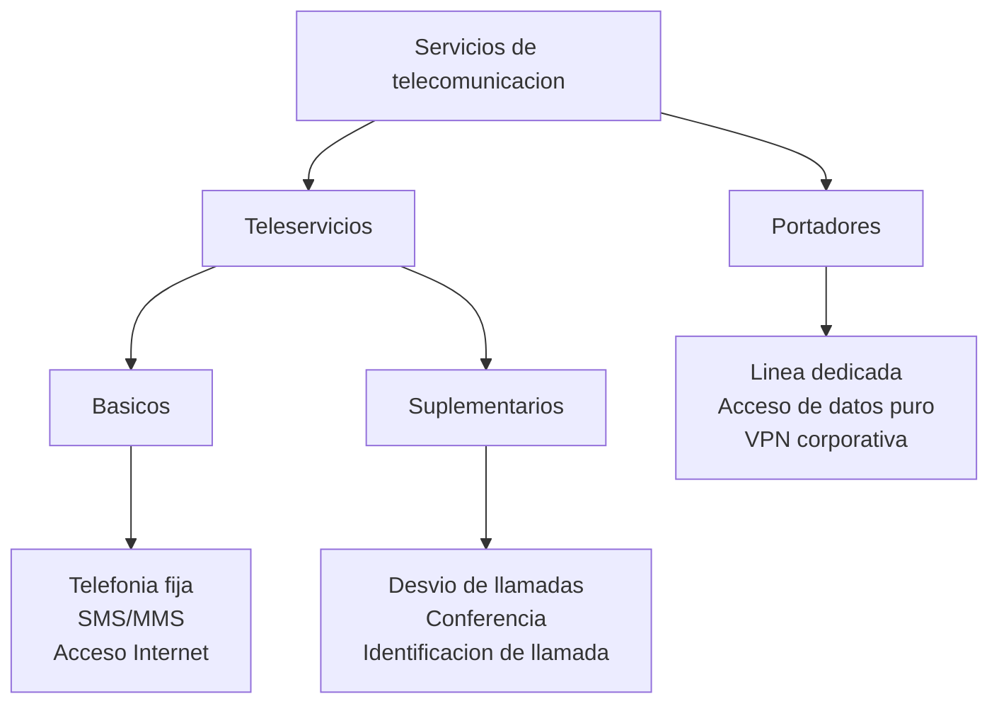
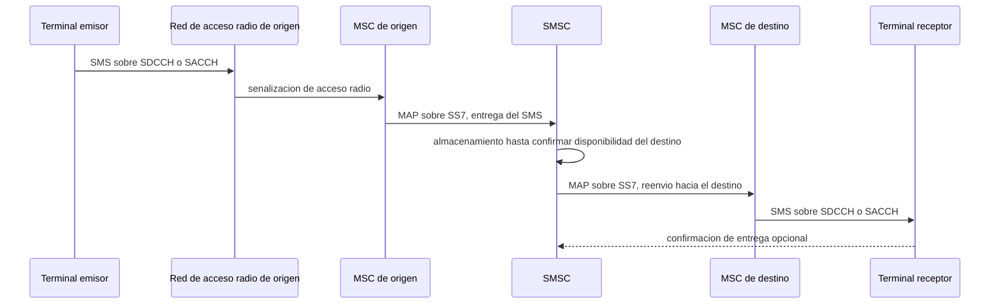
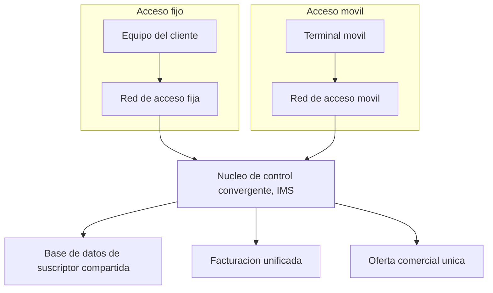

Un operador de telecomunicación ofrece una estructura jerárquica de servicios que, desde
la perspectiva del usuario final, se presentan como unidades de negocio diferenciadas
pero que, en la red, comparten infraestructura, protocolos y recursos bajo políticas de
calidad distintas. Este capítulo clasifica esa oferta de servicios, establece los
criterios de calidad que cada uno exige y describe cómo la estrategia comercial traduce
esos requisitos técnicos en acuerdos con los usuarios.

## Introducción

Un **servicio de telecomunicación** es un conjunto de facilidades y medios gestionados
por un operador que se ponen a disposición de sus clientes para permitir el intercambio
de información a través de la red. Prestar ese servicio exige, en todo caso, cuatro
elementos: los medios físicos y lógicos que sostienen la comunicación, el proveedor que
los gestiona, los clientes o usuarios que lo consumen, y la propia información que se
intercambia. La categorización de servicios sigue la clasificación normativa de la Unión
Internacional de Telecomunicaciones (`ITU`), que distingue entre servicios portadores,
teleservicios y servicios suplementarios, complementada con categorías operacionales que
los operadores utilizan para asegurar la calidad según el perfil de tráfico.

Un segundo eje de clasificación, ortogonal al anterior, atiende al tipo de información
que el servicio transporta: voz, datos, imagen o vídeo. Este segundo eje no sustituye a
la clasificación de la `ITU`, sino que la cruza: un mismo teleservicio, como la
telefonía móvil, transporta voz, mientras que un mismo servicio portador, como una línea
dedicada, puede transportar indistintamente datos, voz digitalizada o vídeo según lo que
el cliente decida enviar por ella. Los apartados de este capítulo dedicados a la voz, a
la mensajería, a los datos y a la difusión desarrollan, precisamente, este segundo eje,
aplicado sobre las categorías normativas ya introducidas.

## Servicios portadores y teleservicios

La `ITU` define dos categorías fundamentales que establecen el nivel de responsabilidad
del operador en la entrega del servicio.

### Servicios portadores

Un **servicio portador** proporciona únicamente la capacidad de transmisión de señales
entre dos puntos de terminación de red. El operador garantiza la conectividad extremo a
extremo y la velocidad de transmisión, pero no interviene en el procesamiento ni en la
interpretación del contenido. Son ejemplos de servicios portadores las líneas dedicadas
punto a punto sin procesamiento intermedio, la transmisión de datos pura a una tasa
fija, y los accesos a Internet donde la red se limita a entregar los paquetes sin
analizar su contenido.

### Teleservicios

Un **teleservicio** proporciona la capacidad completa para la comunicación entre
usuarios, incluyendo no solo la transmisión sino también todas las funciones de
conversión, procesamiento y señalización necesarias para que el usuario pueda utilizarlo
sin requerir equipamiento adicional. La telefonía fija es el teleservicio prototípico:
el operador suministra el número de teléfono, establece la llamada, procesa la
numeración y el encaminamiento, y garantiza la calidad de la voz, dejando al usuario
solo el acto de marcar y responder. Los teleservicios incluyen también las llamadas
móviles, la mensajería corta (`SMS`), la videoconferencia comercial y los servicios de
acceso a contenido como el correo electrónico gestionado.

La distinción entre ambas categorías no depende del medio de transmisión ni de la
tecnología de acceso empleada, sino de dónde termina la responsabilidad del operador. Un
mismo enlace físico de fibra óptica puede sostener, sobre distintos circuitos virtuales,
tanto un servicio portador puro, como una línea dedicada que solo transporta bits entre
dos routers del cliente, como un teleservicio completo, como una centralita telefónica
gestionada por el propio operador. La tabla siguiente resume esta diferencia con
ejemplos representativos de cada categoría.

| Categoría              | Responsabilidad del operador                       | Ejemplo                                  |
| ---------------------- | -------------------------------------------------- | ---------------------------------------- |
| Servicio portador      | Transporte de señales entre puntos de terminación. | Línea dedicada, acceso de datos puro.    |
| Teleservicio           | Comunicación completa entre usuarios finales.      | Telefonía fija, `SMS`, videoconferencia. |
| Servicio suplementario | Funcionalidad añadida sobre un servicio básico.    | Desvío de llamadas, buzón de voz.        |

## Servicios básicos y suplementarios

Dentro de cada teleservicio, el operador ofrece dos niveles de funcionalidad.

### Servicios básicos

Un **servicio básico** tiene entidad comercial propia y se ofrece de forma
independiente. La telefonía básica, que establece comunicaciones de voz entre dos
usuarios, es un servicio básico. Del mismo modo, el acceso a Internet residencial,
considerado como un portador que entrega conectividad a tasa fija, es un servicio
básico.

### Servicios suplementarios

Un **servicio suplementario** añade funcionalidad a un servicio básico, pero no tiene
sentido económico ni operativo si se ofrece de forma aislada. El desvío de llamadas, que
redirige la telefonía básica hacia otro número cuando el usuario no está disponible, es
un servicio suplementario de telefonía. La calidad prioritaria, que marca ciertos
tráficos para recibir tratamiento preferente en la red cuando hay congestión, es un
servicio suplementario que aplica a varios servicios básicos simultáneamente.

## Servicios de difusión

Un **servicio de difusión** transmite el mismo contenido simultáneamente desde un único
origen hacia múltiples receptores sin canal de retorno de contenido. La radiodifusión
sonora analógica (`FM`) y digital (`DAB`), la televisión terrestre (`TDT`) y por
satélite, y la distribución de contenido audiovisual en directo son servicios de
difusión. A diferencia de un acceso punto a punto, donde cada usuario controla el
instante y la duración de su consumo, un servicio de difusión impone un ritmo común a
todos los receptores simultáneos, lo que introduce requisitos especiales de señalización
y de protección de contenido no presentes en servicios conversacionales.

La responsabilidad del operador en un servicio de difusión también admite la misma
distinción entre portador y teleservicio ya introducida: una plataforma de televisión
digital terrestre presta un teleservicio completo, con codificación, empaquetado y
distribución de la señal a cargo del operador de red, mientras que un canal alquilado en
un satélite de comunicaciones para transportar una señal ya codificada por el propio
cliente es, en cambio, un servicio portador de difusión. La arquitectura de distribución
de este tipo de servicio, incluida la diferencia entre una entrega sobre red gestionada
y una entrega de mejor esfuerzo, se trata con mayor detalle en el capítulo dedicado a la
[televisión sobre IP y los servicios de difusión](../04_difusion/section_1_iptv_y_difusion.md).

## Servicios de voz

### Telefonía fija

La **telefonía fija**, sobre la red telefónica pública conmutada, permite la
comunicación bidireccional de voz entre usuarios conectados a terminales fijos
instalados en la red de acceso. El estándar técnico clásico limita el ancho de banda de
la voz a 300-3400 Hz, con una frecuencia de muestreo de 8 kHz y una cuantificación de 8
bits, lo que ofrece una tasa de 64 kbit/s de contenido de voz sin comprimir (codificador
`PCM` `G.711`). La red suministra, además de la comunicación de voz, servicios
suplementarios como el buzón de voz, la conferencia múltiple, la retención de llamadas y
la facturación por concepto.

???+ example "Presupuesto de retardo en una llamada telefónica tradicional"

    Una llamada entre dos usuarios fijos atraviesa varios nodos: la central local del
    emisor, un posible nodo de tránsito, la central local del receptor y los bucles de
    acceso en ambos extremos. La recomendación `ITU-T G.114` clasifica el retardo
    unidireccional extremo a extremo en tres bandas: hasta 150 ms se percibe como buena
    calidad conversacional, entre 150 y 400 ms resulta aceptable pero perceptible, y por
    encima de 400 ms la conversación se degrada de forma significativa. Ese presupuesto
    se reparte entre el retardo de propagación, aproximadamente 5 ms por cada 1000 km de
    fibra óptica al viajar la señal a dos tercios de la velocidad de la luz en el vacío,
    el retardo de procesamiento en cada nodo de conmutación, de pocos milisegundos por
    nodo, y el retardo de codificación y descodificación de la voz. Un retardo
    unidireccional superior a unos 25 ms sin cancelación de eco activa, según la
    recomendación `ITU-T G.131`, permite que el hablante perciba su propia voz reflejada
    por el bucle de abonado del receptor, lo que obliga a instalar canceladores de eco en
    cualquier tramo cuyo retardo supere ese umbral, con independencia de si el
    presupuesto conversacional global sigue dentro de los 150 ms recomendados.

### Telefonía móvil

La **telefonía móvil** extiende el servicio de voz hacia usuarios en movimiento a través
de estaciones base que forman redes celulares. El estándar `GSM` (2G) fue el primero en
integrar completamente telefonía, mensajería corta, transmisión de datos y servicios
suplementarios sobre una plataforma unificada, con voz digital a 13 kbit/s sobre
conmutación de circuitos y un servicio portador de datos limitado a 9600 bit/s, según se
detalla en el capítulo dedicado a
[GSM](../../03_redes_moviles/02_gsm_y_umts/section_1_gsm.md#servicios-ofrecidos). Los
estándares posteriores (`3G`, `4G`, `5G`) han incrementado las velocidades de datos
manteniendo la voz como un teleservicio básico, aunque con la evolución hacia redes solo
de paquetes, la voz se implementa cada vez más como una aplicación `IP` dentro del
propio sistema, tal como describe el capítulo dedicado a la
[voz sobre IP y VoLTE](../03_ims_y_voz/section_2_voz_sobre_ip_y_volte.md#voz-sobre-lte).

### Voz sobre IP

La **voz sobre IP** (`VoIP`) codifica la voz como flujos de paquetes `IP` que se
transportan sobre redes de conmutación de paquetes, ofreciendo las mismas funciones de
una red telefónica tradicional. Emplea codificadores de baja tasa, como `G.729` (8
kbit/s) o la familia `G.726` (entre 16 y 40 kbit/s según el modo), que introducen
retardos de codificación bajos y liberan capacidad de transporte frente al `PCM` sin
comprimir `G.711`, que mantiene los 64 kbit/s de la telefonía fija clásica. El servicio
exige sincronización entre paquetes para reconstruir el flujo de voz sin distorsión,
resuelta mediante el protocolo de transporte en tiempo real (`RTP`) descrito en el
capítulo dedicado a
[`RTP`, `RTCP` y `RTSP`](../02_protocolos/section_2_rtp_rtcp_y_rtsp.md).

???+ example "Llamadas simultáneas de voz sobre IP en un enlace según el codificador"

    Un operador dispone de un enlace agregado de 2048 kbit/s (un `E1`) para transportar
    llamadas de voz sobre IP entre dos centrales. Cada paquete de voz se genera cada 20
    ms y añade una cabecera de transporte de 40 bytes (`RTP`, `UDP` e `IP`) a la carga
    útil del propio codificador. Se pide comparar cuántas llamadas simultáneas admite el
    enlace con el codificador `PCM` sin comprimir `G.711`, a 64 kbit/s, frente al
    codificador `G.729`, a 8 kbit/s.

    Con `G.711`, la carga útil de cada trama de 20 ms es $64\,000 \times 0{,}02 / 8 =
    160$ bytes, que sumados a los 40 bytes de cabecera dan 200 bytes cada 20 ms,
    equivalentes a

    $$
    R_{G.711} = \frac{200 \times 8}{0{,}02} = 80\,000\ \text{bit/s} = 80\ \text{kbit/s}
    $$

    por llamada. El enlace de 2048 kbit/s admite entonces $2048 / 80 = 25{,}6$, es decir,
    25 llamadas simultáneas. Con `G.729`, la carga útil de cada trama de 20 ms es
    $8\,000 \times 0{,}02/8 = 20$ bytes, que sumados a los mismos 40 bytes de cabecera dan
    60 bytes cada 20 ms, equivalentes a

    $$
    R_{G.729} = \frac{60 \times 8}{0{,}02} = 24\,000\ \text{bit/s} = 24\ \text{kbit/s}
    $$

    por llamada, lo que eleva la capacidad del mismo enlace a $2048/24 = 85{,}3$, es
    decir, 85 llamadas simultáneas. La sobrecarga de cabecera domina la comparación tanto
    como la propia tasa del codificador: con `G.729` la cabecera pesa el doble que la
    carga útil, y aun así el enlace multiplica por más de tres su capacidad de llamadas
    simultáneas frente a `G.711`, lo que explica por qué los operadores con enlaces
    troncales de capacidad limitada prefieren codificadores de baja tasa para el tráfico
    interactivo pese a su mayor coste de procesamiento.

## Servicios móviles especializados

Antes de que la telefonía móvil celular alcanzara cobertura y coste asequibles para el
mercado masivo, y en paralelo a ella para segmentos que la propia telefonía celular no
atiende bien, un operador puede ofrecer tres familias de servicios móviles
especializados, cada una resolviendo una limitación distinta de la movilidad: la
notificación unidireccional de bajo coste, el uso compartido de infraestructura de radio
entre un grupo cerrado de usuarios, y la cobertura en zonas sin red terrestre.

### Radiobúsqueda

El servicio de **radiobúsqueda** (_paging_) transmite mensajes cortos, habitualmente
solo un número de teléfono o un código numérico, hacia un receptor móvil de un único
sentido, sin capacidad de respuesta desde el propio terminal. La estación transmisora
difunde el mensaje sobre un área de cobertura amplia, y el receptor, que permanece en
reposo el resto del tiempo para ahorrar energía, se activa periódicamente para escuchar
un canal de control y comprobar si tiene un mensaje pendiente dirigido a su
identificador. Esta arquitectura unidireccional, sin necesidad de un canal de retorno ni
de gestión de movilidad con traspaso entre celdas, permite una cobertura de área muy
superior a la de una celda de telefonía móvil con el mismo transmisor, a costa de un
servicio que solo notifica y no permite establecer una conversación. El servicio de
radiobúsqueda comercial, extendido en los años previos a la generalización de la
telefonía móvil como forma de mantener localizable a un profesional de guardia, ha
quedado hoy reducido a nichos donde la simplicidad del receptor y la cobertura de área
amplia siguen aportando valor frente a un teléfono móvil completo, como los sistemas de
aviso a los servicios de emergencia hospitalarios.

Los sistemas de radiobúsqueda digital operan habitualmente en bandas `VHF` (en torno a
138-174 MHz) y `UHF` (en torno a 400-470 MHz), donde la menor atenuación con la
distancia, frente a las bandas más altas empleadas por la telefonía celular, es
precisamente lo que sostiene su cobertura de área amplia con un único transmisor. El
código `POCSAG`, el más extendido de los protocolos de codificación de radiobúsqueda,
transmite a 512, 1200 o 2400 bit/s según la variante empleada, una tasa binaria
suficiente para un mensaje corto o un código numérico pero muy alejada de la que exige
cualquier servicio con retorno de voz.

### Radio troncalizada y radio móvil privada

La **radio móvil privada** (`PMR`, por _Private Mobile Radio_) proporciona
comunicaciones de voz entre un grupo cerrado de usuarios que comparte una misma
infraestructura de radio, típicamente un cuerpo de seguridad, una flota de transporte o
el personal de una instalación industrial. A diferencia de la telefonía móvil pública,
donde cada llamada se establece entre dos usuarios concretos, la comunicación habitual
en `PMR` es de un emisor hacia todo el grupo simultáneamente, en un modelo más cercano a
la difusión que a la conversación punto a punto, con tiempos de establecimiento de la
comunicación de solo algunas decenas de milisegundos frente al segundo o los varios
segundos que exige establecer una llamada en una red celular pública.

La **radio troncalizada** (_trunking_) es la evolución de la `PMR` que comparte de forma
dinámica un número reducido de canales de radio entre un número mayor de grupos de
usuarios, de forma análoga a como una central telefónica comparte un número reducido de
líneas troncales entre un número mayor de abonados. Un controlador central asigna un
canal libre a cada comunicación en el momento en que se solicita y lo libera en cuanto
termina, lo que multiplica el número de grupos de usuarios que una misma asignación de
espectro puede atender frente a la asignación de un canal fijo y exclusivo por grupo.
Los sistemas troncales digitales normalizados, como `TETRA`, definido en la norma
`ETSI EN 300 392`, añaden cifrado de extremo a extremo, prioridad de llamada
configurable por perfil de usuario y funcionalidades específicas para seguridad pública,
como la llamada de emergencia que interrumpe cualquier otra comunicación en curso en el
grupo. `TETRA` opera en Europa sobre bandas armonizadas en torno a 380-400 MHz para los
servicios de seguridad pública y en torno a 410-430 y 450-470 MHz para uso comercial,
con acceso múltiple por división en el tiempo de cuatro intervalos sobre portadoras
espaciadas 25 kHz, lo que multiplexa cuatro canales de tráfico o de control
independientes sobre una misma portadora física. Estos sistemas siguen desplegados hoy
en servicios de emergencia, transporte público y logística, precisamente en los
segmentos donde el tiempo de establecimiento de la comunicación y la disponibilidad
garantizada del canal importan más que la cobertura y el catálogo de servicios de una
red celular pública.

### Servicios móviles por satélite

Los **servicios móviles por satélite** extienden la cobertura de comunicaciones móviles
a zonas sin infraestructura terrestre: rutas marítimas, corredores aéreos y regiones sin
despliegue de red celular. Un satélite geoestacionario, situado a unos 35 786 km de
altitud sobre el ecuador, ofrece cobertura permanente sobre un área muy amplia con un
único satélite, a costa de un retardo de propagación de ida y vuelta de más de 500 ms
que hace inviable una conversación fluida sin percepción de retardo, mientras que una
constelación de satélites de órbita baja, a varios cientos de kilómetros de altitud,
reduce ese retardo de forma notable pero exige decenas de satélites coordinados para
mantener cobertura continua sobre un mismo punto de la superficie terrestre. Sistemas
como `INMARSAT`, orientado a comunicaciones marítimas y aeronáuticas, ofrecen tanto voz
como datos de baja velocidad a terminales de tamaño reducido, y sostienen además
servicios especializados de control de flotas: un armador o un transportista recibe la
posición de cada vehículo o embarcación, calculada a partir del retardo de propagación
de la señal hacia varios satélites o estaciones de referencia, junto con telemetría
básica del propio vehículo, sin depender en ningún momento de la cobertura de una red
terrestre que en alta mar o en rutas aéreas transoceánicas simplemente no existe.

???+ example "Cobertura satelital geoestacionaria frente a una red celular terrestre"

    Una flota pesquera necesita mantener comunicación de voz y transmisión periódica de
    posición mientras opera a varios cientos de kilómetros de la costa, fuera del
    alcance de cualquier estación base terrestre. Se pide razonar por qué un satélite
    geoestacionario resuelve este caso mejor que una red celular, y qué coste impone esa
    solución frente a la telefonía móvil convencional.

    Una celda de una red móvil terrestre tiene un radio de a lo sumo unas pocas decenas
    de kilómetros incluso en configuraciones rurales de máxima cobertura, de modo que
    extender esa red hasta cubrir una zona de pesca varios cientos de kilómetros mar
    adentro exigiría desplegar estaciones base flotantes o en plataformas fijas, una
    inversión que ningún operador celular amortiza para un volumen de tráfico tan
    reducido. Un único satélite geoestacionario, en cambio, cubre con su huella una
    región oceánica de dimensión continental sin necesidad de infraestructura adicional
    en el mar, porque la estación transmisora permanece en tierra y el satélite se
    limita a retransmitir la señal. El coste de esta solución es el retardo de
    propagación: la distancia de ida y vuelta hasta un satélite geoestacionario y de
    vuelta a una estación terrena en tierra supera los 71 572 km (el doble de los
    35 786 km de altitud orbital), lo que a la velocidad de la luz en el vacío introduce
    un retardo superior a los 230 ms solo de propagación, y del orden de 500 ms si la
    comunicación de voz requiere pasar por dos
    saltos satelitales para conectar con un abonado en la red terrestre. Ese retardo, muy
    por encima del límite de 400 ms que la recomendación `ITU-T G.114` fija como
    aceptable para una conversación fluida, es tolerable para la flota pesquera porque su
    alternativa no es una llamada terrestre de menor retardo, sino ninguna comunicación
    en absoluto.

## Servicios de mensajería

Los servicios de mensajería comparten un rasgo común frente a los servicios
conversacionales de voz: no exigen que emisor y receptor estén disponibles de forma
simultánea. El mensaje se entrega a un nodo intermedio que lo retiene hasta que el
destino puede recibirlo, un modelo de **almacenamiento y reenvío** (_store and forward_)
que relaja notablemente los requisitos de retardo y de _jitter_ frente a la voz, a costa
de introducir un nodo adicional, el centro de mensajes, que debe mantener el estado de
cada mensaje pendiente de entrega.

### Servicio de mensajes cortos

El **servicio de mensajes cortos** (`SMS`) permite el intercambio de mensajes de texto
entre terminales móviles. Cada mensaje ocupa 140 bytes e incluye metadatos como los
números de teléfono del emisor y del receptor, la identificación del centro de mensajes,
el período de validez y la solicitud de confirmación de entrega. En la interfaz radio de
`GSM`, un `SMS` punto a punto se transporta sobre el canal de control dedicado
independiente (`SDCCH`) cuando el terminal no tiene todavía un canal de tráfico
asignado, o sobre el canal de control asociado lento (`SACCH`) cuando la comunicación ya
dispone de uno, según el catálogo de
[canales de control dedicado](../../03_redes_moviles/02_gsm_y_umts/section_1_gsm.md#canales-de-control-dedicado)
descrito en el capítulo de `GSM`. En la red troncal, la señalización del `SMS` se
transporta mediante el protocolo de aplicación móvil (`MAP`) sobre el mismo sistema de
[señalización `SS7`](../../03_redes_moviles/02_gsm_y_umts/section_1_gsm.md#senalizacion-en-la-red-troncal)
que emplea el resto de la red central, con el centro de servicio de mensajes cortos
(`SMSC`) actuando como nodo de almacenamiento y reenvío entre el remitente y el
destinatario: el `SMSC` retiene el mensaje hasta que confirma que el destino está
disponible, y solo entonces lo reenvía, sin que el mensaje consuma en ningún momento
recursos del canal de tráfico de voz.

???+ example "Caracteres que caben en un SMS de 140 bytes con el alfabeto GSM de 7 bits"

    El estándar `3GPP TS 23.038` define un alfabeto de 7 bits para el cuerpo de un `SMS`
    de texto, frente a los 8 bits que ocupa un carácter `ASCII` convencional. Se pide
    calcular cuántos caracteres de ese alfabeto caben en el cuerpo de un mensaje corto
    con la codificación por defecto, y contrastarlo con el número de caracteres que
    cabrían con un alfabeto de 8 bits por carácter.

    El cuerpo de un `SMS` dispone de 140 bytes, es decir, $140 \times 8 = 1120$ bits. Con
    el alfabeto de 7 bits, esos 1120 bits se empaquetan en septetos consecutivos sin bits
    de relleno entre caracteres, lo que permite

    $$
    N_{7\ \text{bits}} = \frac{1120}{7} = 160\ \text{caracteres}
    $$

    Si el mismo cuerpo se codificara con un alfabeto de 8 bits por carácter, como exige
    un mensaje con caracteres fuera del alfabeto de 7 bits, el número de caracteres
    disponibles se reduce a

    $$
    N_{8\ \text{bits}} = \frac{1120}{8} = 140\ \text{caracteres}
    $$

    La diferencia de 20 caracteres, un 14 % más de capacidad con el alfabeto de 7 bits,
    explica por qué el límite habitual de un `SMS` de texto simple se cita como 160
    caracteres y no como 140: esa segunda cifra corresponde en realidad al tamaño en
    bytes del cuerpo del mensaje, no al número de caracteres que contiene.

### Servicio de mensajes multimedia

El **servicio de mensajes multimedia** (`MMS`) integra en un mismo mensaje texto
formateado, imágenes, audio, animaciones y vídeo. A diferencia del `SMS`, cuyo cuerpo
viaja íntegramente por los canales de señalización de la interfaz radio, un `MMS` se
transporta mediante datagramas `IP` dirigidos a un centro servidor de mensajes
multimedia (`MMSC`), que valida los permisos del remitente, almacena el mensaje hasta
que el destino esté disponible, verifica la compatibilidad del contenido con el
dispositivo receptor, y notifica al usuario de la llegada del mensaje, habitualmente con
un `SMS` de aviso. Este uso combinado de dos servicios, un `SMS` de notificación seguido
de una descarga por datagramas `IP`, es habitual en los servicios de valor añadido que
se describen más adelante en este capítulo: el `SMS` aporta la notificación de bajo
coste y disponibilidad casi universal, mientras que el `MMS` aporta la capacidad de
carga útil que la mensajería corta no puede ofrecer.

## Servicios de datos y acceso a Internet

Los servicios de esta categoría comparten un rasgo distintivo frente a los servicios de
voz y de mensajería: la red no interpreta el contenido que transporta, y su papel se
limita a entregarlo con la velocidad y la disponibilidad contratadas. Esta propiedad los
sitúa, casi sin excepción, dentro de la categoría de servicios portadores introducida al
principio de este capítulo.

### Acceso a Internet

El **acceso a Internet residencial o corporativo** proporciona conectividad de red a
velocidades fijas o variables hacia la red pública global. Los operadores ofrecen este
servicio a través de diversos medios de acceso (cobre, fibra óptica, tecnologías de
acceso inalámbrico) y garantizan velocidades mínimas, máximas o nominales según el
contrato comercial. El acceso es un servicio portador: el operador garantiza la
disponibilidad y la velocidad, pero no controla ni procesa el tráfico que circula.

### Servicios de datos corporativos

Un operador ofrece a las empresas servicios estructurados de datos que van más allá del
acceso puro: redes privadas virtuales (`VPN`) que conectan múltiples sedes con cifrado y
aislamiento, líneas dedicadas punto a punto que garantizan una ruta fija y una
congestión controlada, y acceso a nubes privadas o híbridas operadas por el propio
operador o por un tercero bajo acuerdo de nivel de servicio. La diferencia entre estos
servicios y el acceso a Internet residencial no es tecnológica sino contractual: una
`VPN` corporativa puede circular sobre la misma infraestructura de acceso que un abonado
residencial, pero incorpora garantías de aislamiento y de calidad que el contrato
residencial no ofrece, precisamente porque el segmento corporativo tolera peor las
interrupciones y está dispuesto a pagar por un `SLA` más exigente, según se detalla en
el apartado dedicado a los acuerdos de nivel de servicio más adelante en este capítulo.

### Servicios de datos y aplicaciones de Internet

Sobre el acceso a Internet, ya sea portador puro o incluido en un teleservicio
convergente, un operador presta o intermedia además un catálogo de servicios de
aplicación que el usuario final percibe como parte de su experiencia de conectividad,
aunque técnicamente se apoyen por completo en el servicio portador subyacente sin
requerir ningún tratamiento especial de la red de transporte.

El **sistema de nombres de dominio** (`DNS`) resuelve un nombre legible, como el de un
sitio web o el dominio de una dirección de correo, hacia la dirección `IP` numérica que
identifica al servidor que responde por ese nombre en la red. Sin esta resolución
previa, cualquier otro servicio de datos exigiría al usuario memorizar y teclear
direcciones `IP` numéricas para cada destino, de modo que el `DNS` no es un servicio que
el usuario contrate ni perciba de forma directa, sino una infraestructura de resolución
de nombres que sostiene de forma transparente a prácticamente todos los demás servicios
de datos de este apartado. Un operador de acceso a Internet presta este servicio
mediante servidores de resolución propios, configurados por defecto en el equipo del
cliente, aunque el usuario puede sustituirlos por servidores de resolución de terceros
sin perder la conectividad al resto de servicios.

El **correo electrónico** permite el intercambio de mensajes de texto con adjuntos entre
usuarios a través de servidores intermedios que almacenan los mensajes hasta que el
destinatario los recupera, en un modelo de almacenamiento y reenvío análogo al descrito
para la mensajería móvil en el apartado siguiente de este capítulo, aunque resuelto con
protocolos de aplicación de Internet en lugar de con señalización de red móvil. Un
operador que presta correo electrónico gestionado, como se ha mencionado ya en el
apartado de servicios de valor añadido, mantiene el servidor de buzones, aplica filtros
de seguridad contra correo no deseado y garantiza la disponibilidad del servicio dentro
de su propio `SLA` de acceso a Internet.

La **World Wide Web** (`WWW`) es el servicio de datos de mayor volumen de tráfico sobre
una red de acceso residencial o corporativa actual, con una arquitectura
cliente-servidor en la que un navegador solicita recursos identificados por una
dirección de recurso y un servidor los entrega junto con su tipo de contenido. Un
operador no suele intervenir en el contenido de esta comunicación, salvo cuando opera
mecanismos de caché o de aceleración de contenido para reducir la carga sobre sus
enlaces de tránsito hacia el resto de Internet, una decisión de ingeniería de tráfico
más que de prestación de un servicio de aplicación propio. Los protocolos concretos que
sostienen la web y el correo electrónico, y su relación con la pila de protocolos de
transporte de Internet, se tratan con el detalle técnico correspondiente en el capítulo
dedicado a los
[protocolos de transporte](../../02_redes/02_ip/section_2_protocolos_de_transporte.md);
este apartado los sitúa únicamente como partidas del catálogo comercial de un operador,
no como protocolos a desarrollar de nuevo aquí.

## Servicios de valor añadido

Un **servicio de valor añadido** enriquece un servicio portador o teleservicio básico
con procesamiento, almacenamiento o mediación adicional ofrecido por el operador. El
buzón de voz, que graba y almacena mensajes de audio durante la ausencia del usuario, es
un servicio de valor añadido sobre telefonía. El correo electrónico gestionado, donde el
operador mantiene los buzones centrales y aplica filtros de seguridad, es un servicio de
valor añadido sobre acceso a Internet. Estos servicios generan ingresos adicionales sin
requerir una inversión proporcionalmente mayor en infraestructura de red, porque
reutilizan la capacidad de transporte ya amortizada.

La diferencia entre un servicio de valor añadido y un servicio suplementario,
introducida en un apartado anterior de este capítulo, es sutil pero relevante para la
estrategia comercial de un operador. Un servicio suplementario modifica el
comportamiento del servicio básico sobre el que se apoya, como el desvío de llamadas que
altera el destino de una llamada entrante, mientras que un servicio de valor añadido
introduce una funcionalidad nueva que no existía en el servicio básico, como la
conversión de un mensaje de voz en texto mediante reconocimiento automático del habla.
Esta distinción importa a la hora de fijar el precio: un servicio suplementario suele
facturarse como una variante del servicio básico, mientras que un servicio de valor
añadido suele facturarse como una línea independiente en la factura del cliente,
precisamente porque introduce un valor diferenciado que el servicio básico por sí solo
no ofrecía.

???+ example "Distinción entre un servicio suplementario y uno de valor añadido"

    Un operador ofrece a sus clientes de telefonía fija dos prestaciones adicionales: el
    desvío de llamadas hacia un número alternativo cuando el titular no responde, y un
    servicio de transcripción automática de los mensajes de voz recibidos en el buzón,
    entregada por correo electrónico. Se pide clasificar cada prestación y justificar la
    diferencia de facturación esperable entre ambas.

    El desvío de llamadas no introduce ninguna función nueva sobre la telefonía básica:
    sigue siendo una llamada de voz punto a punto, solo que redirigida hacia otro
    destino, de modo que se trata de un servicio suplementario que altera el
    comportamiento del servicio básico sin añadir una capacidad distinta. La
    transcripción automática del buzón de voz, en cambio, convierte un contenido de audio
    en texto mediante un procesamiento que la telefonía básica no realiza en ningún caso,
    y que además se entrega a través de un canal distinto, el correo electrónico, ajeno
    al propio servicio de voz. Esa capacidad añadida, inexistente en el servicio básico,
    es la marca característica de un servicio de valor añadido, y explica por qué un
    operador puede facturarlo como una línea de producto independiente mientras el
    desvío de llamadas se integra habitualmente en el propio plan de telefonía sin coste
    diferenciado o con un recargo menor.

## Servicios convergentes

Un **servicio convergente** integra voz, datos y vídeo bajo una única oferta comercial y
una única factura, denominada habitualmente **convergencia fijo-móvil** (`FMC`, por
_Fixed-Mobile Convergence_). Un usuario empresarial recibe desde un único operador:
acceso a Internet fijo en su oficina, acceso móvil en su teléfono, telefonía corporativa
unificada que encamina las llamadas entrantes a cualquiera de los dos dispositivos según
disponibilidad, y buzón de voz integrado. La realización técnica requiere una
integración profunda de la red de acceso fijo con la red móvil, sistemas de señalización
comunes y bases de datos de suscriptores compartidas, un papel que en la práctica cumple
el [subsistema IP multimedia](../03_ims_y_voz/section_1_ims.md), capaz de ofrecer un
mismo catálogo de servicios con independencia de la tecnología de acceso concreta que
emplee el terminal en cada momento.

La oferta convergente no se limita al segmento corporativo. En el segmento residencial,
un paquete convergente típico combina el acceso a Internet fijo del domicilio, la
telefonía fija asociada a ese mismo acceso, uno o varios contratos de telefonía móvil y,
en muchos casos, un servicio de televisión sobre `IP`. La ventaja comercial de esta
combinación es doble: reduce el coste de adquisición de cada servicio individual al
repartir el coste fijo de la relación con el cliente entre varios productos, y reduce la
probabilidad de que el cliente abandone al operador, porque cancelar un paquete
convergente exige sustituir varios servicios de forma simultánea en lugar de uno solo.
Esta segunda propiedad, conocida en el sector como reducción de la tasa de abandono
(_churn_), es a menudo el argumento comercial principal para justificar la inversión en
la integración técnica que la convergencia exige.

## Acuerdos de nivel de servicio

Un **acuerdo de nivel de servicio** (`SLA`, por _Service Level Agreement_) es un
contrato que especifica los requisitos mínimos de rendimiento que el operador garantiza
para cada servicio, los mecanismos de medición y las compensaciones o sanciones
aplicables si el operador incumple.

Un `SLA` típico de conectividad de Internet fijo especifica una disponibilidad mínima
del 99,5 % medida mensualmente, un retardo máximo promedio de 50 ms, una variación del
retardo (_jitter_) máxima de 10 ms en el percentil P95, y una pérdida de paquetes
inferior al 0,1 %. Si el operador incumple alguno de estos objetivos durante un mes,
debe acreditar el incumplimiento y aplicar una deducción proporcionada en la facturación
del mes siguiente. La definición de estos mismos indicadores, retardo, _jitter_ y
pérdida de paquetes, con sus causas y sus mecanismos de mitigación, se trata con mayor
detalle en el capítulo dedicado a la
[calidad de servicio en redes IP](../05_qos_y_qoe/section_1_qos_en_redes_ip.md#indicadores-de-calidad-de-servicio).

Para servicios críticos como el acceso corporativo o las nubes privadas, los `SLA`
incluyen tiempos máximos de reparación desde la notificación de fallo (`MTTR`, por _Mean
Time To Repair_), típicamente entre 2 y 24 horas según la severidad, y obligaciones de
redundancia como la provisión de enlaces alternativos automáticos sin intervención
manual.

???+ example "Minutos de indisponibilidad del SLA al 99,5 % y al 99,95 %"

    Un operador ofrece dos niveles de `SLA` de disponibilidad para su servicio de acceso
    corporativo: un nivel estándar del 99,5 % y un nivel prémium del 99,95 %, ambos
    medidos sobre un mes de referencia de 30 días. Se pide calcular los minutos de
    indisponibilidad que tolera cada nivel y comparar la diferencia.

    Un mes de 30 días equivale a $30 \times 24 \times 60 = 43\,200$ minutos. El nivel
    estándar tolera una indisponibilidad máxima de

    $$
    T_{99{,}5\%} = (1 - 0{,}995) \times 43\,200 = 216\ \text{minutos}
    $$

    es decir, 3 horas y 36 minutos al mes, mientras que el nivel prémium tolera

    $$
    T_{99{,}95\%} = (1 - 0{,}9995) \times 43\,200 = 21{,}6\ \text{minutos}
    $$

    La diferencia entre ambos niveles es de un orden de magnitud, diez veces menos
    indisponibilidad tolerada, lo que exige del operador mecanismos de redundancia y de
    recuperación mucho más exigentes para sostener el nivel prémium: pasar de 216 a 21,6
    minutos mensuales no es una mejora incremental sino un cambio de arquitectura, porque
    un único fallo no detectado y resuelto en menos de media hora agota ya buena parte
    del presupuesto de indisponibilidad mensual del nivel prémium.

## Relación entre catálogo comercial y capacidad de red

La oferta de servicios que un operador puede comercializar está determinada por las
capacidades técnicas disponibles en su red. Un operador con acceso principalmente de
cobre de par trenzado puede ofertar telefonía, acceso `ADSL` de velocidades limitadas y
servicios de valor añadido como el buzón de voz, pero no puede comercializar paquetes
convergentes que exijan velocidades de fibra de 100 Mbit/s para el componente fijo. De
forma inversa, la inversión en capacidad debe estar precedida por una estrategia
comercial: una región sin usuarios corporativos no justifica la inversión en líneas
dedicadas empresariales.

La planificación de servicios es un ciclo iterativo: la estrategia comercial identifica
la demanda por segmento (residencial, pyme, corporativo), los servicios requeridos por
cada segmento, los requisitos de calidad asociados, la capacidad de red necesaria para
soportarlos sin incumplir el `SLA`, y finalmente el coste de la inversión. Si el retorno
no es competitivo frente a los operadores rivales, se redefinen los servicios o se
priorizan zonas geográficas. Nuevas tecnologías (`5G`, fibra óptica), la regulación de
precios o los cambios en el comportamiento del usuario pueden alterar esta ecuación,
requiriendo una revisión del portafolio y de las inversiones de red.

Esta interdependencia entre catálogo y capacidad se manifiesta de forma particularmente
visible cuando un operador introduce un servicio nuevo cuyos requisitos de calidad
superan lo que la red desplegada puede sostener de forma generalizada. El caso habitual
es el de un servicio de vídeo en alta definición que exige una velocidad garantizada y
un retardo acotado que solo la parte de la red ya migrada a fibra puede ofrecer: el
operador se enfrenta entonces a la decisión de comercializar el servicio únicamente en
las zonas con capacidad suficiente, fragmentando su catálogo por zona geográfica, o de
posponer el lanzamiento comercial hasta completar la migración de la red de acceso a una
escala que justifique una oferta homogénea.

???+ example "Decisión de lanzamiento de un servicio ante una red heterogénea"

    Un operador dispone de una red de acceso mixta: el 60 % de sus clientes residenciales
    tiene fibra óptica capaz de sostener 300 Mbit/s, y el 40 % restante sigue conectado
    mediante `ADSL` con una velocidad máxima de 20 Mbit/s. El nuevo servicio convergente
    que el área comercial quiere lanzar exige un mínimo de 50 Mbit/s en el componente fijo
    para garantizar la calidad del vídeo incluido en el paquete. Se pide razonar qué
    opciones tiene el operador y qué compromiso implica cada una.

    La primera opción es lanzar el servicio únicamente entre los clientes con fibra
    óptica, lo que permite cumplir el requisito de 50 Mbit/s desde el primer día, pero
    reduce el mercado potencial inmediato al 60 % de la base de clientes y exige mantener
    dos catálogos comerciales distintos según la tecnología de acceso disponible en cada
    domicilio, con el coste operativo y de atención al cliente que esa fragmentación
    conlleva. La segunda opción es posponer el lanzamiento hasta completar la migración a
    fibra del 40 % restante, lo que permite ofrecer un catálogo homogéneo a toda la base
    de clientes, pero retrasa los ingresos del nuevo servicio durante el tiempo que dure
    esa migración, un plazo que en despliegues de gran escala se mide en años más que en
    meses. La decisión correcta depende, en última instancia, de si el ingreso adicional
    que aporta el lanzamiento inmediato sobre el 60 % de la base compensa el coste de
    gestionar temporalmente dos catálogos, frente al coste de oportunidad de retrasar el
    ingreso sobre toda la base hasta que la red lo sostenga de forma homogénea.

El capítulo siguiente, [regulación y organismos](section_2_regulacion_y_organismos.md),
profundiza en las obligaciones de servicio universal y en los marcos normativos que
circunscriben el catálogo que un operador puede ofertar.
