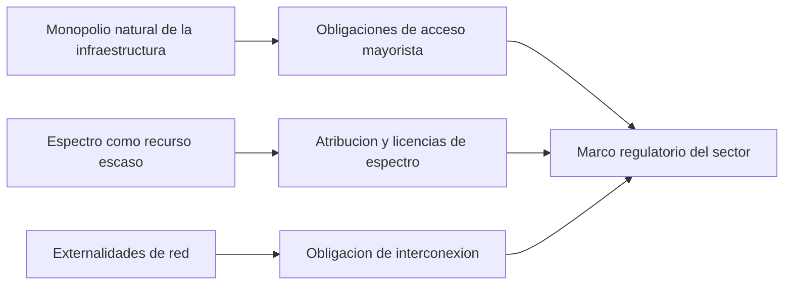
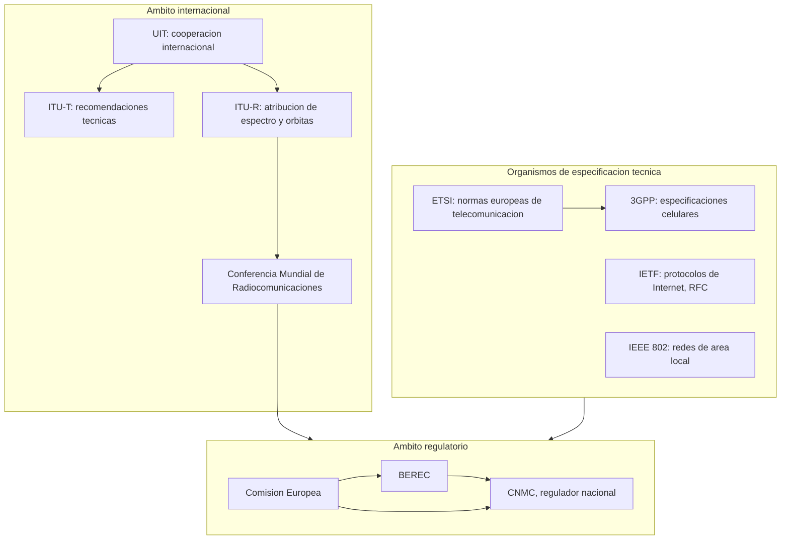
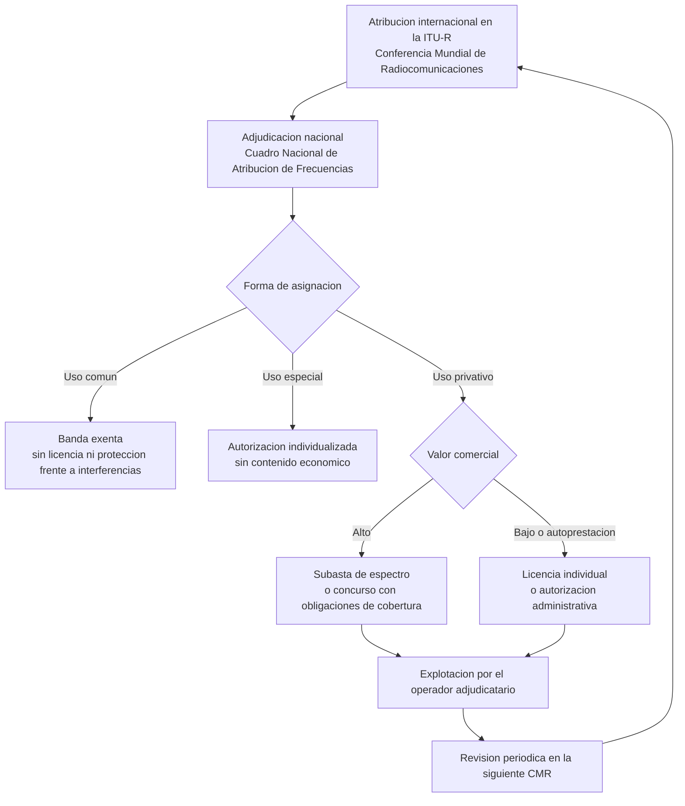
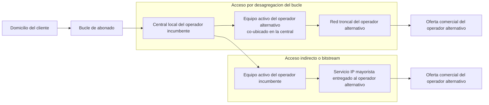

El [catálogo de servicios](section_1_catalogo_de_servicios.md) descrito en el capítulo
anterior no se despliega en un mercado libre de restricciones. Un operador de
telecomunicación opera bajo un marco normativo que condiciona qué puede ofrecer, a qué
precio, con qué garantías de calidad y bajo qué obligaciones hacia el resto de
operadores y hacia el usuario final. Este capítulo explica por qué el sector exige ese
marco, qué organismos lo construyen a distintas escalas geográficas, cómo se gestiona el
espectro radioeléctrico como recurso escaso, y qué mecanismos protegen la competencia
efectiva y los derechos del usuario.

## Introducción

La intervención pública sobre las telecomunicaciones no es una anomalía histórica, sino
la respuesta a tres propiedades económicas del sector que el mercado libre no resuelve
por sí solo.

La primera es el **monopolio natural** de la infraestructura de red. Desplegar una red
de acceso fijo o una red celular exige una inversión inicial muy elevada en cableado,
estaciones base o centrales de conmutación, mientras que el coste de atender a un
abonado adicional sobre una red ya desplegada es comparativamente bajo. Esa estructura
de costes favorece que un único operador alcance economías de escala que ningún
competidor entrante puede igualar duplicando la infraestructura, lo que en ausencia de
intervención conduce a un monopolio de facto. Hasta la década de 1990, la mayoría de los
países europeos, España entre ellos, resolvió esta propiedad asignando la explotación de
la red a una única empresa pública. La liberalización posterior no eliminó la economía
de escala subyacente, sino que introdujo obligaciones de interconexión y de acceso
mayorista, descritas más adelante en este capítulo, para permitir la competencia sobre
una infraestructura que sigue siendo antieconómica de duplicar en su totalidad.

La segunda propiedad es el **espectro radioeléctrico como recurso escaso**. A diferencia
de un cable o una fibra, que puede tenderse en la cantidad que la inversión permita, el
espectro utilizable para comunicaciones sin guía es finito y compartido por naturaleza:
dos transmisores que emiten en la misma banda y en la misma zona geográfica se
interfieren mutuamente. Sin una autoridad que atribuya bandas a servicios, coordine su
uso entre países vecinos y otorgue derechos de uso exclusivo o compartido, el espectro
se degradaría hasta resultar inutilizable para cualquiera. Esta propiedad justifica que
el espectro se declare bien de dominio público y que su gestión se reserve al Estado,
tal como se desarrolla en el apartado dedicado a la gestión del espectro.

La tercera propiedad son las **externalidades de red**: el valor de una red de
comunicaciones para cada usuario crece con el número de usuarios que puede alcanzar a
través de ella. Un operador que controla la red con más abonados obtiene una ventaja
competitiva que no depende de la calidad de su servicio, sino simplemente de su tamaño,
porque un abonado de una red pequeña valora menos su conexión si no puede comunicarse
con los abonados de las redes rivales. Sin una obligación de interconexión entre
operadores, el operador dominante podría negarse a interconectar con los competidores
entrantes, o fijar unas condiciones de interconexión que los expulsaran del mercado, lo
que perpetuaría su posición dominante con independencia de la eficiencia relativa de su
red. La obligación de interconexión, que se detalla más adelante en este capítulo, es la
respuesta regulatoria directa a esta tercera propiedad.

## Organismos de normalización

La normalización técnica del sector se reparte entre organismos que operan a escala
mundial, regional y sectorial, cada uno con una competencia delimitada que evita la
duplicación de esfuerzos entre ellos.

### La Unión Internacional de Telecomunicaciones

La **Unión Internacional de Telecomunicaciones** (`ITU`, por sus siglas en inglés, `UIT`
en español) es el organismo de más largo recorrido histórico del sector, con origen en
la Convención Telegráfica Internacional firmada en París en 1865 para normalizar los
equipos de telegrafía entre países y establecer tarifas internacionales comunes. Tras
sucesivas ampliaciones de su ámbito a la telefonía y a la radiocomunicación, la `ITU` se
convirtió en 1947 en un organismo especializado de las Naciones Unidas, con el objetivo
general de mantener y ampliar la cooperación internacional entre sus Estados miembros
para el empleo racional de las telecomunicaciones y la extensión de sus beneficios a
toda la población mundial.

La `ITU` organiza su trabajo técnico en sectores especializados, de los que dos resultan
centrales para este capítulo.

El sector de **normalización** (`ITU-T`) produce las recomendaciones técnicas que fijan
requisitos de interoperabilidad e interfaces entre redes de distintos operadores y
países. Las recomendaciones `ITU-T G.711` y `G.114`, que fijan respectivamente la
codificación de voz sin comprimir y los presupuestos de retardo conversacional citados
en el capítulo anterior, son ejemplos representativos de este sector: no son normas de
obligado cumplimiento en sentido estricto, pero su adopción generalizada por fabricantes
y operadores las convierte en la referencia de facto para la interoperabilidad
internacional.

El sector de **radiocomunicaciones** (`ITU-R`) gestiona la atribución internacional del
espectro radioeléctrico y de las órbitas de satélites, con el objetivo de evitar
interferencias entre los sistemas de radiocomunicación de distintos países. Su
instrumento de trabajo periódico es la **Conferencia Mundial de Radiocomunicaciones**
(`CMR`, o `WRC` por sus siglas en inglés), que reúne a los Estados miembros cada tres o
cuatro años para revisar el Reglamento de Radiocomunicaciones, un tratado internacional
que fija qué bandas de frecuencia se atribuyen a qué categorías de servicio en cada una
de las tres regiones en que la `ITU-R` divide el planeta. Una decisión de la `CMR` de
reatribuir una banda, por ejemplo trasladar espectro de la radiodifusión televisiva
terrestre hacia las comunicaciones móviles de banda ancha, no despliega servicios por sí
misma, pero abre la puerta a que cada administración nacional planifique después esa
banda para el uso decidido internacionalmente, dentro del margen de flexibilidad que el
propio Reglamento reconoce a cada región.

???+ example "Alcance de una reatribución adoptada en una Conferencia Mundial"

    Una `CMR` decide reatribuir una banda que hasta entonces estaba destinada en
    exclusiva a la radiodifusión televisiva terrestre, añadiendo el servicio móvil como
    uso permitido en esa misma banda a escala mundial. Se pide razonar qué efecto
    inmediato tiene esa decisión sobre los operadores de telefonía móvil de un país
    concreto y qué pasos administrativos posteriores son todavía necesarios antes de que
    puedan prestar servicio sobre esa banda.

    La decisión de la `CMR` modifica el Reglamento de Radiocomunicaciones, el tratado
    internacional que fija qué categorías de servicio pueden coexistir en cada banda sin
    generar interferencias entre países vecinos, pero no otorga por sí misma ningún
    derecho de uso a ningún operador concreto. El efecto inmediato es exclusivamente
    normativo: la banda pasa a estar disponible, en el plano internacional, para que
    cualquier administración nacional decida planificarla para el servicio móvil sin
    incurrir en un conflicto de atribución con los países vecinos. Antes de que un
    operador pueda prestar servicio sobre esa banda, la administración nacional
    competente debe actualizar su propio cuadro de atribución de frecuencias para
    reflejar el nuevo uso permitido, y posteriormente adjudicar el uso efectivo de la
    banda a uno o varios operadores mediante alguno de los procedimientos descritos en
    el apartado dedicado a la gestión del espectro, típicamente una subasta cuando la
    banda tiene valor comercial elevado. El recorrido completo, desde la decisión
    internacional hasta la prestación efectiva del servicio, suele extenderse varios
    años, porque cada uno de esos pasos exige su propio proceso administrativo y su
    propio calendario de despliegue de infraestructura por parte de los operadores.

### ETSI, 3GPP, IETF e IEEE 802

Bajo el paraguas de coordinación internacional que ejerce la `ITU`, cuatro organismos
adicionales producen las especificaciones técnicas concretas que los fabricantes y
operadores implementan en sus equipos y protocolos.

El **Instituto Europeo de Normalización de las Telecomunicaciones** (`ETSI`) se creó en
1988 por iniciativa de la Comisión Europea, como desarrollo del Libro Verde de las
Telecomunicaciones, asumiendo las competencias técnicas que hasta entonces ejercía la
Conferencia Europea de administraciones Postales y de Telecomunicaciones (`CEPT`)
desde 1959. Su objetivo es producir normas técnicas aceptadas por el conjunto de los
Estados miembros europeos que permitan un mercado europeo de telecomunicaciones
unificado y competitivo frente a los mercados de Estados Unidos y Japón, acelerando
además la armonización técnica mediante la cooperación con otras organizaciones europeas
de normalización en radiodifusión y telemática. El estándar `GSM`, tratado con mayor
detalle en el capítulo dedicado a las
[redes celulares de segunda generación](../../03_redes_moviles/02_gsm_y_umts/section_1_gsm.md),
es el resultado más citado de esta labor. Cualquier entidad con interés acreditado en el
desarrollo de normas de telecomunicación puede afiliarse a `ETSI`, con categorías de
membresía que van desde los miembros de pleno derecho (administraciones, operadores,
fabricantes, proveedores de servicios, centros de investigación y universidades, con
voto en los órganos de gobierno y en los comités técnicos) hasta los miembros
observadores (con voz pero sin voto, y sin acceso a los comités técnicos), pasando por
los miembros asociados y por los consejeros que representan a la Comisión Europea.

El **proyecto de asociación de tercera generación** (`3GPP`) es una colaboración entre
varios organismos regionales de normalización, entre ellos `ETSI`, que produce las
especificaciones técnicas completas de los sistemas celulares desde `GSM` y `UMTS` hasta
`LTE` y `5G`. A diferencia de `ETSI`, que es una organización con personalidad jurídica
propia, `3GPP` es un marco de colaboración sin personalidad jurídica independiente, cuyo
resultado técnico se publica en forma de series de especificaciones agrupadas por
_release_ numerada, cada una de las cuales congela un conjunto coherente de
funcionalidades para permitir su implementación estable por parte de los fabricantes de
equipos.

El **grupo de trabajo de ingeniería de Internet** (`IETF`) normaliza los protocolos que
sostienen el funcionamiento de Internet, publicados como solicitudes de comentario
(`RFC`). A diferencia de `ETSI` y de `3GPP`, cuya participación está mediada por la
afiliación institucional de sus miembros, la `IETF` opera con una participación abierta
a cualquier persona interesada, organizada en grupos de trabajo temáticos y regida por
un proceso de consenso técnico informal antes que por votación formal. Los protocolos de
transporte en tiempo real y de señalización de sesión multimedia descritos en los
capítulos de este mismo tema dedicados a
[`SIP` y `SDP`](../02_protocolos/section_1_sip_y_sdp.md) y a
[`RTP`, `RTCP` y `RTSP`](../02_protocolos/section_2_rtp_rtcp_y_rtsp.md) son
especificaciones producidas por este organismo.

El **Instituto de Ingenieros Eléctricos y Electrónicos, comité 802** (`IEEE 802`)
normaliza las tecnologías de red de área local y de área metropolitana, entre ellas
Ethernet (`802.3`) y las redes de área local inalámbricas (`802.11`), tratadas en el
capítulo dedicado a la
[arquitectura y capa física de `802.11`](../../04_inalambricas/02_wlan/section_1_802_11_arquitectura_y_capa_fisica.md).
Cada familia de la numeración `802` cubre una tecnología de acceso distinta, con
subcomités que evolucionan de forma independiente sus propias revisiones y extensiones.

El reparto de competencias entre estos organismos no es jerárquico sino funcional: la
`ITU-R` fija qué bandas pueden usarse para qué servicios a escala mundial, mientras que
`ETSI`, `3GPP`, `IETF` e `IEEE 802` normalizan, cada uno dentro de su ámbito
tecnológico, cómo se implementa un sistema concreto dentro de las bandas ya atribuidas.

## Reguladores nacionales y europeos

La normalización técnica descrita en el apartado anterior fija cómo funcionan los
sistemas, pero no decide quién puede operarlos, en qué condiciones de precio ni bajo qué
obligaciones de competencia. Esa función corresponde a los reguladores, organizados en
España en tres niveles: nacional, europeo y comunitario.

### La CNMC en España

La **Comisión Nacional de los Mercados y la Competencia** (`CNMC`) es el regulador
español del sector, creado el 7 de octubre de 2013 por fusión de seis organismos
sectoriales preexistentes, entre ellos la Comisión del Mercado de las Telecomunicaciones
(`CMT`), que había sido creada en 1996 como primer regulador independiente del sector
tras la liberalización. La normativa comunitaria exige esta separación entre las
autoridades reguladoras del proceso de liberalización y la Administración General del
Estado, precisamente para que el regulador no dependa jerárquicamente del mismo Gobierno
que en el pasado fue propietario del operador dominante.

El objetivo principal de la `CNMC` es garantizar, preservar y promover el correcto
funcionamiento, la transparencia y la existencia de una competencia efectiva en los
mercados que supervisa, en beneficio de los consumidores y de las empresas. Sus
funciones incluyen investigar y sancionar prácticas anticompetitivas, ya sea a partir de
denuncias o por iniciativa propia, dictar recomendaciones para mejorar las condiciones
de competencia, supervisar la conducta de los operadores y tramitar procedimientos
sancionadores, contribuir a la garantía de la unidad de mercado, y resolver conflictos
entre operadores, entre ellos los relativos a las condiciones de interconexión y de
acceso mayorista que se detallan más adelante en este capítulo. La `CNMC` gestiona
además el Fondo Nacional del Servicio Universal y los planes nacionales de numeración,
ambos descritos en sus apartados correspondientes.

### BEREC y la Comisión Europea

A escala europea, la **Comisión Europea** fija el marco legislativo común mediante
directivas y reglamentos que cada Estado miembro debe transponer o aplicar directamente,
entre ellos el Código Europeo de Comunicaciones Electrónicas, que armoniza las
condiciones de autorización, las obligaciones de acceso mayorista y la protección del
usuario final en el conjunto de la Unión, y el Reglamento sobre el acceso a una Internet
abierta, que fija a escala comunitaria el principio de neutralidad de la red
desarrollado más adelante en este capítulo.

El **Organismo de Reguladores Europeos de las Comunicaciones Electrónicas** (`BEREC`)
coordina a los reguladores nacionales de todos los Estados miembros, entre ellos la
`CNMC`, con el objetivo de asegurar una aplicación coherente del marco regulatorio
europeo en todo el mercado único. `BEREC` no sustituye a los reguladores nacionales ni
dicta resoluciones vinculantes sobre operadores concretos, sino que emite directrices de
interpretación común, por ejemplo sobre la aplicación práctica de la neutralidad de la
red o sobre las condiciones de itinerancia entre países, e informa a la Comisión Europea
sobre el estado del mercado. La relación entre los tres niveles es, por tanto, de
armonización descendente: la Comisión Europea fija el marco legislativo, `BEREC`
armoniza su interpretación entre reguladores, y cada regulador nacional, la `CNMC` en el
caso español, lo aplica sobre los operadores de su propio mercado.

## Gestión y asignación del espectro

El espectro radioeléctrico se gestiona mediante un procedimiento escalonado que
distingue tres decisiones sucesivas, cada una a una escala geográfica distinta.

La **atribución** es la decisión, adoptada a escala internacional en el seno de la
`ITU-R` y de sus Conferencias Mundiales de Radiocomunicaciones, de reservar una banda de
frecuencias para una categoría de servicio, por ejemplo el servicio móvil o el servicio
de radiodifusión, dentro de una de las tres regiones en que la `ITU-R` divide el
planeta. La atribución no otorga ningún derecho de uso a ningún país ni a ningún
operador concreto, sino que fija el marco dentro del cual cada administración nacional
puede planificar su propio uso del espectro sin generar interferencias con los países
vecinos.

La **adjudicación** es la decisión, adoptada a escala nacional, de asignar una banda ya
atribuida internacionalmente a un uso concreto dentro del territorio de un país. En
España, esta decisión se recoge en el **Cuadro Nacional de Atribución de Frecuencias**
(`CNAF`), gestionado por el ministerio competente en materia de telecomunicaciones, que
reserva partes del espectro para servicios determinados, fija preferencias de uso de
ciertas bandas por razón de fin social, reserva determinadas bandas para el propio
Estado, y prevé la utilización futura de las bandas todavía no asignadas.

La **asignación** es la decisión final, también nacional, de otorgar el derecho de uso
efectivo de una frecuencia o de un canal concreto a una estación o a un operador
determinado. Esta última decisión admite tres formas de utilización, que la legislación
española distingue según el grado de exclusividad del uso y según si genera o no un
derecho de contenido económico.

El **uso común** no exige licencia ni autorización previa, a cambio de que el usuario no
interfiera a otros servicios ni pueda solicitar protección frente a las interferencias
que reciba. Es el régimen habitual de las **bandas exentas** de uso general, como la
banda de 2400 a 2483,5 MHz empleada por Bluetooth o las bandas de 5 GHz reservadas para
redes de área local inalámbricas, además de otros usos de baja potencia como los
telemandos de corto alcance o los sistemas de identificación por radiofrecuencia.

El **uso especial** admite el uso compartido de una banda sin exclusión de terceros, sin
contenido económico asociado, pero exige la obtención previa de una autorización
administrativa individualizada. La actividad de radioaficionado es el ejemplo
característico de este régimen: comparte banda con otros radioaficionados bajo
condiciones técnicas fijadas por la autorización, sin que ninguno de ellos pueda excluir
a los demás.

El **uso privativo** es un uso excluyente y no compartido, que requiere estar en
posesión de un título habilitante con contenido económico, ya sea una autorización
administrativa para autoprestación o una concesión vinculada a una licencia individual
para la prestación de un servicio o la explotación de una red. Las bandas asignadas a
las redes celulares comerciales, por ejemplo las bandas de 1710 a 1785 MHz y de 1805 a
1880 MHz empleadas por `GSM 1800`, son un ejemplo representativo de uso privativo.

Cuando una banda de uso privativo tiene valor comercial elevado y varios operadores
compiten por su explotación, la asignación se resuelve habitualmente mediante una
**subasta de espectro**, un procedimiento competitivo en el que los operadores
interesados pujan por bloques de frecuencia, y el Estado obtiene un ingreso directo
proporcional a la valoración comercial que los propios operadores atribuyen a la banda.
Cuando el objetivo perseguido no es exclusivamente recaudatorio, sino también asegurar
una cobertura mínima o un despliegue en zonas de baja densidad de población, la
asignación puede condicionarse a obligaciones de cobertura que el operador adjudicatario
debe cumplir con independencia del precio pagado en la subasta, o resolverse mediante
concurso público que valore, además del precio ofertado, el compromiso de despliegue.

???+ example "Clasificación del régimen de uso de tres bandas de frecuencia distintas"

    Un ingeniero debe clasificar el régimen de uso de tres bandas: la banda de 2400 a
    2483,5 MHz empleada por dispositivos Bluetooth de consumo, la banda de 135,7 a 137,8
    kHz reservada a radioaficionados con una potencia máxima reducida, y la banda de
    1710 a 1785 MHz asignada en exclusiva a un operador de telefonía móvil. Se pide
    razonar el régimen de cada una y la obligación administrativa que conlleva.

    La banda Bluetooth es de uso común: cualquier fabricante o usuario puede operar un
    dispositivo en esa banda sin solicitar licencia ni autorización previa, a cambio de
    aceptar que no puede reclamar protección si otro dispositivo cercano interfiere su
    comunicación, y de respetar los límites de potencia fijados para ese uso. La banda
    de radioaficionados es de uso especial: varios radioaficionados comparten la misma
    banda sin excluirse mutuamente y sin que su actividad genere ingresos, pero cada uno
    de ellos necesita una autorización administrativa individualizada que acredite su
    cualificación técnica antes de poder emitir. La banda asignada al operador de
    telefonía móvil es de uso privativo: el operador excluye a cualquier otro operador de
    esa banda en su zona de cobertura, y esa exclusividad exige la posesión de un título
    habilitante con contenido económico, típicamente adjudicado mediante una subasta de
    espectro dado el valor comercial de una banda celular.

## Obligaciones del operador y títulos habilitantes

El ejercicio de la actividad de telecomunicaciones tras la liberalización del sector
exige, con carácter general, un título habilitante que permite al Estado conocer quién
presta cada servicio, comprobar el cumplimiento de las especificaciones técnicas
aplicables y asegurar que se prestan los servicios de interés general que la ley
reserva. El marco regulatorio vigente reduce este requisito, para la mayoría de las
actividades, a una **autorización general** de notificación previa, sin necesidad de
resolución administrativa expresa, reservando la **licencia individual** para los usos
que exigen un recurso escaso: la utilización del espectro radioeléctrico y la asignación
de recursos públicos de numeración. En cualquiera de sus formas, el título habilitante
resulta exigible siempre que el operador pretenda cobrar por el servicio al público, o
interconectarse con otras redes, o utilizar el espectro radioeléctrico.

Cualquier operador de telecomunicaciones, con independencia del título habilitante
concreto que ostente, debe cumplir un conjunto de obligaciones comunes: seguir los
planes nacionales de numeración vigentes, gestionar de forma eficaz el espectro
radioeléctrico que tenga asignado, respetar la normativa de medio ambiente, de
ordenación del territorio y de urbanismo aplicable a su despliegue de infraestructura,
declarar las características de su servicio, su zona de cobertura, su calendario de
despliegue y sus modalidades de acceso, incluyendo la previsión de terminales de uso
público en municipios rurales, preservar la confidencialidad de las comunicaciones que
transporta, y mantener disponibles circuitos susceptibles de ser alquilados a terceros.

## Acceso mayorista y desagregación del bucle de abonado

La obligación de interconexión introducida en la introducción de este capítulo se
concreta, en la práctica regulatoria, en un conjunto de **obligaciones de acceso
mayorista** que el regulador impone selectivamente a los operadores con un peso
significativo en un mercado determinado, tras un análisis de ese mercado que identifica
si existe una posición dominante que distorsione la competencia. Un operador declarado
con **peso significativo de mercado** puede ser obligado a ofrecer a sus competidores el
acceso a elementos de su propia red en condiciones reguladas de precio y de calidad, en
lugar de negociarlas libremente, precisamente porque su posición de partida le
permitiría imponer condiciones que expulsarían a los competidores entrantes.

La forma más profunda de esta obligación es la **desagregación del bucle de abonado**
(_local loop unbundling_), que exige al operador con la red de acceso incumbente ceder a
un operador alternativo el uso físico del propio
[bucle de abonado](../../02_redes/03_conmutacion_y_lan/section_2_redes_de_acceso_fijo.md#bucle-de-abonado)
que llega hasta el domicilio del cliente final, de modo que el operador alternativo
instala su propio equipamiento activo en la central local del incumbente y controla
directamente la calidad y las prestaciones que ofrece sobre ese par de cobre o esa
fibra, sin depender del equipamiento del operador cedente más allá del propio medio
físico. Una forma menos profunda de acceso mayorista es el **acceso indirecto** o de
_bitstream_, en el que el operador alternativo no accede al medio físico sino a un
servicio de conectividad `IP` ya activado por el incumbente sobre su propia red de
acceso, lo que exige una inversión inicial mucho menor pero deja al operador alternativo
con menos control sobre las prestaciones y sobre la diferenciación técnica de su oferta.

La elección entre desagregar el bucle o contratar acceso indirecto no es indiferente
para un operador entrante: la desagregación exige instalar equipamiento propio en cada
central donde quiera ofrecer servicio, lo que limita su despliegue inicial a las zonas
de mayor densidad de clientes donde esa inversión se amortiza, pero le permite
diferenciarse técnicamente del operador incumbente y capturar un margen mayor por
cliente, mientras que el acceso indirecto permite una cobertura geográfica inmediata sin
inversión en equipamiento de central, a cambio de un margen menor y de una oferta
técnicamente muy similar a la del propio incumbente, del que en la práctica depende.

???+ example "Desagregación del bucle o acceso indirecto según densidad de zona"

    Un operador alternativo evalúa su entrada en dos zonas: una zona urbana con una
    densidad de clientes potenciales alta y una zona rural con una densidad muy baja. Se
    pide razonar qué modalidad de acceso mayorista resulta más adecuada en cada zona.

    En la zona urbana, la densidad de clientes potenciales permite amortizar en un plazo
    razonable la inversión en equipamiento activo propio dentro de la central local del
    operador incumbente, de modo que la desagregación del bucle resulta atractiva: el
    operador entrante asume el coste de instalación pero, a cambio, controla
    directamente la calidad de su oferta y captura un margen mayor por cada cliente que
    capta. En la zona rural, la baja densidad de clientes potenciales no justifica esa
    misma inversión, porque el número de clientes que se repartirían su coste es
    demasiado reducido para amortizarla en un plazo competitivo, de modo que el acceso
    indirecto o de _bitstream_ resulta la opción razonable: el operador entrante ofrece
    servicio de inmediato sobre la infraestructura ya activada por el incumbente, a costa
    de un margen menor y de una menor diferenciación técnica frente a la oferta de ese
    mismo incumbente.

## Servicio universal

El **servicio universal** es el conjunto mínimo de servicios de una calidad determinada
que debe estar accesible a todo usuario, con independencia de su localización
geográfica, a un precio asequible atendiendo a las condiciones nacionales específicas.
La definición procede del marco comunitario de liberalización de los años noventa, y
persigue evitar que la introducción de la competencia deje sin servicio, o con un
servicio de coste prohibitivo, a los usuarios de zonas poco rentables para un operador
comercial, típicamente las islas y las zonas rurales de baja densidad de población.

Los servicios comprendidos en el servicio universal incluyen la conexión a la red
telefónica pública fija con capacidad para emitir y recibir llamadas nacionales e
internacionales y para transmitir voz, fax y datos a una velocidad mínima garantizada,
una guía telefónica actualizada y unificada en la que todo abonado tiene derecho a
figurar, una oferta suficiente de teléfonos públicos de pago en el dominio público a
precio uniforme en todo el territorio nacional, y el acceso al servicio telefónico
público para las personas con discapacidad o con necesidades sociales especiales en
condiciones equiparables a las que se ofrecen al resto de usuarios.

La obligación de prestar el servicio universal recae, según los casos, sobre el operador
que históricamente ha ostentado una posición dominante en el mercado, sobre cualquier
operador cuya cuota de mercado supere un umbral fijado por la normativa, sobre el
operador que designe expresamente el regulador, o sobre cualquier operador que desee
asumirla mediante concurrencia a un concurso público. Como el servicio universal no
genera, por definición, ingresos suficientes para cubrir su propio coste en las zonas
donde se presta, su financiación se resuelve mediante un **Fondo Nacional del Servicio
Universal**, gestionado por el regulador, al que cada operador que explota redes
públicas aporta una cantidad proporcional a su cuota de mercado medida sobre sus
ingresos brutos. El regulador puede eximir de esta aportación a un operador que, por
ejemplo, ofrezca ya condiciones especiales de acceso a usuarios discapacitados o con
necesidades sociales especiales, y el coste que cada operador designado reclama al Fondo
debe ser aprobado por el regulador tras una auditoría previa.

???+ example "Reparto de la aportación al Fondo del Servicio Universal"

    El coste anual del servicio universal en un país se fija en 40 millones de euros. El
    mercado de telecomunicaciones de ese país está repartido entre tres operadores con
    unos ingresos brutos anuales de 4000, 2500 y 1500 millones de euros respectivamente.
    Se pide calcular la aportación que corresponde a cada operador si el reparto se
    realiza en proporción directa a sus ingresos brutos.

    Los ingresos brutos conjuntos de los tres operadores suman $4000 + 2500 + 1500 =
    8000$ millones de euros. La aportación de cada operador es proporcional a su cuota
    sobre ese total, de modo que el primer operador, con una cuota del $4000/8000 =
    50\,\%$, aporta

    $$
    A_1 = 0{,}50 \times 40 = 20\ \text{millones de euros}
    $$

    el segundo operador, con una cuota del $2500/8000 = 31{,}25\,\%$, aporta

    $$
    A_2 = 0{,}3125 \times 40 = 12{,}5\ \text{millones de euros}
    $$

    y el tercer operador, con una cuota del $1500/8000 = 18{,}75\,\%$, aporta

    $$
    A_3 = 0{,}1875 \times 40 = 7{,}5\ \text{millones de euros}
    $$

    El reparto proporcional a los ingresos brutos traslada la carga del servicio
    universal en mayor medida hacia el operador con más cuota de mercado, lo que evita
    que un operador entrante de tamaño reducido soporte una aportación desproporcionada
    respecto a su propia capacidad de generar ingresos, sin eximir por ello a ningún
    operador de su obligación de contribuir al sostenimiento del servicio en las zonas
    donde no resulta comercialmente rentable.

## Portabilidad numérica y planes de numeración

Los números de teléfono constituyen, igual que el espectro radioeléctrico, un recurso
público escaso cuya gestión afecta directamente a la libre competencia: un operador que
controlara en exclusiva la asignación de números podría condicionar la entrada de
competidores, y un usuario que perdiera su número al cambiar de operador se enfrentaría
a una barrera de salida artificial que reduciría su libertad efectiva de elección.

El **plan nacional de numeración** organiza el espacio de numeración en rangos
reservados por tipo de servicio, de modo que un usuario puede inferir del propio número
qué clase de servicio va a recibir antes de realizar la llamada, por ejemplo un rango
diferenciado para la telefonía fija, otro para la telefonía móvil, otro para los
servicios de tarificación gratuita y otro para los servicios de tarificación adicional.
El plan lo aprueba el Gobierno a propuesta del regulador, que después lo gestiona y
puede modificarlo, teniendo en cuenta los intereses de los operadores afectados y los
costes de adaptación que toda modificación genera. El regulador debe además autorizar
cualquier transferencia de recursos públicos de numeración entre operadores, y arbitra
el reparto de los costes derivados de una modificación del plan entre los operadores
afectados.

La **portabilidad numérica** garantiza que un abonado pueda conservar el número que se
le ha asignado cuando cambia de operador sin modificar su ubicación física, eliminando
así la ventaja competitiva que un operador dominante obtendría del simple coste de
cambiar de número que soportaría un cliente insatisfecho. La ejecución técnica de la
portabilidad exige que todos los operadores consulten, antes de encaminar cualquier
llamada, una base de datos de referencia que indica qué operador presta servicio
efectivo sobre cada número portado, con independencia de qué operador lo asignó
originalmente, de modo que el encaminamiento de la llamada sigue siempre al número y no
al rango de numeración original al que ese número perteneció en el momento de su
asignación.

## Neutralidad de la red

La **neutralidad de la red** es el principio según el cual un proveedor de acceso a
Internet debe tratar todo el tráfico de forma equivalente, sin bloquear, ralentizar ni
priorizar el tráfico en función de la aplicación, el servicio, el contenido o el emisor
o receptor de ese tráfico. El fundamento económico de este principio es evitar que el
operador de la red de acceso, que ocupa una posición de control sobre el único camino
disponible hacia el usuario final, favorezca sus propios servicios o los de terceros que
le compensen económicamente frente a los servicios competidores que dependen de esa
misma red de acceso para llegar al usuario.

El marco comunitario permite, no obstante, una **gestión razonable del tráfico**
aplicada de forma no discriminatoria y basada en criterios objetivos de calidad técnica
del servicio, por ejemplo para gestionar la congestión puntual de una red de acceso
móvil de forma transitoria y equivalente entre todas las aplicaciones afectadas, así
como la provisión de **servicios especializados** que exigen un nivel de calidad
determinado, siempre que la capacidad de red disponible sea suficiente para no degradar
el acceso general a Internet del resto de usuarios. La frontera entre una gestión de
tráfico razonable y una práctica discriminatoria encubierta es, en la práctica, la
cuestión más disputada de la aplicación de este principio, y corresponde a `BEREC` y a
cada regulador nacional resolverla caso por caso a partir de directrices de
interpretación común.

???+ example "Evaluación de una tarificación diferenciada sobre una aplicación"

    Un operador de telefonía móvil ofrece a sus clientes de datos un plan en el que el
    tráfico generado por una aplicación de mensajería determinada no consume del saldo
    de datos contratado, mientras que el resto de aplicaciones sí lo consume de forma
    ordinaria. Se pide razonar si esta práctica, conocida como tarificación diferenciada
    a coste cero, es compatible con el principio de neutralidad de la red.

    La práctica no bloquea ni ralentiza técnicamente ninguna aplicación: todas las
    aplicaciones reciben el mismo tratamiento en cuanto a velocidad y prioridad de
    encaminamiento sobre la red de acceso. Sin embargo, el trato diferenciado en el
    plano económico introduce un incentivo indirecto para que el usuario prefiera la
    aplicación exenta de consumo de datos frente a sus competidoras, que sí consumen
    saldo, lo que puede alterar la elección del usuario por una razón ajena al mérito
    técnico de cada aplicación. Por esta razón, las autoridades de regulación europeas
    no descartan de forma automática esta práctica, pero la someten a un examen
    específico caso por caso que valora si el efecto discriminatorio sobre la
    competencia entre aplicaciones resulta significativo, en lugar de aplicar sobre ella
    la misma prohibición general que sobre el bloqueo o la ralentización técnica
    directa, que sí se consideran incompatibles con el principio sin necesidad de un
    examen adicional.

## Protección del usuario final

El marco regulatorio impone, además de las obligaciones dirigidas a preservar la
competencia entre operadores, un conjunto de garantías dirigidas directamente al usuario
final. Estas garantías incluyen el derecho a recibir información contractual
transparente sobre las condiciones del servicio, incluidos los indicadores de calidad
comprometidos y las condiciones de terminación anticipada del contrato, el derecho a una
compensación cuando el operador incumple los niveles de calidad comprometidos en el
acuerdo de nivel de servicio descrito en el capítulo anterior, y el acceso a mecanismos
de resolución de conflictos ante el propio regulador o ante instancias arbitrales de
consumo cuando la reclamación directa ante el operador no resulta satisfactoria.

La protección del usuario final se apoya, en última instancia, sobre las mismas
obligaciones de servicio de interés general que motivan el resto de este capítulo: un
usuario solo puede ejercer de forma efectiva su libertad de elección entre operadores si
dispone de un servicio universal mínimo garantizado, de una portabilidad numérica que no
penalice el cambio de operador, de una neutralidad de la red que no distorsione su
elección de aplicaciones, y de un mercado mayorista suficientemente abierto para que
existan alternativas reales al operador incumbente. Ninguna de estas garantías opera de
forma aislada, y su eficacia conjunta es, en última instancia, la medida del éxito del
marco regulatorio descrito en este capítulo.
