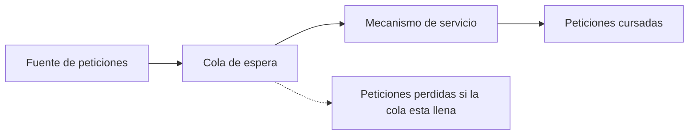
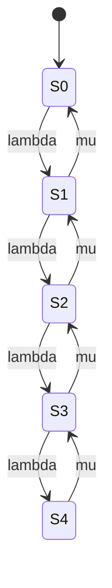

Cualquier sistema que atiende peticiones con recursos finitos se enfrenta, tarde o
temprano, a una demanda que supera momentáneamente su capacidad de respuesta. La
**teoría de colas** proporciona el marco matemático para describir esa situación,
caracterizar el comportamiento del sistema mientras dura y cuantificar el compromiso
entre el coste de los recursos que se instalan y la calidad del servicio que esos
recursos permiten ofrecer. Este capítulo introduce los elementos que componen un sistema
de colas, la notación estándar con que se clasifican y las magnitudes que resumen su
comportamiento en régimen estacionario.

## Introducción

Una **cola** es una petición de servicio que espera turno porque el recurso que debe
atenderla está ocupado en ese instante. El fenómeno aparece siempre que la demanda de un
servicio es temporalmente superior a la capacidad del proveedor para atenderla: la
petición no se pierde ni se atiende de inmediato, sino que permanece almacenada hasta
que el sistema dispone de capacidad libre. La **teoría de colas** estudia las
características de estos sistemas, analizando el reparto de unos recursos finitos entre
varios usuarios, con el objetivo de encontrar un compromiso razonable entre el coste de
dotar al sistema de recursos y el grado de satisfacción que esos recursos producen en el
usuario.

En el contexto de las telecomunicaciones, dimensionar una red consiste precisamente en
determinar qué recursos son necesarios, entendiendo por recursos tanto enlaces como
capacidad de conmutación o de procesamiento, con dos objetivos que se persiguen de forma
simultánea. El primero es reducir aquello que perjudica la calidad percibida por el
usuario: el número de comunicaciones rechazadas, los errores de comunicación y los
tiempos de espera excesivos. El segundo es de naturaleza más técnica y se resume en dos
criterios opuestos entre sí que todo dimensionado debe equilibrar: minimizar el
**retardo** que experimenta cada petición y maximizar el _throughput_ agregado que el
sistema es capaz de sostener. Estos dos criterios reaparecen en cualquier sistema que
reparte un recurso compartido entre múltiples usuarios, incluidos los protocolos de
acceso al medio por contienda, donde el mismo compromiso entre ocupación y retardo
determina el punto de carga en el que conviene operar la red.

## Concepto de cola

### Demanda temporalmente superior a la capacidad

Una cola surge cuando, en un instante dado, el número de peticiones que solicitan
servicio supera el número de peticiones que el sistema puede atender de forma
simultánea. Mientras esa situación se mantiene, las peticiones excedentes no
desaparecen: se almacenan a la espera de que el sistema libere capacidad, y solo
entonces se atienden, siguiendo un orden que determina la disciplina de servicio del
sistema. Si la demanda excesiva es solo transitoria, la cola se vacía en cuanto la
capacidad disponible vuelve a superar a la demanda. Si la demanda supera de forma
sostenida a la capacidad, la cola crece sin límite y el sistema entra en un régimen de
saturación del que no puede salir por sí mismo.

### Objetivo del dimensionado

El dimensionado de un sistema de colas busca fijar la capacidad de servicio en un punto
que equilibre dos fuerzas opuestas. Una capacidad insuficiente provoca colas largas,
retardos elevados y, en los sistemas con capacidad de almacenamiento limitada,
peticiones rechazadas. Una capacidad sobredimensionada evita esos problemas, pero a
costa de recursos que permanecen ociosos la mayor parte del tiempo, lo que penaliza el
coste del sistema sin aportar una mejora perceptible para el usuario. El dimensionado
correcto es, por tanto, el que sostiene los niveles de calidad exigidos con el menor
recurso posible, y ese cálculo es precisamente lo que las magnitudes que se desarrollan
en este capítulo permiten cuantificar.

## Estructura de un sistema de colas

Todo sistema de colas comparte la misma estructura básica con independencia del servicio
concreto que preste. Las peticiones de servicio se generan en una fuente de peticiones y
se dirigen hacia un mecanismo de servicio. Si ese mecanismo está ocupado en el instante
en que llega una petición, la petición pasa a una cola de espera, donde permanece hasta
que el mecanismo de servicio queda libre. Cuando eso ocurre, se selecciona la siguiente
petición a atender según una disciplina de cola, un conjunto de reglas que decide el
orden de atención entre las peticiones almacenadas.

### Fuente de peticiones

La **fuente de peticiones** es el conjunto de clientes o terminales que generan las
peticiones de servicio. Puede tratarse de un número reducido de fuentes conocidas o de
una población amplia que se comporta, a efectos de modelado, como si generase peticiones
de forma independiente y aleatoria. La caracterización precisa de esta fuente, en cuanto
a su tamaño y al patrón temporal con que genera peticiones, se desarrolla en la sección
siguiente.

### Cola de espera

La **cola de espera** almacena las peticiones que han llegado al sistema pero que
todavía no pueden atenderse porque el mecanismo de servicio está ocupado. Su capacidad
de almacenamiento y la disciplina con la que selecciona la siguiente petición a atender
son los dos rasgos que la definen, y ambos se detallan en la sección dedicada a su
caracterización.

### Mecanismo de servicio

El **mecanismo de servicio** es el recurso, o el conjunto de recursos, que atiende las
peticiones. Puede estar formado por un único servidor o por varios servidores que operan
en paralelo, cada uno capaz de atender una petición de forma independiente de los demás.
El tiempo que un servidor tarda en atender una petición, y la tasa a la que el conjunto
de servidores da salida a las peticiones, son las magnitudes que caracterizan este
elemento del sistema.

## Caracterización del cliente

### Población finita e infinita

El número de clientes que pueden generar peticiones sobre el sistema puede ser finito o
infinito. Una **población finita** es propia de escenarios en los que el número de
fuentes potenciales está acotado y es comparable en magnitud al número de peticiones que
el sistema puede atender a la vez, de modo que el hecho de que algunos clientes ya estén
generando una petición reduce de forma apreciable el número de clientes que todavía
pueden generar una nueva. Una **población infinita** es la hipótesis contraria, y es la
más habitual en el modelado de sistemas de telecomunicaciones porque resulta
matemáticamente más sencilla de tratar: se supone que el número de fuentes potenciales
es tan grande frente al número de peticiones simultáneas que la tasa a la que se generan
nuevas peticiones no depende del número de peticiones que ya están en curso.

### Llegadas deterministas y aleatorias

Las peticiones que llegan al sistema pueden seguir dos patrones temporales distintos.
Las **llegadas deterministas** se producen de forma periódica, con un intervalo fijo y
conocido entre una petición y la siguiente. Las **llegadas aleatorias** se generan cada
cierto tiempo, pero ese tiempo no es fijo, sino que sigue una distribución de
probabilidad. La inmensa mayoría del tráfico de telecomunicaciones se modela como
llegadas aleatorias, porque el instante en que un usuario decide iniciar una
comunicación no depende de ningún patrón periódico impuesto por el sistema.

La distribución de probabilidad más habitual para modelar tanto el tiempo entre llegadas
como el tiempo de servicio es la **distribución exponencial**, que modela intervalos
independientes entre sí y sin memoria del tiempo transcurrido desde el último evento.
Cuando el tiempo entre llegadas sigue una distribución exponencial de parámetro
$\lambda$, el número de llegadas que se producen en un intervalo de duración fija sigue
una **distribución de Poisson** de media proporcional a $\lambda$: ambas descripciones,
la del tiempo entre eventos y la del número de eventos por unidad de tiempo, son dos
caras del mismo proceso, conocido como **proceso de Poisson**, y es la hipótesis de
partida de la práctica totalidad de los modelos de colas que maneja este capítulo.

### Tiempo entre llegadas y tasa media de llegadas

Dos magnitudes describen de forma completa el patrón de llegadas bajo la hipótesis de un
proceso de Poisson. El **tiempo entre llegadas**, $1/\lambda$, es el tiempo medio que
transcurre entre dos peticiones consecutivas. La **tasa media de llegadas**, $\lambda$,
es el número medio de peticiones que llegan al sistema por unidad de tiempo, expresada
en peticiones por segundo o en la unidad de tiempo que resulte natural para el sistema
que se modela. Ambas magnitudes son inversas entre sí y describen la misma fuente desde
dos puntos de vista complementarios.

## Caracterización de la cola

### Capacidad finita e infinita

La cola de espera tiene una capacidad de almacenamiento que puede ser finita o infinita.
Una **cola de capacidad finita** solo puede almacenar un número limitado de peticiones:
cuando está llena, cualquier petición nueva que llegue se pierde, porque el sistema no
tiene dónde guardarla. Una **cola de capacidad infinita** no impone ese límite y es la
hipótesis más habitual en el modelado, tanto porque simplifica considerablemente el
análisis matemático como porque, en muchos sistemas reales, la capacidad de
almacenamiento disponible es lo bastante grande frente a la ocupación típica como para
que el límite físico rara vez se alcance.

### Número de peticiones en cola

El **número de peticiones en cola**, $Q$, es el número medio de peticiones que esperan
turno de servicio sin contar las que ya están siendo atendidas por un servidor. Esta
magnitud se refiere exclusivamente a la cola de espera, y conviene no confundirla con el
número de peticiones en el sistema, que se define más adelante y que sí incluye también
las que están en servicio.

### Tiempo de espera

El **tiempo de espera en cola**, $W$, es el tiempo medio que una petición permanece
almacenada en la cola antes de que un servidor quede libre para atenderla. Al igual que
$Q$, esta magnitud mide únicamente el tiempo que se pasa esperando, sin incluir el
tiempo que después se emplea en el propio servicio.

### Disciplinas de servicio

La **disciplina de servicio** es la regla que determina qué petición almacenada en la
cola se selecciona en cuanto un servidor queda libre. La disciplina más común, y la que
se asume por defecto salvo que se indique lo contrario, es **el primero en llegar es el
primero en ser atendido**, que selecciona siempre la petición que lleva más tiempo
esperando. Existen disciplinas alternativas, como las que asignan una prioridad distinta
a cada tipo de petición y atienden primero a las de mayor prioridad con independencia de
su orden de llegada, pero su tratamiento matemático excede el alcance de este capítulo.

## Caracterización del servicio

### Número de servidores

El **número de servidores**, $c$, es el número de recursos que pueden atender peticiones
de forma simultánea e independiente. Un sistema con $c=1$ tiene un único servidor y solo
puede atender una petición a la vez; un sistema con $c>1$ dispone de varios servidores
en paralelo, de modo que hasta $c$ peticiones pueden estar en servicio al mismo tiempo
antes de que una nueva petición tenga que esperar en cola.

### Tasa media de servicio

La **tasa media de servicio**, $\mu$, es el número medio de peticiones que un servidor
es capaz de atender por unidad de tiempo, expresada en las mismas unidades que la tasa
de llegadas $\lambda$ para que ambas puedan compararse directamente. Su inversa,
$1/\mu$, es el **tiempo medio de servicio**, el tiempo medio que un servidor emplea en
atender una petición por completo. Bajo la hipótesis habitual de tiempo de servicio
exponencial, $1/\mu$ juega para el servicio el mismo papel que $1/\lambda$ juega para
las llegadas.

### Intensidad de tráfico y utilización

La **intensidad de tráfico**, también llamada **tráfico ofrecido** y medida en
**erlangs**, se define para un sistema de un solo servidor como el cociente

$$
\rho = \frac{\lambda}{\mu}
$$

donde $\lambda$ es la tasa media de llegadas y $\mu$ la tasa media de servicio de un
único servidor. Un erlang equivale a una hora de ocupación continua de un servidor, de
modo que $\rho$ puede interpretarse como el número medio de peticiones nuevas que llegan
mientras el servidor está ocupado atendiendo una petición anterior.

Cuando el sistema dispone de $c$ servidores, la magnitud que mide su grado de ocupación
es el **factor de utilización**,

$$
\rho = \min \left\lbrack \frac{\lambda}{c\mu}, \, 1 \right\rbrack
$$

que indica la fracción media de la capacidad total de servicio, $c\mu$, que la demanda
$\lambda$ ocupa efectivamente. Si $\rho$ alcanza el valor $1$ en un sistema con cola de
capacidad infinita, el sistema deja de ser estable: la demanda iguala o supera a la
capacidad de servicio, la cola crece sin límite con el tiempo y no existe un régimen
estacionario al que el sistema pueda converger. Por esa razón, todo dimensionado con
cola infinita exige mantener $\rho$ estrictamente por debajo de $1$, y cuanto más se
aproxima $\rho$ a ese límite, mayor es el retardo que experimentan las peticiones, como
se desarrolla en la sección de magnitudes de interés.

### Notación de Kendall

La combinación de las características anteriores del cliente, de la cola y del servicio
se resume de forma compacta mediante la **notación de Kendall**, una cadena de hasta
seis campos separados por barras, $A/B/C/K/m/D$, de los que los tres primeros son
obligatorios y los tres últimos opcionales.

- **$A$**: distribución del tiempo entre llegadas.
- **$B$**: distribución del tiempo de servicio.
- **$C$**: número de servidores.
- **$K$**: capacidad total del sistema, cola más servidores. Si se omite, se asume
  infinita.
- **$m$**: tamaño de la población de clientes. Si se omite, se asume infinita.
- **$D$**: disciplina de servicio. Si se omite, se asume el primero en llegar es el
  primero en ser atendido.

Los campos $A$ y $B$ toman valores de un conjunto reducido de símbolos: `M` denota una
distribución exponencial, o markoviana por carecer de memoria; `D` denota una llegada o
un servicio deterministas, de duración fija; `G` denota una distribución general
cualquiera. Con esta notación, `M/M/1` designa el sistema con llegadas de Poisson,
servicio exponencial y un único servidor, con cola y población infinitas y disciplina
por orden de llegada, que es precisamente el modelo que se desarrolla con detalle en la
sección final de este capítulo. `M/M/c` generaliza ese mismo sistema a $c$ servidores en
paralelo, y `M/M/1/K` añade una cola de capacidad finita $K$ al modelo de un único
servidor. Estos dos últimos modelos exigen fórmulas específicas para su probabilidad de
bloqueo y su tiempo de espera, que se desarrollan en el capítulo que trata las fórmulas
de Erlang.

## Sistemas con pérdidas y sistemas con espera

Los sistemas de colas se dividen en dos grandes familias según qué ocurre con una
petición que llega cuando el sistema no tiene capacidad libre para atenderla de
inmediato. En un **sistema con espera**, la petición se almacena en una cola de
capacidad suficiente y espera turno hasta que un servidor queda libre, de modo que,
salvo por el retardo adicional, la petición siempre termina siendo atendida. En un
**sistema con pérdidas**, la petición que llega cuando todos los servidores están
ocupados, o cuando la cola ya está llena, se rechaza directamente, y esa fracción de
tráfico rechazado se pierde sin ser atendida.

Esta distinción no es una elección arbitraria de modelado, sino que responde a
diferencias reales entre servicios: un servicio de datos que tolera cierto retardo se
modela habitualmente como un sistema con espera, mientras que un servicio de voz
conmutada, en el que un intento de llamada que no encuentra un canal libre se rechaza en
lugar de esperar indefinidamente, se modela como un sistema con pérdidas. Cuantificar la
probabilidad de que una petición se rechace en un sistema con pérdidas, o el tiempo
adicional que introduce la espera en un sistema con espera de varios servidores, exige
las fórmulas de Erlang B y Erlang C, que se tratan en el capítulo dedicado
específicamente al tráfico y al dimensionado de recursos a partir de esas fórmulas. Este
capítulo se limita a establecer el marco conceptual sobre el que esas fórmulas se
apoyan, ilustrado con el caso más simple de sistema con espera: el modelo con un único
servidor.

## Magnitudes de interés

### Número medio de peticiones en el sistema

El **número medio de peticiones en el sistema**, $N$, cuenta todas las peticiones que se
encuentran en el sistema en un instante dado, tanto las que esperan en la cola como las
que están siendo atendidas por un servidor. Conviene distinguir con cuidado esta
magnitud de $Q$, definida antes como el número medio de peticiones que esperan
exclusivamente en la cola: $N$ incluye a $Q$ y añade las peticiones que ya están en
servicio, de modo que $N \geq Q$ siempre, con igualdad solo si ningún servidor está
ocupado.

### Tiempo medio de permanencia

El **tiempo medio de permanencia**, o tiempo medio de respuesta, $T$, es el tiempo medio
transcurrido desde que una petición llega al sistema hasta que su servicio se completa
por entero. Se descompone en dos términos,

$$
T = W + \frac{1}{\mu}
$$

donde $W$ es el tiempo medio de espera en cola, definido antes, y $1/\mu$ es el tiempo
medio de servicio. Igual que ocurre entre $N$ y $Q$, $T$ mide el tiempo total en el
sistema, mientras que $W$ mide únicamente el tiempo que se pasa esperando antes de
empezar a ser atendido.

### Relación entre ambas magnitudes

La **fórmula de Little** relaciona el número medio de peticiones en un sistema con el
tiempo medio que esas peticiones permanecen en él, y es válida para cualquier sistema de
colas en régimen estacionario, con independencia de la distribución concreta que sigan
las llegadas o el servicio:

$$
N = \lambda T
$$

donde $\lambda$ es la tasa media de llegadas que efectivamente entran en el sistema. La
misma relación se aplica de forma análoga a la cola de espera exclusivamente,

$$
Q = \lambda W
$$

de modo que conocer dos de las tres magnitudes de cualquiera de los dos pares, número
medio y tiempo medio, junto con la tasa de llegadas, permite obtener la tercera sin
necesidad de un modelo más detallado del sistema. Esta generalidad es la razón por la
que la fórmula de Little resulta tan útil en la práctica: no exige suponer que las
llegadas sean de Poisson ni que el servicio sea exponencial, solo que el sistema haya
alcanzado un régimen estable en el que las magnitudes medias no varíen con el tiempo.

???+ example "Retardo de un enlace a partir de su ocupación media medida"

    Un operador monitoriza el búfer de salida de una interfaz de un enrutador durante un
    periodo prolongado y observa que, en promedio, hay $N = 6$ paquetes presentes en el
    sistema, contando tanto los que esperan en el búfer como el que se está transmitiendo
    en cada instante. La interfaz cursa una tasa media de $\lambda = 500$ paquetes por
    segundo. Se pide el retardo medio que experimenta un paquete al atravesar esa
    interfaz.

    Por la fórmula de Little, el retardo medio es directamente
    $T = N/\lambda = 6/500 = 0{,}012$ s, es decir, $12$ ms. El cálculo no exige conocer
    ni la distribución de los tiempos entre llegadas ni la del tiempo de transmisión de
    cada paquete: basta con la ocupación media observada y la tasa de paquetes cursados,
    lo que hace de esta relación una herramienta habitual para inferir retardos a partir
    de medidas de ocupación cuando el modelo interno del sistema no se conoce con
    detalle.

El caso particular más simple de sistema con espera, y el único que este capítulo
desarrolla con sus fórmulas completas, es el modelo `M/M/1`: llegadas de Poisson de tasa
$\lambda$, un único servidor con tiempo de servicio exponencial de tasa $\mu$, cola de
capacidad infinita y disciplina por orden de llegada. Con la intensidad de tráfico $\rho
= \lambda/\mu$ estrictamente menor que $1$, el sistema alcanza un régimen estacionario
en el que el número de peticiones en el sistema sigue una distribución geométrica,

$$
P_n = (1-\rho)\,\rho^n
$$

donde $P_n$ es la probabilidad de que haya exactamente $n$ peticiones en el sistema, y
en particular $P_0 = 1-\rho$ es la probabilidad de que el sistema esté vacío. A partir
de esa distribución se obtienen las cuatro magnitudes que resumen el comportamiento del
sistema `M/M/1`:

$$
N = \frac{\rho}{1-\rho}
$$

$$
Q = N - \rho = \frac{\rho^2}{1-\rho}
$$

$$
T = \frac{1}{\mu(1-\rho)}
$$

$$
W = \frac{\rho}{\mu(1-\rho)}
$$

En todas ellas, $\rho$ es la intensidad de tráfico definida antes, $\mu$ es la tasa
media de servicio y las cuatro magnitudes son consistentes con la fórmula de Little y
con la descomposición $T = W + 1/\mu$: puede comprobarse que $N = \lambda T$ y $Q =
\lambda W$ se cumplen de forma exacta al sustituir $\rho = \lambda/\mu$ en cualquiera de
las cuatro expresiones.

El diagrama anterior representa la cadena de Markov subyacente al modelo `M/M/1`: cada
estado $S_n$ corresponde a tener exactamente $n$ peticiones en el sistema, las
transiciones hacia la derecha se producen con tasa $\lambda$ cuando llega una nueva
petición y las transiciones hacia la izquierda se producen con tasa $\mu$ cuando el
servidor completa una atención. Es una cadena de nacimiento y muerte en la que cada
estado solo se comunica con sus vecinos inmediatos, y es precisamente esa estructura la
que permite resolver la distribución estacionaria $P_n$ de forma cerrada.

???+ example "Ocupación y retardo de una interfaz de enrutador modelada como M/M/1"

    Una interfaz de un enrutador recibe paquetes según un proceso de Poisson de tasa
    $\lambda = 800$ paquetes por segundo, y los transmite con un tiempo de servicio
    exponencial de media $1/\mu = 1$ ms, es decir, $\mu = 1000$ paquetes por segundo. Se
    pide el factor de utilización de la interfaz, el número medio de paquetes en el
    sistema, el número medio de paquetes en la cola exclusivamente y el retardo medio
    total.

    La intensidad de tráfico es $\rho = \lambda/\mu = 800/1000 = 0{,}8$, un $80\,\%$ de
    ocupación. El número medio de paquetes en el sistema es
    $N = \rho/(1-\rho) = 0{,}8/0{,}2 = 4$ paquetes, de los cuales
    $Q = \rho^2/(1-\rho) = 0{,}64/0{,}2 = 3{,}2$ paquetes esperan en la cola sin estar
    todavía en transmisión. El retardo medio total es
    $T = 1/(\mu(1-\rho)) = 1/(1000 \cdot 0{,}2) = 0{,}005$ s, es decir, $5$ ms, de los
    cuales $W = \rho/(\mu(1-\rho)) = 0{,}8/(1000 \cdot 0{,}2) = 0{,}004$ s, o $4$ ms, se
    emplean esperando y el $1$ ms restante corresponde al tiempo de transmisión del
    propio paquete, de acuerdo con $T = W + 1/\mu$.

???+ example "Divergencia del retardo al aproximarse la utilización a la unidad"

    Sobre la misma interfaz del ejemplo anterior, con $\mu = 1000$ paquetes por segundo
    fijo, se pide comparar el retardo medio total $T$ para distintos valores del factor
    de utilización $\rho$, sin variar la capacidad de servicio.

    | Utilización $\rho$ | Retardo medio $T = 1/(\mu(1-\rho))$ |
    | ------------------- | ------------------------------------ |
    | $0{,}5$              | $2$ ms                                |
    | $0{,}8$              | $5$ ms                                |
    | $0{,}9$              | $10$ ms                               |
    | $0{,}95$             | $20$ ms                               |
    | $0{,}99$             | $100$ ms                              |

    El retardo crece de forma muy poco lineal con la utilización: duplicar $\rho$ de
    $0{,}5$ a $0{,}99$ no duplica el retardo, sino que lo multiplica por cincuenta,
    porque el factor $1/(1-\rho)$ tiende a infinito cuando $\rho$ tiende a $1$. Esta
    divergencia es la razón estructural por la que ningún dimensionado con cola de
    capacidad infinita opera cerca de la saturación: un margen de capacidad que parece
    modesto en términos de ocupación evita un crecimiento del retardo que, de otro modo,
    no tiene cota superior. El mismo fenómeno cualitativo, un rendimiento que se
    desploma al aproximarse la carga a la capacidad máxima del sistema, aparece también
    en los protocolos de acceso al medio por contienda, donde superar la carga ofrecida
    óptima colapsa el
    [_throughput_ del canal](../../01_fundamentos/04_acceso_al_medio/section_2_acceso_multiple.md)
    en lugar de limitarse a aumentar el retardo.

El dimensionado de recursos concretos a partir de estas magnitudes, mediante los modelos
con pérdidas y sus fórmulas asociadas, se trata con detalle en la sección dedicada
específicamente a ese problema.
