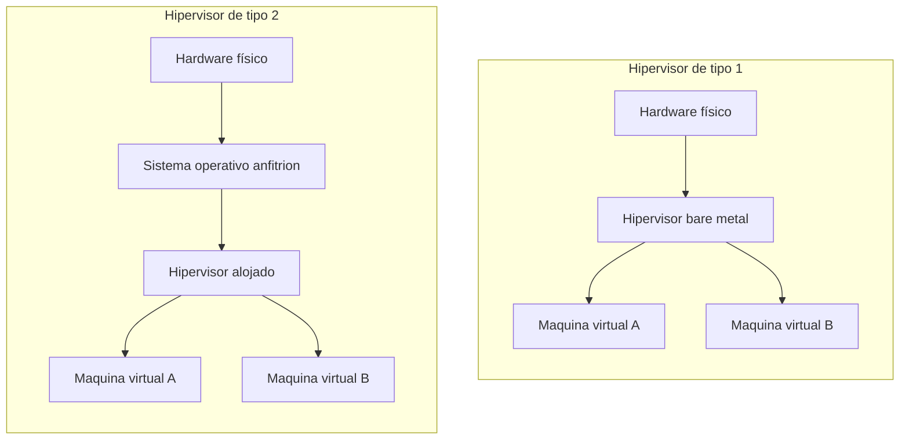
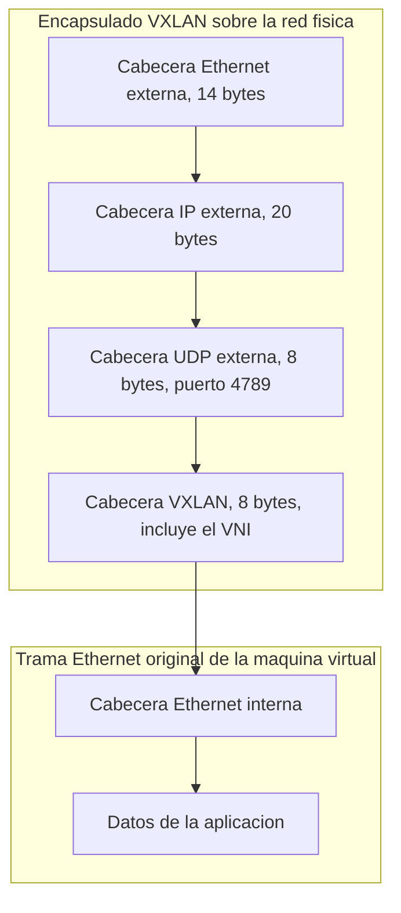
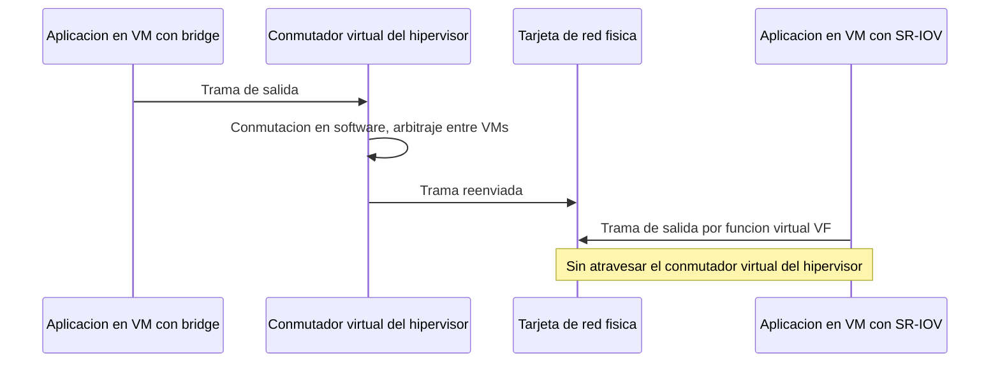

Esta área trata la separación entre las funciones de una red de telecomunicación y el
hardware dedicado que tradicionalmente las ejecutaba, desde la máquina virtual hasta la
función de red completamente virtualizada. Este primer capítulo fija el vocabulario y la
taxonomía que el resto del área reutiliza: los tipos de virtualización de cómputo, la
virtualización de almacenamiento y de red que los sostiene, y el coste de rendimiento
que cada opción introduce frente al acceso directo al hardware físico.

## Introducción

Una red de operador tradicional despliega cada función, un enrutador, un cortafuegos, un
servidor de aplicaciones, sobre un equipo físico dedicado a esa función y a ninguna
otra. Ese modelo liga la vida de la función a la vida del equipo que la sostiene: para
añadir capacidad hace falta comprar e instalar hardware nuevo, y un equipo que solo
utiliza una fracción de su capacidad de cómputo no puede prestar esa capacidad ociosa a
ninguna otra función, porque el propio hardware es la unidad de despliegue. La
**virtualización** rompe esa dependencia al introducir una capa de software entre las
funciones y el hardware físico, de modo que la unidad de despliegue pasa a ser una
máquina virtual, un contenedor o una función de red virtualizada, y el hardware físico
subyacente se convierte en un recurso compartido que varias de esas unidades consumen al
mismo tiempo.

Esa separación entre función y hardware es la que sostiene tres ventajas que motivan la
adopción de la virtualización en una red de operador. La **consolidación de servidores**
reduce el número de equipos físicos que hay que mantener, porque varias funciones que
antes exigían un equipo dedicado cada una pasan a compartir la capacidad de cómputo de
un número menor de servidores físicos, con la eficiencia de uso de recursos que ese
reparto conlleva. La **elasticidad** permite ajustar la capacidad asignada a una función
a medida que cambia su demanda, añadiendo o retirando recursos virtuales sin la
operación física de instalar o desmontar un equipo, y sin el sobredimensionado
permanente que exigiría reservar de antemano la capacidad física para el peor caso de
demanda previsto. La **portabilidad** de una función que ya no está atada a un equipo
concreto permite trasladarla, clonarla o restaurarla sobre cualquier hardware físico
compatible con la capa de virtualización, lo que sostiene además la recuperación ante
fallos y las migraciones entre centros de datos sin interrumpir el servicio.

???+ example "Migración de una organización con varios servidores infrautilizados"

    Una organización mantiene varios servidores físicos, cada uno dedicado a un único
    servicio, y observa que ninguno de ellos agota su capacidad de cómputo salvo en
    picos ocasionales. Se pide valorar si una migración hacia servicios virtualizados
    reduce el número de servidores físicos que la organización necesita mantener y por
    qué.

    La migración sí reduce el número de servidores físicos, porque al virtualizar los
    servicios es posible asignar de forma más eficiente los recursos disponibles: varios
    servicios que antes exigían un equipo dedicado cada uno pasan a convivir como
    máquinas virtuales o contenedores sobre un número menor de servidores físicos, cuya
    capacidad de cómputo se reparte entre ellos en lugar de permanecer ociosa en cada
    equipo por separado. Los recursos físicos que quedan libres tras la consolidación no
    tienen por qué eliminarse de la infraestructura: pueden reservarse para redundancia,
    para formar clústeres de alta disponibilidad o para absorber picos de demanda
    futuros, de modo que la reducción de servidores no implica necesariamente una
    reducción del gasto total en infraestructura, sino una redistribución de esa
    infraestructura hacia un uso más eficiente.

El resto de este capítulo desarrolla esa separación entre función y hardware en cinco
niveles progresivos: los tres tipos de virtualización de cómputo (completa,
paravirtualización y ligera), la virtualización asistida por hardware que reduce el
coste de la primera, la virtualización del almacenamiento y de la red que rodea a una
máquina virtual, y las herramientas de simulación y emulación que comparten buena parte
de este mismo vocabulario sin llegar a desplegar un servicio real.

## Virtualización completa

La **virtualización completa** instala un sistema operativo sobre hardware real y
ejecuta, por encima de ese sistema operativo, un **hipervisor** que virtualiza los
recursos de cómputo, memoria y entrada y salida para que varias aplicaciones aisladas
entre sí, empaquetadas como máquinas virtuales completas, se ejecuten de forma
independiente unas de otras sin ser conscientes de que comparten el mismo hardware
físico. El hipervisor actúa como supervisor, aislante y controlador de esas máquinas
virtuales: cada una ejecuta su propio sistema operativo, sin modificar, exactamente como
lo haría sobre hardware físico dedicado, porque el hipervisor le presenta una
interpretación completa del hardware que ese sistema operativo espera encontrar. Esa es
la propiedad que da nombre a la virtualización completa, frente a la paravirtualización
que se describe en el apartado siguiente: el sistema operativo invitado no necesita
saber que está virtualizado.

### Hipervisor y sistema operativo invitado

El hipervisor se presenta ante cada máquina virtual como un contenedor que aloja un
sistema operativo propio de esa máquina, denominado sistema operativo **invitado**, que
convive con el sistema operativo **anfitrión** sobre el que se instaló el hipervisor o,
en los hipervisores que se instalan directamente sobre el hardware, sin ningún sistema
operativo anfitrión intermedio. Para que las aplicaciones lleguen a ejecutarse dentro de
un hipervisor hace falta, en cualquier caso, un sistema operativo base que las sostenga,
sea el anfitrión que aloja al hipervisor o el propio hipervisor cuando asume él mismo
esa función.

### Hipervisores de tipo 1 y de tipo 2

Los hipervisores se clasifican en dos familias según qué se ejecuta directamente sobre
el hardware físico. Un **hipervisor de tipo 1**, también llamado de metal desnudo (_bare
metal_), se instala directamente sobre el hardware físico y asume él mismo las funciones
básicas de un sistema operativo, sin ningún sistema operativo anfitrión intermedio entre
el hardware y el hipervisor. `VMware ESXi`, `Xen` y `Hyper-V` en su modo de servidor son
ejemplos de esta familia, y es la que domina en los centros de datos de un operador,
porque elimina la capa de sistema operativo anfitrión y con ella la sobrecarga de
planificación y de gestión de memoria que esa capa introduciría antes de llegar al
hipervisor. Un **hipervisor de tipo 2** se instala como una aplicación más sobre un
sistema operativo anfitrión ya en funcionamiento, y delega en ese anfitrión el acceso
final al hardware físico. `VirtualBox` o `VMware Workstation` ejecutándose sobre un
sistema operativo de escritorio son ejemplos de esta segunda familia: si el equipo tiene
instalado un sistema operativo Windows como anfitrión y se utiliza `VirtualBox` para
ejecutar una máquina virtual con Linux, todos los cambios y configuraciones que se
realizan dentro de esa máquina virtual persisten sobre el sistema operativo anfitrión
Windows, del que el hipervisor de tipo 2 depende para cualquier acceso al hardware.



La diferencia entre ambas familias no es solo estructural: cada capa adicional que
atraviesa una operación de entrada y salida antes de llegar al hardware físico añade una
latencia y un consumo de cómputo propios de esa capa, de modo que un hipervisor de tipo
2 parte con una sobrecarga mayor que uno de tipo 1 para la misma operación, precisamente
porque debe atravesar además la pila de entrada y salida del sistema operativo
anfitrión. El apartado dedicado al coste de rendimiento, más adelante en este capítulo,
retoma esta diferencia con el detalle de las técnicas que la mitigan.

### Persistencia y portabilidad de las máquinas virtuales

Salvo en configuraciones específicas que descartan explícitamente los cambios al apagar
la máquina virtual, todo lo que se instala o modifica dentro de una máquina virtual
persiste de la misma forma en que persistiría en un equipo físico, almacenado en el
disco virtual que el hipervisor le asigna sobre el almacenamiento del sistema anfitrión.
Esa persistencia sostiene, a su vez, la portabilidad que distingue a la virtualización
completa: una máquina virtual puede clonarse para desplegar varias copias idénticas,
exportarse a un formato que otro programa de virtualización distinto pueda importar, o
migrarse en caliente hacia otro hipervisor sin detener el servicio que presta, porque
toda su configuración y todo su estado quedan encapsulados en ficheros que no dependen
del hardware físico concreto sobre el que se ejecutaba originalmente.

### Ventajas para la virtualización de servicios

La virtualización completa admite incorporar periféricos físicos concretos, como
unidades de procesamiento gráfico o tarjetas de red adicionales, a una máquina virtual
determinada, lo que la hace especialmente adecuada para virtualizar servicios que deben
permanecer accesibles desde el exterior de la organización, como un servidor de correo o
un servidor `DHCP`, sin renunciar a las prestaciones de un periférico dedicado cuando el
servicio lo necesita. Frente al despliegue sobre hardware dedicado, esta forma de
virtualización aporta además la posibilidad de mantener tecnologías heredadas que
dependen de un sistema operativo concreto sin necesidad de actualizar el servicio
completo, junto con las ventajas de seguridad y de escalabilidad que se derivan del
aislamiento entre máquinas virtuales y de la posibilidad de ajustar en caliente los
recursos que cada una recibe.

## Paravirtualización

En la **paravirtualización**, el hipervisor y un sistema operativo que se ejecuta sobre
él siguen presentes, igual que en la virtualización completa, pero el sistema operativo
invitado se diseña de forma consciente para ejecutarse en un entorno virtualizado, en
lugar de esperar encontrarse sobre hardware físico dedicado sin saberlo.

### Sistema operativo consciente del entorno virtual

Un sistema operativo paravirtualizado incluye modificaciones, generalmente en sus
controladores de dispositivo, que reconocen explícitamente que se ejecutan bajo un
hipervisor y que cooperan con él en lugar de asumir que tienen acceso exclusivo al
hardware. Esa cooperación explícita evita al hipervisor una parte del trabajo de
interceptar y traducir instrucciones privilegiadas que sí necesita realizar frente a un
sistema operativo sin modificar, porque el propio sistema operativo invitado invoca al
hipervisor mediante llamadas específicas en los puntos donde antes se limitaría a
acceder al hardware directamente.

### Acceso directo al hardware

Esa cooperación permite que las aplicaciones que se ejecutan sobre el sistema operativo
paravirtualizado obtengan un acceso más directo al hardware real que el que lograría un
sistema operativo sin modificar bajo virtualización completa, propiedad que se conoce
como virtualización de metal desnudo (_bare metal_) del sistema operativo invitado. Un
caso habitual de esta cooperación aparece en los adaptadores de red virtuales: un
adaptador emulado que reproduce fielmente el comportamiento de una tarjeta de red física
concreta es compatible con cualquier sistema operativo invitado sin modificar, pero
introduce la sobrecarga de traducir cada operación al protocolo de esa tarjeta emulada,
y no siempre admite tramas de gran tamaño (tramas jumbo, mayores de 1500 bytes) en su
emulación. Un adaptador de tipo `virtio-net`, en cambio, expone directamente al sistema
operativo invitado una interfaz diseñada para la virtualización, sin imitar ninguna
tarjeta física concreta, y con ello ofrece un mayor rendimiento a cambio de exigir un
controlador consciente de la virtualización dentro del invitado: exactamente el
compromiso que define a la paravirtualización.

???+ example "Elección entre un adaptador de red emulado y uno paravirtualizado"

    Una máquina virtual necesita conectividad de red y el administrador debe decidir
    entre asignarle un adaptador que emula fielmente una tarjeta de red física conocida
    o un adaptador de tipo `virtio-net`. Se pide razonar en qué situación conviene cada
    opción.

    El adaptador emulado conviene cuando el sistema operativo invitado es antiguo o no
    dispone de un controlador para el adaptador paravirtualizado, porque el sistema
    operativo lo reconoce sin ninguna modificación, al precio de una sobrecarga mayor en
    cada operación de entrada y salida de red y de no admitir, en muchas
    implementaciones, tramas jumbo. El adaptador `virtio-net` conviene cuando el sistema
    operativo invitado incluye o admite instalar el controlador correspondiente, porque
    evita gran parte de la traducción que exige emular una tarjeta física completa y
    ofrece un mayor rendimiento de red a la máquina virtual. La decisión, en definitiva,
    enfrenta la compatibilidad universal del adaptador emulado frente al mejor
    rendimiento del adaptador consciente de la virtualización, y es la misma tensión que
    separa, en general, a la virtualización completa de la paravirtualización.

## Virtualización ligera

La **virtualización ligera** introduce los contenedores como unidad de despliegue, en
lugar de la máquina virtual completa que emplean la virtualización completa y la
paravirtualización.

### Contenedores y aislamiento

Un **contenedor** es un entorno aislado dentro de un único sistema operativo que permite
que varias aplicaciones se ejecuten de forma independiente entre sí sin necesidad de que
cada una disponga de su propio sistema operativo invitado. Cada contenedor mantiene su
propio espacio de nombres de procesos, de sistema de ficheros y de red, de modo que, por
ejemplo, dos contenedores distintos pueden utilizar el mismo número de puerto sin
interferir entre sí, porque ese puerto pertenece al espacio de nombres de red de cada
contenedor y no al del sistema operativo anfitrión que los sostiene a ambos. A
diferencia de la virtualización completa y de la paravirtualización, la virtualización
ligera no emplea ningún hipervisor: el aislamiento entre contenedores lo proporciona
directamente el núcleo del sistema operativo anfitrión, compartido por todos los
contenedores que se ejecutan sobre él. En general, cada contenedor ejecuta una sola
aplicación, lo que sostiene un nivel de seguridad razonable, aunque no tan elevado como
el de una máquina virtual completa, precisamente porque un contenedor comparte el núcleo
del sistema operativo anfitrión con el resto de contenedores, mientras que una máquina
virtual no comparte ni siquiera el núcleo con el hipervisor que la aloja.

### Comparación con la máquina virtual

Al no necesitar arrancar un sistema operativo invitado completo, un contenedor se crea y
se destruye en una fracción del tiempo que exige una máquina virtual, y consume una
fracción de sus recursos de cómputo, memoria y almacenamiento, porque no reserva
capacidad para un núcleo ni para los servicios de un sistema operativo que ya está
presente, compartido, en el anfitrión. Esa rapidez de creación es la que sostiene el
despliegue de servicios a demanda característico de los entornos de contenedores: un
nuevo contenedor puede desplegarse en el tiempo que tarda en iniciarse su aplicación,
sin la fase de arranque de un sistema operativo completo. El desarrollo de un servicio
sobre esta base, junto con las herramientas concretas de construcción, despliegue y
orquestación de contenedores, se retoma en el
[capítulo siguiente](./section_2_contenedores_y_orquestacion.md) de este mismo tema, que
es el capítulo propietario de todo lo relativo a contenedores, a sus imágenes y a su
orquestación en clúster.

### Índice de consolidación

El **índice de consolidación** de una plataforma de virtualización es el número de
máquinas virtuales, o de contenedores, que caben simultáneamente sobre un mismo gestor
de virtualización con los recursos físicos disponibles. Un índice de consolidación más
alto reduce el número de servidores físicos necesarios para sostener una carga de
trabajo dada, en la misma línea que la consolidación de servidores presentada en la
introducción de este capítulo, y la virtualización ligera alcanza índices de
consolidación mayores que la virtualización completa precisamente porque cada contenedor
adicional no arrastra el coste de un sistema operativo invitado propio.

## Simulación y emulación de redes

Junto a los tres tipos de virtualización de cómputo, el diseño y la validación de una
red de telecomunicación emplean con frecuencia herramientas de simulación y de emulación
que comparten el vocabulario de la virtualización sin desplegar necesariamente un
servicio real.

### Simuladores

Un **simulador** reproduce el comportamiento lógico de una red o de un protocolo
mediante un modelo software del propio dispositivo, sin ejecutar el firmware real que
ese dispositivo utilizaría en producción. `Packet Tracer` es un ejemplo de esta
categoría: permite construir una topología de red y comprobar cómo se comportarían sus
protocolos, pero los dispositivos que aparecen en la topología son una representación
simplificada, no una réplica funcional del sistema operativo de red real.

### Emuladores

Un **emulador**, en cambio, ejecuta el firmware real del dispositivo que se desea
emular, lo que permite construir una infraestructura de prueba que después puede
trasladarse a un entorno de producción con un comportamiento equivalente al que se
validó en la emulación. `GNS3` es un emulador de este tipo: cada dispositivo emulado
ejecuta la imagen de firmware real de un enrutador o de un conmutador, en lugar de un
modelo simplificado de su comportamiento.

### Dispositivos emulados sobre máquinas virtuales

En `GNS3`, cada dispositivo emulado se aloja dentro de una máquina virtual, y esas
máquinas virtuales se ejecutan a su vez sobre un hipervisor del propio sistema operativo
del usuario, lo que compone una estructura de virtualización anidada: un hipervisor de
tipo 1 o de tipo 2 aloja las máquinas virtuales que sostienen a `GNS3`, y dentro de cada
una de esas máquinas virtuales `GNS3` ejecuta, a su vez, el firmware de un dispositivo
de red distinto. Cada máquina virtual necesaria para un dispositivo concreto se obtiene
a través de lo que la propia herramienta denomina un complemento (_appliance_), que se
importa y se asocia al proyecto de emulación en el que va a utilizarse.

???+ example "Virtualización anidada en un entorno de emulación de red"

    Un proyecto de emulación de red construye una topología con varios enrutadores y
    conmutadores mediante un emulador que ejecuta firmware real, y ese emulador se
    ejecuta a su vez sobre el sistema operativo de un equipo de laboratorio. Se pide
    describir cuántas capas de virtualización atraviesa una trama que circula entre dos
    de los dispositivos emulados.

    La trama atraviesa, como mínimo, dos capas de virtualización distintas. La primera
    capa es la del hipervisor del equipo de laboratorio, que aloja una máquina virtual
    independiente para cada dispositivo emulado y que virtualiza, entre otros recursos,
    la interconexión de red entre esas máquinas virtuales. La segunda capa es la del
    propio emulador, que dentro de cada máquina virtual ejecuta el firmware real de un
    enrutador o de un conmutador y presenta sus interfaces de red como si fueran las de
    un dispositivo físico independiente. Una trama que viaja entre dos dispositivos
    emulados recorre, por tanto, la interconexión virtual que gestiona el hipervisor y,
    dentro de cada máquina virtual visitada, el propio firmware emulado que procesa esa
    trama como lo haría el dispositivo real que reproduce.

## Virtualización asistida por hardware

Ejecutar una máquina virtual mediante virtualización completa exige que el hipervisor
intercepte y traduzca las instrucciones privilegiadas que el sistema operativo invitado
intenta ejecutar directamente sobre el procesador, porque ese sistema operativo no es
consciente de estar virtualizado y espera comportarse como si tuviera acceso exclusivo
al procesador físico. Los primeros hipervisores de virtualización completa resolvían esa
interceptación mediante traducción binaria, reescribiendo en tiempo de ejecución las
instrucciones privilegiadas del sistema operativo invitado por una secuencia de
instrucciones equivalente que sí podía ejecutarse de forma segura, con el coste de
cómputo que esa reescritura añade a cada instrucción interceptada.

Los fabricantes de procesadores introdujeron extensiones de conjunto de instrucciones
diseñadas específicamente para eliminar ese coste: `Intel VT-x` y `AMD-V` añaden un modo
de ejecución adicional del procesador, en el que las instrucciones privilegiadas del
sistema operativo invitado provocan una transición controlada por hardware hacia el
hipervisor, en lugar de exigir que el hipervisor las intercepte y las traduzca por
software. Esa transición gestionada directamente por el procesador es sustancialmente
más rápida que la traducción binaria por software, y es la razón por la que la
virtualización completa moderna se apoya en estas extensiones en lugar de en las
técnicas de traducción binaria de sus primeras implementaciones. `Intel VT-d` y `AMD-Vi`
extienden esta misma idea a las operaciones de entrada y salida, mediante una unidad de
gestión de memoria de entrada y salida (`IOMMU`) que permite asignar un dispositivo
físico directamente a una máquina virtual, con el aislamiento de memoria que ese acceso
directo exige y que se retoma en el apartado dedicado al coste de rendimiento.

La paravirtualización y la virtualización ligera no eliminan la necesidad de estas
extensiones de la misma forma: la paravirtualización sigue apoyándose en un hipervisor
que gestiona instrucciones privilegiadas, aunque con menos frecuencia gracias a la
cooperación del sistema operativo invitado, mientras que la virtualización ligera, al no
virtualizar el conjunto de instrucciones del procesador ni ejecutar un núcleo distinto
por contenedor, no depende de estas extensiones para el aislamiento entre contenedores.

## Virtualización de almacenamiento y de red

Una máquina virtual o un contenedor no solo necesitan cómputo virtualizado: necesitan
también un disco y una conexión de red que se comporten como los de un equipo físico sin
estar atados a un disco ni a una tarjeta de red física exclusivos.

### Almacenamiento virtual y persistencia

El **disco virtual** que el hipervisor presenta a una máquina virtual es, en la
práctica, un fichero o un conjunto de ficheros almacenados sobre el sistema de
almacenamiento del anfitrión, que el sistema operativo invitado percibe como si fuera
una unidad de disco física independiente. Separar, dentro de ese almacenamiento virtual,
el disco que contiene el sistema operativo y las aplicaciones del disco que contiene los
datos persistentes del servicio, bien mediante dos discos virtuales distintos, bien
mediante particiones dentro de un único disco, facilita sustituir o restaurar el primero
sin arrastrar ni perder el segundo. La persistencia de ese almacenamiento no está
garantizada por defecto en todos los entornos de virtualización: en los contenedores, en
particular, los cambios realizados dentro del sistema de ficheros del contenedor pueden
perderse al detenerlo o al eliminarlo, salvo que se le asocie explícitamente un volumen
de almacenamiento persistente en el anfitrión, independiente del ciclo de vida del
propio contenedor. Esa garantía de persistencia resulta imprescindible para cualquier
servicio que mantenga un estado, como una base de datos, y su ausencia es una de las
diferencias prácticas más relevantes entre desplegar un servicio con estado sobre una
máquina virtual completa o sobre un contenedor efímero.

### Configuración de red de las máquinas virtuales

Cada adaptador de red virtual que recibe una máquina virtual se conecta a uno de varios
modos de red que el hipervisor ofrece, y la elección entre ellos determina con qué otros
equipos, virtuales o físicos, puede comunicarse esa máquina virtual. En el modo de
traducción de direcciones (`NAT`), la máquina virtual obtiene acceso a redes externas a
través de una traducción de direcciones que gestiona el propio hipervisor, sin que
equipos externos puedan iniciar una conexión directa hacia ella salvo que se configure
explícitamente una redirección de puertos hacia un puerto concreto de la máquina
virtual. En el modo puente (`bridge mode`), el adaptador virtual se conecta directamente
a una de las tarjetas de red físicas del equipo anfitrión, como si fuera otro
dispositivo más de la red física a la que ese anfitrión está conectado, lo que exige que
la máquina virtual disponga de su propia dirección IP dentro de esa misma red física, en
el mismo segmento que el equipo anfitrión. En el modo de red interna, varias máquinas
virtuales configuradas con ese modo forman una red virtual aislada entre ellas, sin
conectividad ni con el equipo anfitrión ni con ninguna red externa a esa red interna, lo
que la hace adecuada para reproducir en laboratorio una red que debe quedar
completamente separada de la infraestructura del anfitrión. En el modo de adaptador sólo
anfitrión, la máquina virtual se conecta a una red virtual que sí incluye al propio
equipo anfitrión, que recibe una dirección IP dentro de esa misma red virtual y puede
comunicarse con todas las máquinas virtuales configuradas con este modo.

???+ example "Identificador de VLAN entre una máquina virtual en modo puente"

    Una máquina virtual se configura en modo puente, conectada directamente a la
    interfaz de red física del equipo anfitrión. Se pide valorar si estaría justificado
    asignar a esa máquina virtual un identificador de `VLAN` distinto del que utiliza el
    equipo anfitrión en esa misma interfaz física.

    No estaría justificado. En el modo puente, la máquina virtual comparte la misma
    interfaz de red física que el anfitrión y, por tanto, el mismo dominio de conmutación
    en el que esa interfaz se encuentra conectada: asignarle un identificador de `VLAN`
    distinto rompería precisamente el objetivo del aislamiento de tráfico y de la
    organización lógica que las redes de área local virtuales persiguen, descritas con
    detalle en el capítulo de
    [conmutación y Ethernet](../../02_redes/03_conmutacion_y_lan/section_1_conmutacion_y_ethernet.md#redes-de-area-local-virtuales),
    porque introduciría una inconsistencia entre la segmentación lógica que el
    conmutador físico espera aplicar a esa interfaz y la que la máquina virtual declara
    utilizar. La coherencia entre ambos identificadores es, en la práctica, una condición
    de seguridad y de orden en el diseño de la red, no solo una convención administrativa.

La conmutación entre las máquinas virtuales de un mismo hipervisor, en cualquiera de los
modos anteriores salvo el modo puente, no ocurre sobre un conmutador físico externo,
sino sobre un **conmutador virtual** (_vSwitch_) que el propio hipervisor implementa en
software, y que reenvía las tramas entre las máquinas virtuales conectadas a él con la
misma lógica de aprendizaje de direcciones que un conmutador físico, descrita en el
capítulo de
[conmutación y Ethernet](../../02_redes/03_conmutacion_y_lan/section_1_conmutacion_y_ethernet.md#conmutadores).
Ese conmutador virtual puede, a su vez, etiquetar el tráfico de cada máquina virtual con
un identificador de `VLAN` concreto y presentar hacia la red física un enlace troncal
que agrupe el tráfico de varias `VLAN`, con el mismo mecanismo de etiquetado descrito en
ese mismo capítulo, aplicado ahora dentro del propio hipervisor en lugar de sobre un
conmutador físico dedicado.

Cuando la red que interconecta a las máquinas virtuales debe extenderse más allá de los
límites de una única red física, por ejemplo entre servidores situados en centros de
datos distintos, el límite de identificadores que impone `802.1Q`, ya descrito en
[redes de área local virtuales](../../02_redes/03_conmutacion_y_lan/section_1_conmutacion_y_ethernet.md#redes-de-area-local-virtuales),
y la propia topología de la red física subyacente resultan insuficientes: una `VLAN` no
atraviesa routers de forma transparente. La **extensión de red virtual mediante LAN**, o
`VXLAN`, resuelve ambas limitaciones encapsulando la trama Ethernet completa de una
máquina virtual, con su propio identificador de `VLAN` si lo tuviera, dentro de un
datagrama `UDP` que viaja sobre la red `IP` física, de modo que dos máquinas virtuales
que pertenecen a la misma red superpuesta (_overlay_) se comunican como si compartieran
un mismo segmento Ethernet aunque la red física subyacente (_underlay_) que las conecta
sea una red `IP` enrutada de alcance arbitrario. Cada red superpuesta `VXLAN` se
identifica mediante un identificador de red virtual (`VNI`) de 24 bits, lo que permite
distinguir hasta 16 777 216 segmentos distintos, muy por encima de los 4094 que admite
una `VLAN` sola.



El encapsulado `VXLAN` añade, por tanto, 50 bytes de sobrecarga (_overhead_) a cada
trama original: 14 bytes de la cabecera Ethernet externa, 20 bytes de la cabecera `IP`
externa, 8 bytes de la cabecera `UDP` externa y 8 bytes de la propia cabecera `VXLAN`,
que transporta el `VNI` y un campo de indicadores. El puerto `UDP` de destino reservado
para este encapsulado es el `4789`. Esa sobrecarga no es gratuita frente a una `VLAN`
convencional, que no añade ninguna cabecera adicional más allá de los 4 bytes de la
propia etiqueta `802.1Q`: una red superpuesta `VXLAN` cambia alcance y escala por un
coste de cabecera mayor, una relación que el siguiente apartado analiza junto con el
resto de costes de rendimiento de la virtualización.

???+ example "Ajuste de la MTU efectiva ante una red superpuesta VXLAN"

    Una red física entre dos servidores admite una unidad máxima de transmisión (`MTU`)
    de 1500 bytes, el valor habitual de una red Ethernet sin tramas jumbo. Sobre esa red
    física se despliega una red superpuesta `VXLAN` que interconecta máquinas virtuales
    situadas en ambos servidores. Se pide calcular la `MTU` efectiva que le queda
    disponible a la trama Ethernet interna de una máquina virtual, y explicar por qué
    ese cálculo importa en el despliegue.

    La `MTU` efectiva se obtiene restando a la `MTU` física la sobrecarga que introduce
    el encapsulado `VXLAN`, de 50 bytes según la composición de cabeceras descrita en
    este mismo apartado.

    ```python linenums="1"
    def calcular_mtu_efectiva(mtu_fisica: int, overhead_encapsulado: int) -> int:
        """Calcula la MTU disponible para la trama interna tras encapsular.

        Args:
            mtu_fisica: MTU de la red fisica subyacente, en bytes.
            overhead_encapsulado: Bytes que anade la cabecera de encapsulado.

        Returns:
            MTU efectiva disponible para la trama Ethernet interna, en bytes.
        """
        return mtu_fisica - overhead_encapsulado

    # Cabecera VXLAN: Ethernet externa (14) + IP externa (20) + UDP (8) + VXLAN (8)
    overhead_vxlan = 14 + 20 + 8 + 8
    mtu_interna = calcular_mtu_efectiva(1500, overhead_vxlan)
    print(mtu_interna)
    ```

    ```plaintext title="Expected output"
    1450
    ```

    El resultado, 1450 bytes, importa porque si la máquina virtual sigue anunciando una
    `MTU` de 1500 bytes sin ser consciente del encapsulado que la envuelve, cualquier
    trama que se aproxime a ese tamaño excede la `MTU` física una vez añadida la
    cabecera `VXLAN`, lo que obliga a fragmentar el datagrama `IP` externo o provoca su
    descarte si la fragmentación está deshabilitada. Las dos soluciones habituales son
    reducir la `MTU` que se anuncia dentro de la red superpuesta a 1450 bytes, o aumentar
    la `MTU` de la red física subyacente por encima de 1500 bytes mediante tramas jumbo,
    de modo que siga sobrando margen para la cabecera `VXLAN` sin penalizar el tamaño de
    trama disponible dentro de la red superpuesta.

## Coste de rendimiento frente al acceso directo al hardware

Cada capa de virtualización que atraviesa una operación de entrada y salida, sea de red
o de almacenamiento, añade a esa operación un coste de rendimiento que no existiría si
la aplicación accediera directamente al hardware físico. Este apartado reúne ese coste
para las tres capas descritas en el capítulo: el propio hipervisor, el conmutador
virtual de red y el encapsulado de una red superpuesta, y las técnicas que lo reducen a
cambio de renunciar a parte del aislamiento o de la portabilidad que la virtualización
ofrece.

### Paso de entrada y salida por el hipervisor

En la configuración más simple, cada operación de entrada y salida de una máquina
virtual, ya sea de red o de disco, la intercepta el hipervisor, que la traduce a una
operación equivalente sobre el dispositivo físico compartido y devuelve el resultado a
la máquina virtual. Ese paso de entrada y salida (_I/O path_) por el hipervisor es el
que hace posible que varias máquinas virtuales compartan un mismo dispositivo físico sin
conflicto entre ellas, porque es el propio hipervisor el que arbitra el acceso, pero
introduce en cada operación la latencia de la propia intercepción y la del cambio de
contexto entre la máquina virtual y el hipervisor. Cuantas más máquinas virtuales
comparten el mismo dispositivo físico, mayor es la contención por ese arbitraje, y mayor
la latencia que cada una experimenta frente al acceso exclusivo que tendría sobre
hardware dedicado.

### Asignación directa de dispositivos y SR-IOV

La **asignación directa** de un dispositivo físico (_passthrough_) a una máquina virtual
concreta elimina ese paso por el hipervisor para las operaciones de entrada y salida
dirigidas a ese dispositivo: la máquina virtual accede a él con la misma latencia que
tendría sobre hardware dedicado, apoyándose en la unidad de gestión de memoria de
entrada y salida (`IOMMU`) que las extensiones `VT-d` y `AMD-Vi` presentadas en el
apartado de virtualización asistida por hardware ponen a disposición del hipervisor para
aislar de forma segura ese acceso directo frente al resto de máquinas virtuales. El
coste de esta técnica es que el dispositivo asignado deja de estar disponible para
ninguna otra máquina virtual mientras dure la asignación, y que la migración en caliente
de esa máquina virtual hacia otro servidor físico se complica considerablemente, porque
el dispositivo asignado no tiene por qué existir, ni comportarse de forma idéntica, en
el servidor de destino.

La **virtualización de entrada y salida de raíz única** (`SR-IOV`) ofrece un compromiso
entre la asignación directa completa y el paso por el hipervisor: un único dispositivo
físico compatible, típicamente una tarjeta de red, se presenta ante el sistema como
varias funciones virtuales (`VF`) además de su función física (`PF`) original, y cada
función virtual puede asignarse directamente a una máquina virtual distinta con el mismo
mecanismo de `IOMMU` que la asignación directa completa, sin necesidad de reservar el
dispositivo físico entero para una sola máquina virtual. Cada máquina virtual con una
función virtual asignada obtiene una latencia y un _throughput_ muy próximos a los del
acceso directo, porque sus operaciones de entrada y salida evitan igualmente el
conmutador virtual del hipervisor, mientras que la función física conserva la capacidad
de gestionar de forma centralizada las funciones virtuales que reparte.



La contrapartida de `SR-IOV` frente al conmutador virtual convencional es la misma que
la de la asignación directa completa, aunque limitada a la función virtual concreta: la
máquina virtual pasa a depender de un controlador específico para esa función virtual
dentro del sistema operativo invitado, y las funciones de red que el conmutador virtual
del hipervisor aplicaría en software, como el filtrado o el etiquetado de `VLAN`
descritos en el apartado anterior, deben poder aplicarse ahora en el propio dispositivo
físico si se quieren conservar, porque el tráfico de una función virtual ya no pasa por
ese conmutador virtual para que este las aplique.

???+ example "Elección entre un conmutador virtual y SR-IOV para una función de red"

    Un operador despliega dos funciones de red virtualizadas sobre el mismo servidor
    físico: una función de facturación con requisitos de _throughput_ moderados y
    varias interfaces de red virtuales, y una función de procesado de paquetes en el
    plano de datos con requisitos estrictos de latencia y de _throughput_ sostenido. Se
    pide razonar qué mecanismo de entrada y salida conviene a cada una.

    La función de facturación conviene desplegarla sobre el conmutador virtual
    convencional del hipervisor, porque sus requisitos de rendimiento son moderados y se
    beneficia, a cambio, de la flexibilidad de ese conmutador virtual para aplicar
    políticas de red, migrar en caliente entre servidores físicos o compartir la misma
    tarjeta de red física con otras muchas máquinas virtuales sin ninguna asignación
    dedicada. La función de procesado de paquetes en el plano de datos, en cambio,
    conviene asignarle una función virtual mediante `SR-IOV`, porque sus requisitos de
    latencia y de _throughput_ sostenido no toleran el coste del paso por el conmutador
    virtual del hipervisor, y puede permitirse renunciar a parte de la flexibilidad de
    migración a cambio de un acceso casi directo a la tarjeta de red física. La decisión
    reproduce, a escala de una función de red concreta, el mismo compromiso entre
    rendimiento y flexibilidad que separa a la virtualización completa convencional de
    las técnicas de asignación directa de hardware.

### Coste relativo de la virtualización ligera

La virtualización ligera descrita anteriormente en este capítulo no sufre, en general,
el mismo coste de paso por un hipervisor, porque los contenedores comparten directamente
el núcleo del sistema operativo anfitrión y sus operaciones de entrada y salida las
atiende ese mismo núcleo, sin la capa adicional de traducción hacia un sistema operativo
invitado distinto. Ese menor coste de rendimiento es coherente con el menor aislamiento
que ofrece un contenedor frente a una máquina virtual, señalado en el apartado dedicado
a la comparación entre ambas: el mismo núcleo compartido que evita una capa de
virtualización de entrada y salida es también el que impide que un contenedor aísle a
sus aplicaciones tan completamente como lo hace el hipervisor frente a una máquina
virtual.

## Consideraciones de un despliegue real

Los apartados anteriores describen la virtualización desde la perspectiva de una única
máquina virtual, de un único contenedor o de una única operación de entrada y salida. Un
despliegue real de virtualización de servicios, sin embargo, agrupa muchas de esas
unidades sobre una infraestructura común, lo que introduce consideraciones adicionales
de administración, de red y de almacenamiento que no aparecen al considerar una sola
máquina virtual de forma aislada.

### Consolidación de servidores en la práctica

Un despliegue típico de consolidación parte de varios servidores físicos con una
utilización de recursos baja y decide virtualizarlos por completo sobre sistemas
operativos propietarios que actúan como hipervisores de tipo 1, reduciendo así el número
total de servidores físicos que hay que mantener. La consolidación no elimina la
necesidad de dimensionar correctamente los recursos de cómputo, memoria, disco y ancho
de banda que se asignan a cada máquina virtual o contenedor: una asignación insuficiente
provoca un rendimiento deficiente del servicio, mientras que el propio hipervisor es el
que arbitra el acceso a los recursos físicos compartidos para evitar que las máquinas
virtuales entren en conflicto entre sí por ellos.

### Administración centralizada

Un despliegue de varias decenas o de varios centenares de máquinas virtuales resulta
inviable de administrar máquina a máquina, por lo que los despliegues reales recurren a
una plataforma de administración centralizada que permite aprovisionar, monitorizar y
migrar máquinas virtuales desde un único punto de control, con la mayor portabilidad y
el mejor aprovechamiento de recursos que esa visión centralizada permite frente a
gestionar cada hipervisor de forma independiente.

### Planificación de una migración hacia servicios virtualizados

Migrar servicios que se ejecutaban sobre servidores físicos hacia una infraestructura
virtualizada exige una planificación que no se limita a instalar el software del
servicio dentro de una máquina virtual nueva. Conviene, en orden, identificar con
precisión qué problema de disponibilidad o de eficiencia motiva la migración, detallar
el propio proceso de migración con el objetivo de minimizar el tiempo en que el servicio
queda inactivo o degradado, estimar qué infraestructura física está disponible y cómo se
aprovecha mejor, decidir qué servicios se migran primero según las necesidades del
negocio, y validar la migración con pruebas exhaustivas antes de sustituir por completo
el despliegue físico original. Una plataforma de virtualización local, desplegada dentro
de las propias instalaciones, difiere en ubicación, en gestión, en escalabilidad y en
modelo de costes de una plataforma suministrada por un tercero en la nube, una
distinción que se retoma con más detalle en el capítulo de servicios que sigue a esta
área.

Con la taxonomía de tipos de virtualización, la virtualización de almacenamiento y de
red, y el coste de rendimiento de cada opción ya establecidos, el
[capítulo siguiente](./section_2_contenedores_y_orquestacion.md) desarrolla el
despliegue de servicios sobre contenedores y su orquestación en clúster, y el
[tema de redes definidas por software y virtualización de funciones de red](../02_sdn_y_nfv/section_1_sdn.md)
retoma esta misma separación entre función y hardware a la escala de una red de operador
completa.
