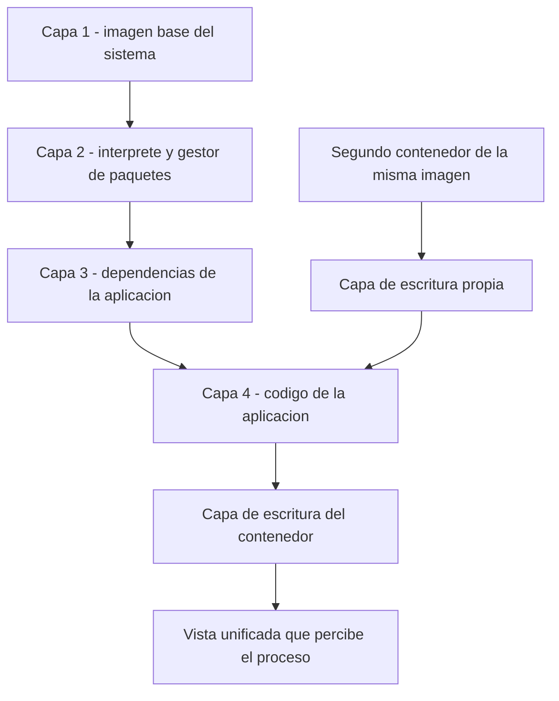
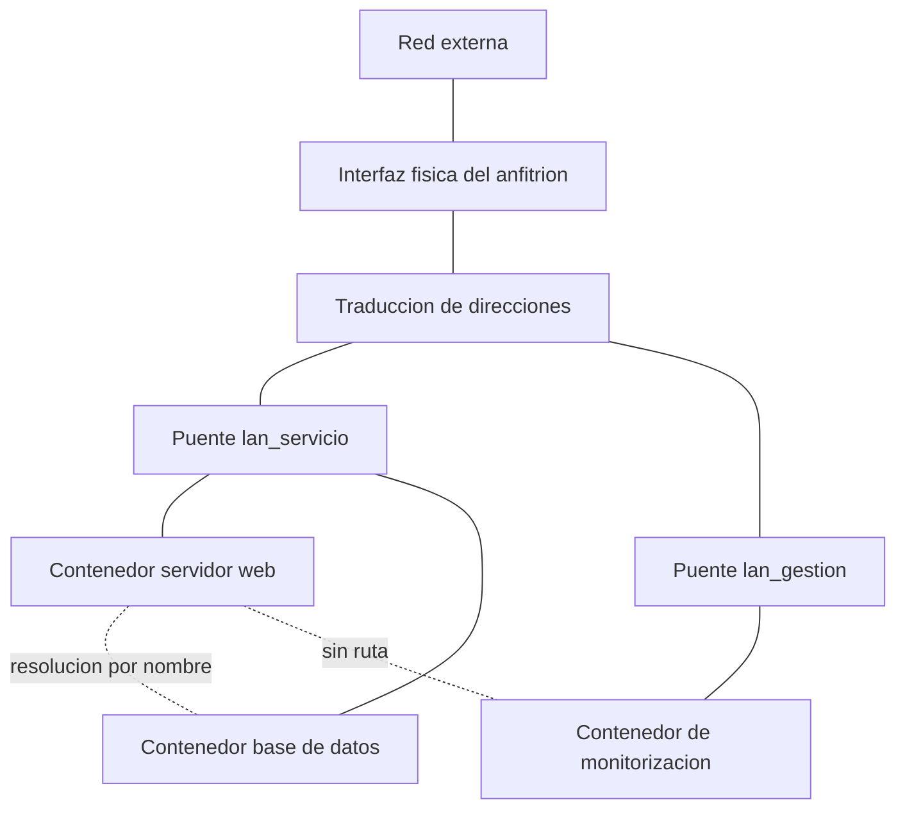
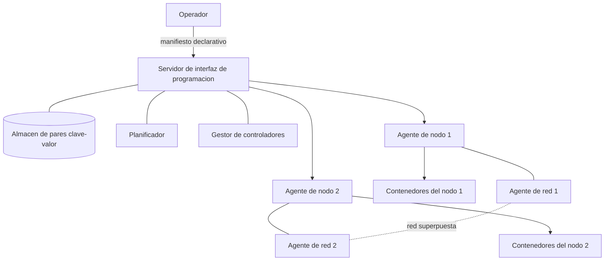
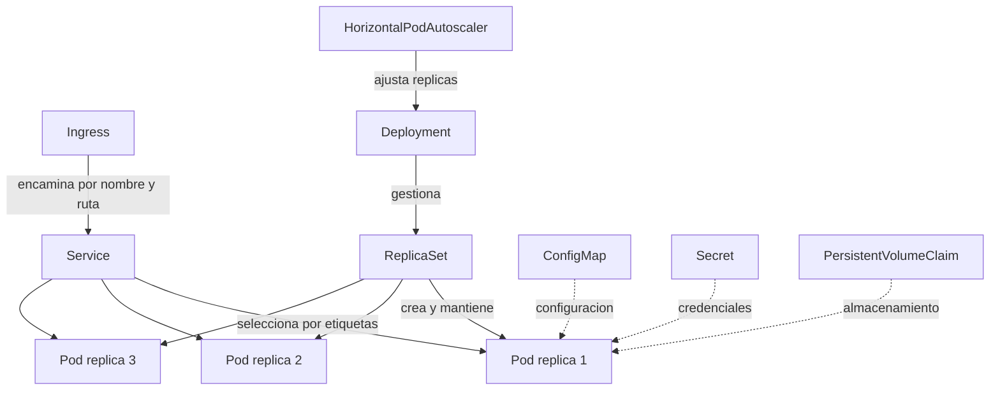
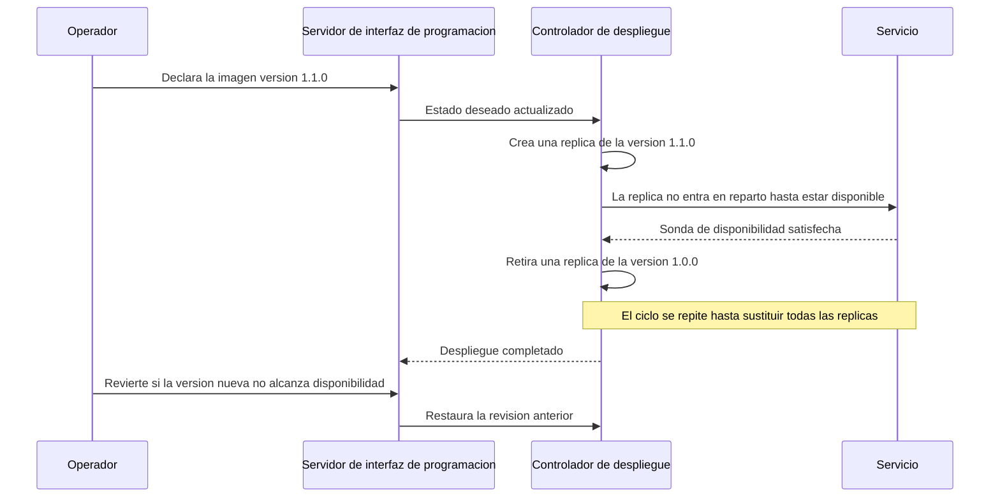

Un servicio empaquetado en un contenedor arranca en menos de un segundo, ocupa unas
decenas de megabytes y se comporta igual en el equipo de desarrollo que en el servidor
de producción. Ese conjunto de propiedades explica por qué el contenedor desplazó a la
máquina virtual como unidad de despliegue de servicios, y por qué alrededor de él creció
una capa de software dedicada a decidir en qué máquina se ejecuta cada instancia,
cuántas réplicas hacen falta y qué hacer cuando una de ellas deja de responder. Este
capítulo desarrolla ambas capas: el aislamiento a nivel de sistema operativo que hace
posible el contenedor, y la orquestación que lo convierte en un servicio distribuido y
tolerante a fallos. La comparación de fondo con los hipervisores y con la virtualización
de máquina completa corresponde a
[tipos de virtualización](section_1_tipos_de_virtualizacion.md).

## Introducción

Un **contenedor** es un entorno de ejecución aislado dentro de un sistema operativo, en
el que un proceso dispone de su propia vista del sistema de ficheros, de la red y del
árbol de procesos, mientras comparte el núcleo con el resto del sistema. El aislamiento
no lo proporciona una capa de emulación de hardware, sino un conjunto de mecanismos del
propio núcleo que restringen lo que el proceso puede ver y consumir. De esa diferencia
se derivan todas las demás: no hay sistema operativo invitado que arrancar, no hay
hipervisor que traduzca los accesos a memoria y el coste de crear una instancia se
reduce al de lanzar un proceso.

La consecuencia práctica es que un contenedor ejecuta habitualmente una sola aplicación,
con sus dependencias empaquetadas junto a ella. Si un contenedor ocupa el puerto 80
dentro de su propio espacio de red, ese puerto sigue libre para los demás contenedores y
para el anfitrión, de modo que varias instancias del mismo servicio conviven sin
conflicto en una única máquina. Esa combinación de arranque rápido, consumo reducido y
despliegue a demanda es lo que permite dimensionar la infraestructura según la carga
real en lugar de según la carga máxima prevista.

## Aislamiento a nivel de sistema operativo

El aislamiento de un contenedor se construye con dos familias de mecanismos del núcleo
que resuelven problemas complementarios. Los espacios de nombres deciden **qué ve** el
proceso, y los grupos de control deciden **cuánto consume**. Ninguno de los dos basta
por separado: un proceso con su propio espacio de red pero sin límite de memoria puede
agotar la del anfitrión, y un proceso con memoria limitada pero sin aislamiento del
sistema de ficheros puede leer y modificar los datos de sus vecinos.

### Espacios de nombres

Un **espacio de nombres** (_namespace_) es una partición de un recurso global del núcleo
en instancias independientes, de forma que los procesos de una instancia solo perciben
los objetos que pertenecen a ella. El núcleo mantiene varios tipos, cada uno asociado a
un recurso distinto, y un contenedor se define en la práctica como un proceso al que se
le ha asignado un conjunto nuevo de ellos.

| Espacio de nombres | Recurso que aísla                                                 |
| ------------------ | ----------------------------------------------------------------- |
| `pid`              | Árbol de procesos e identificadores de proceso.                   |
| `net`              | Interfaces de red, tablas de rutas, reglas de filtrado y puertos. |
| `mnt`              | Puntos de montaje y jerarquía visible del sistema de ficheros.    |
| `uts`              | Nombre de máquina y nombre de dominio.                            |
| `ipc`              | Colas de mensajes, semáforos y memoria compartida.                |
| `user`             | Correspondencia entre identificadores de usuario y de grupo.      |

El espacio de nombres `pid` explica un comportamiento llamativo: el proceso principal de
la aplicación tiene el identificador `1`, el que en un sistema completo corresponde al
proceso de arranque, y hereda con él la responsabilidad de recoger los procesos hijos
terminados. De ahí que un proceso que no gestiona correctamente las señales deje al
contenedor sin responder a una petición de parada ordenada. El espacio de nombres `net`,
por su parte, dota a cada contenedor de una pila de red completa y propia.

### Grupos de control

Los **grupos de control** (_control groups_, `cgroups`) limitan, contabilizan y aíslan
el consumo de recursos de un conjunto de procesos. El aislamiento de visibilidad que
aportan los espacios de nombres no impide que un contenedor monopolice el procesador o
agote la memoria disponible, y es el grupo de control el que establece ese techo sobre
el tiempo de procesador, la memoria residente, el ancho de banda de disco y el número de
procesos.

Declarar los límites no es un refinamiento opcional. Sin ellos, el rendimiento de cada
servicio depende del comportamiento instantáneo de los demás servicios del mismo
anfitrión, y el orquestador carece de la información que necesita para decidir en qué
máquina cabe cada instancia.

???+ example "Límites de procesador y memoria en un servicio de señalización"

    Un servicio que analiza mensajes de señalización necesita como máximo la mitad de
    un núcleo en régimen normal y no debe superar los 512 megabytes de memoria, para
    que un aumento inesperado del tráfico no degrade a los servicios vecinos del mismo
    anfitrión. Los límites se declaran al crear el contenedor:

    ```bash linenums="1"
    docker run -d --name analizador_senalizacion \
        --cpus 0.5 \
        --memory 512m \
        --memory-swap 512m \
        --restart unless-stopped \
        analizador:1.4.0
    ```

    La opción `--cpus 0.5` no reserva medio núcleo en exclusiva, sino que limita el
    tiempo de procesador que el contenedor consume en cada periodo de planificación.
    Igualar `--memory-swap` a `--memory` desactiva la memoria de intercambio, de modo
    que un consumo excesivo termina el proceso en lugar de degradar su latencia de
    forma silenciosa. El consumo real se observa con `docker stats`.

### Contenedor frente a máquina virtual

Las dos tecnologías resuelven el mismo problema, ejecutar varias cargas de trabajo
aisladas en una misma máquina física, pero operan en capas distintas de la pila. Una
máquina virtual virtualiza el hardware y necesita por tanto un sistema operativo
invitado completo por instancia. Un contenedor virtualiza el sistema operativo y
comparte el núcleo del anfitrión con todos los demás contenedores.

| Criterio             | Máquina virtual                          | Contenedor                            |
| -------------------- | ---------------------------------------- | ------------------------------------- |
| Unidad virtualizada  | Hardware completo.                       | Sistema operativo.                    |
| Núcleo               | Propio, por instancia.                   | Compartido con el anfitrión.          |
| Tiempo de arranque   | Decenas de segundos.                     | Fracciones de segundo.                |
| Tamaño de la imagen  | Gigabytes.                               | Decenas o centenares de megabytes.    |
| Grado de aislamiento | Alto, delimitado por el hipervisor.      | Medio, delimitado por el núcleo.      |
| Sistema operativo    | Cualquiera compatible con el hipervisor. | De la misma familia que el anfitrión. |

El aislamiento del contenedor es, en contrapartida, menos estricto, porque una
vulnerabilidad del núcleo compartido afecta potencialmente a todos los contenedores del
anfitrión. Por eso ambas tecnologías se combinan, ejecutando contenedores dentro de
máquinas virtuales: el hipervisor aporta la frontera de aislamiento fuerte entre
entornos y el motor de contenedores la densidad y la velocidad de despliegue dentro de
ella.

## Imágenes de contenedor

Un contenedor en ejecución se crea a partir de una **imagen**, que es una plantilla de
solo lectura con el sistema de ficheros y los metadatos necesarios para arrancar el
proceso. La imagen contiene las bibliotecas, los intérpretes y el código de la
aplicación, pero no un núcleo, y esa es la razón de su tamaño reducido.

### Capas y sistemas de archivos de unión

Una imagen no es un archivo monolítico sino una pila de **capas**, cada una de las
cuales registra las diferencias que introduce respecto a la capa inferior. El motor de
contenedores presenta esa pila como un único sistema de ficheros coherente mediante un
**sistema de archivos de unión** (_union filesystem_), que superpone las capas y
resuelve los conflictos dando prioridad a la más alta. Cuando una capa superior contiene
un fichero que ya existía en una inferior, la versión visible es la de la capa superior,
y cuando una capa borra un fichero heredado el sistema de unión registra una marca que
lo oculta sin eliminarlo de la capa donde reside.

Al instanciar un contenedor, el motor añade sobre la pila de solo lectura una **capa de
escritura** propia de esa instancia. Toda modificación del sistema de ficheros se aplica
en esa capa mediante una operación de copia en escritura: el fichero original se copia
desde la capa de solo lectura y solo entonces se modifica. Las capas de la imagen quedan
intactas, de forma que varias instancias de la misma imagen comparten físicamente su
contenido y cada una acumula únicamente sus propios cambios.



De este modelo se deriva la consecuencia operativa más importante: la capa de escritura
vive y muere con la instancia, de manera que una base de datos o cualquier estado que
deba sobrevivir necesita un mecanismo de persistencia explícito. El mismo modelo explica
la caché de construcción, porque una capa que no ha cambiado se reutiliza en lugar de
reconstruirse y una capa que cambia invalida todas las que se apoyan sobre ella.

### Fichero de construcción

El fichero de construcción, `Dockerfile`, declara en forma de instrucciones sucesivas
cómo se obtiene una imagen a partir de otra. Cada instrucción que modifica el sistema de
ficheros genera una capa nueva, y el resultado es reproducible: la misma secuencia de
instrucciones sobre la misma imagen base produce el mismo contenido.

| Instrucción  | Función                                                                          |
| ------------ | -------------------------------------------------------------------------------- |
| `FROM`       | Declara la imagen base sobre la que se construye la nueva imagen.                |
| `WORKDIR`    | Fija el directorio de trabajo de las instrucciones siguientes y del proceso.     |
| `COPY`       | Copia ficheros del contexto de construcción al sistema de ficheros de la imagen. |
| `RUN`        | Ejecuta una orden durante la construcción y consolida su resultado en una capa.  |
| `ENV`        | Define variables de entorno para la construcción y para la ejecución.            |
| `EXPOSE`     | Documenta el puerto en el que escucha el proceso, sin publicarlo.                |
| `USER`       | Fija el usuario con el que se ejecutan las instrucciones y el proceso principal. |
| `ENTRYPOINT` | Declara el ejecutable que constituye el proceso principal del contenedor.        |
| `CMD`        | Aporta los argumentos por omisión, o la orden completa si no hay `ENTRYPOINT`.   |

La distinción entre `EXPOSE` y la publicación efectiva de un puerto es fuente habitual
de confusión. `EXPOSE` no abre nada hacia el exterior: el puerto queda accesible desde
otros contenedores de la misma red virtual, y no desde el anfitrión ni desde la red
externa mientras no se publique al crear el contenedor.

!!! note

    `ENTRYPOINT` y `CMD` admiten forma de cadena y forma de lista de argumentos. La
    forma de lista, `ENTRYPOINT ["python", "servidor.py"]`, ejecuta el binario
    directamente y el proceso recibe las señales del sistema. La forma de cadena lo
    ejecuta a través de un intérprete de órdenes intermedio, que se convierte en el
    proceso con identificador `1` y no propaga las señales, de modo que una petición
    de parada no llega a la aplicación y el contenedor termina por tiempo de espera.

### Buenas prácticas de construcción

Una imagen bien construida es pequeña, rápida de reconstruir y no contiene más de lo que
el servicio necesita para ejecutarse.

- **Anclar la versión de la imagen base**: Una etiqueta móvil como `latest` hace que dos
  construcciones separadas en el tiempo partan de contenidos distintos, y con ello se
  pierde la reproducibilidad que justifica todo el mecanismo.
- **Ordenar las instrucciones de menos a más volátil**: Copiar primero el fichero de
  dependencias, instalarlas y copiar el código después permite reutilizar la capa de
  dependencias en la mayoría de las reconstrucciones.
- **Agrupar las órdenes relacionadas en una sola instrucción `RUN`**: Los ficheros
  temporales que una orden posterior elimine siguen ocupando espacio en la capa donde se
  crearon si la creación y el borrado ocurren en capas distintas.
- **Ejecutar el proceso con un usuario sin privilegios**: El usuario por omisión de una
  imagen es el administrador, y un proceso comprometido que se ejecuta con ese usuario
  amplía notablemente el alcance de una fuga del aislamiento.
- **Excluir del contexto lo que no forma parte de la imagen**: El fichero
  `.dockerignore` evita enviar al motor el historial de versiones, los entornos
  virtuales locales y las credenciales de desarrollo.
- **Emplear una construcción en varias etapas cuando hay compilación**: Las herramientas
  de compilación se quedan en la etapa intermedia y la imagen final contiene solo el
  artefacto resultante y sus dependencias de ejecución.

!!! warning

    Una credencial pasada como argumento de construcción o escrita en una capa
    intermedia permanece en el historial de la imagen aunque una capa posterior borre
    el fichero que la contenía. Cualquiera que disponga de la imagen puede recuperarla
    inspeccionando las capas. Las credenciales se inyectan en tiempo de ejecución como
    variables de entorno o como ficheros montados, nunca en la imagen.

???+ example "Imagen de un servidor web en Python con sus dependencias"

    Un equipo de desarrollo entrega un servidor web escrito en Python que se ejecuta
    con `python servidor.py`, escucha en el puerto 80 y necesita dos bibliotecas
    declaradas en un fichero `requirements.txt`. El servicio debe quedar en marcha al
    instanciar el contenedor, sin ninguna orden manual posterior.

    ```dockerfile title="Dockerfile"
    # Imagen base anclada a una version concreta del interprete
    FROM python:3.11-slim

    # Directorio de trabajo de las instrucciones siguientes y del proceso
    WORKDIR /app

    # Las dependencias se copian e instalan antes del codigo para que su capa
    # se reutilice mientras el fichero de dependencias no cambie
    COPY requirements.txt .
    RUN pip install --no-cache-dir -r requirements.txt

    # El codigo de la aplicacion es lo que cambia en cada version
    COPY servidor.py .

    # Usuario sin privilegios para el proceso principal
    RUN useradd --create-home --shell /usr/sbin/nologin servicio
    USER servicio

    # El servidor escucha en el puerto 80 dentro de su espacio de nombres de red
    EXPOSE 80

    ENTRYPOINT ["python", "servidor.py"]
    ```

    Fuera de un contenedor, un proceso sin privilegios de administrador no puede
    enlazarse a un puerto por debajo de 1024 en un anfitrión Linux convencional; dentro
    de un contenedor ese límite depende de las capacidades que el motor conceda por
    defecto, y `CAP_NET_BIND_SERVICE` no se otorga a un usuario sin privilegios salvo
    que la imagen base la conceda explícitamente. Con la imagen base de este ejemplo,
    el contenedor debe remapear el puerto 80 a un puerto alto del anfitrión con `-p`, o
    bien concederle esa capacidad de forma explícita al construir o ejecutar la imagen.

    La imagen se construye y se instancia con dos órdenes, donde el punto final de la
    primera indica que el contexto de construcción es el directorio actual:

    ```bash linenums="1"
    docker build -t servicioweb:1.0.0 .
    docker run -d --name servidor -p 8080:80 servicioweb:1.0.0
    ```

    El servidor queda accesible en el puerto 8080 del anfitrión. El procedimiento
    equivalente ejecutado a mano exige instanciar una imagen base, entrar en su
    consola, instalar el intérprete y las dependencias, copiar los ficheros e invocar
    el servidor, una secuencia irrepetible que el fichero de construcción sustituye
    por un artefacto versionable de resultado constante.

### Registros de imágenes

Un **registro de imágenes** es el servicio que almacena y distribuye imágenes, y es el
punto donde la construcción y el despliegue se separan: una imagen se construye una vez,
se publica en el registro y se descarga desde allí en cada anfitrión que la necesite. El
identificador completo tiene la forma
`registro/espacio_de_nombres/repositorio:etiqueta`, y cuando se omite el registro se
asume el registro público por omisión del motor.

La **etiqueta** nombra una versión dentro de un repositorio pero no la fija, porque
puede reasignarse a un contenido distinto en cualquier momento. Para referirse a un
contenido inmutable se emplea el **resumen criptográfico** (_digest_) de la imagen, de
la forma `repositorio@sha256:...`, que identifica un contenido exacto y no admite
reasignación. Los despliegues que exigen reproducibilidad estricta referencian el
resumen, y sobre él operan también el análisis de vulnerabilidades y la firma de
contenido que un registro privado de operador integra en su cadena de publicación.

| Orden                        | Efecto                                                           |
| ---------------------------- | ---------------------------------------------------------------- |
| `docker pull imagen:version` | Descarga del registro las capas que no estén ya en el anfitrión. |
| `docker tag origen destino`  | Asigna un nuevo identificador a una imagen local existente.      |
| `docker push imagen:version` | Publica en el registro las capas que este no tenga todavía.      |
| `docker image ls`            | Enumera las imágenes disponibles localmente y su tamaño.         |
| `docker rmi imagen:version`  | Elimina una imagen local que no tenga contenedores asociados.    |

## Redes de contenedores

El espacio de nombres de red que recibe cada contenedor lo deja, por omisión, sin
conectividad con nada. El motor de contenedores completa ese aislamiento con un
**controlador de red** (_driver_) que determina cómo se conecta el contenedor con el
anfitrión, con sus vecinos y con la red externa. Los tres modos relevantes son el
puente, el modo anfitrión y la red superpuesta.

### Modo puente

El modo **puente** (_bridge_) es el comportamiento por omisión. El motor crea en el
anfitrión un conmutador virtual de nivel de enlace y conecta a él cada contenedor
mediante una pareja de interfaces virtuales, una en el espacio de nombres del contenedor
y otra en el del anfitrión. Cada contenedor recibe una dirección IP privada del rango
asignado a ese puente, y los contenedores del mismo puente se alcanzan entre sí
directamente, igual que dos equipos del mismo segmento de red. El tráfico hacia el
exterior atraviesa una traducción de direcciones en el anfitrión, con el mecanismo
descrito en
[interconexión de redes](../../02_redes/04_encaminamiento/section_3_interconexion_de_redes.md).

Un puente definido por el usuario aporta dos propiedades que el puente por omisión no
ofrece. La primera es la resolución de nombres, ya que los contenedores conectados a él
se resuelven mutuamente por su nombre sin conocer direcciones IP. La segunda es el
aislamiento entre grupos, porque dos contenedores conectados a puentes distintos no
tienen ninguna ruta entre ellos aunque compartan anfitrión.



???+ example "Aislamiento de dos grupos de contenedores en el mismo anfitrión"

    Un servidor web y su base de datos deben comunicarse entre sí, y un contenedor de
    monitorización debe quedar fuera de su alcance aunque comparta anfitrión. Dos
    puentes definidos por el usuario resuelven la separación:

    ```bash linenums="1"
    docker network create -d bridge lan_servicio
    docker network create -d bridge lan_gestion
    docker run -d --name basedatos --network lan_servicio redis:7-alpine
    docker run -d --name servidor --network lan_servicio -p 8080:80 servicioweb:1.0.0
    docker run -d --name monitor --network lan_gestion monitor:2.1.0
    ```

    Una prueba de alcanzabilidad desde `servidor` hacia `basedatos` por su nombre
    funciona, porque comparten puente y el motor resuelve el nombre. La misma prueba
    hacia `monitor` no obtiene respuesta, porque no existe ruta entre los dos puentes.
    La composición de cada red se consulta con `docker network inspect lan_servicio`,
    y la pertenencia a un grupo se modifica en caliente con `docker network connect` y
    `docker network disconnect`, sin recrear la instancia.

### Modo anfitrión

En el modo **anfitrión** (_host_) el contenedor no recibe un espacio de nombres de red
propio, sino que comparte el del anfitrión. No tiene dirección IP propia ni interfaz
virtual, y un proceso que escuche en el puerto 80 queda accesible directamente en el
puerto 80 de la dirección del anfitrión. La publicación de puertos pierde sentido en
este modo y las opciones correspondientes se ignoran.

La renuncia al aislamiento de red se justifica cuando el rendimiento importa por encima
de todo, porque desaparecen la traducción de direcciones y el paso por el conmutador
virtual, y cuando el proceso necesita observar el tráfico del anfitrión. El precio es
que el contenedor compite por el espacio de puertos del anfitrión, de forma que dos
instancias del mismo servicio no pueden coexistir sin reconfigurar el puerto de escucha.

### Red superpuesta

Una **red superpuesta** (_overlay_) extiende un mismo dominio de nivel de enlace virtual
sobre varios anfitriones, encapsulando las tramas de los contenedores dentro de
datagramas que viajan por la red física entre los nodos. Los contenedores de cualquier
anfitrión del conjunto se comportan como si compartieran segmento, con direcciones del
mismo rango y resolución mutua por nombre, y el encaminamiento de la red subyacente
queda oculto para ellos.

Este es el modo que hace posible la orquestación en clúster, porque un servicio
distribuido en varios nodos necesita que sus instancias se alcancen entre sí con
independencia del nodo en que el planificador las haya colocado. El coste es el
_overhead_ de encapsulado, que añade cabeceras a cada trama y reduce la unidad máxima de
transferencia efectiva.

### Publicación de puertos

La **publicación de puertos** establece una correspondencia entre un puerto del
anfitrión y un puerto del contenedor, de modo que el tráfico que llega al primero se
reenvía al segundo. Es el mecanismo por el que un servicio en contenedor se hace
accesible desde fuera del anfitrión, y equivale al reenvío de puertos de un encaminador
con traducción de direcciones.

| Forma                  | Efecto                                                                  |
| ---------------------- | ----------------------------------------------------------------------- |
| `-p 8080:80`           | Publica el puerto 80 del contenedor en el 8080 de todas las interfaces. |
| `-p 127.0.0.1:8080:80` | Restringe la publicación a la interfaz de bucle local del anfitrión.    |
| `-p 8080:80/udp`       | Publica la correspondencia para el protocolo UDP en lugar de TCP.       |
| `-P`                   | Publica los puertos declarados con `EXPOSE` en puertos altos asignados. |

## Volúmenes y persistencia

La capa de escritura de un contenedor desaparece con él, de modo que todo estado que
deba sobrevivir a la instancia necesita almacenarse fuera de ella. Un **volumen** es una
zona de almacenamiento gestionada por el motor de contenedores, con un ciclo de vida
independiente del de cualquier contenedor, que se monta en una ruta del sistema de
ficheros del contenedor. Las escrituras en esa ruta no pasan por la capa de escritura
sino directamente al volumen, y permanecen cuando la instancia se elimina. Su capacidad
no está predefinida: se gestiona de forma dinámica sobre el almacenamiento del
anfitrión.

Existe además el montaje de un directorio del anfitrión dentro del contenedor, útil en
desarrollo porque el código editado se refleja de inmediato, y poco recomendable en
producción porque acopla el servicio a la estructura de directorios de una máquina.

| Mecanismo             | Ciclo de vida                 | Uso habitual                                      |
| --------------------- | ----------------------------- | ------------------------------------------------- |
| Capa de escritura     | Ligado al contenedor.         | Ficheros temporales del proceso.                  |
| Volumen gestionado    | Independiente del contenedor. | Bases de datos y estado del servicio.             |
| Montaje de directorio | Ligado al anfitrión.          | Código en desarrollo y ficheros de configuración. |

???+ example "Persistencia del almacén de un servicio de contabilidad de tráfico"

    Un servicio que acumula contadores de tráfico escribe su almacén en
    `/var/lib/contadores` y debe conservarlo entre reinicios y entre versiones de la
    imagen. Un volumen gestionado independiza ese estado del ciclo de vida de la
    instancia:

    ```bash linenums="1"
    docker volume create datos_contadores
    docker run -d --name contabilidad \
        -v datos_contadores:/var/lib/contadores \
        contabilidad:2.0.0
    ```

    Al eliminar el contenedor y volver a crearlo sobre una imagen más reciente con la
    misma orden de montaje, el nuevo proceso encuentra los contadores tal como los
    dejó el anterior, mientras que en la capa de escritura se habría descartado todo
    el historial. Los montajes se fijan al crear la instancia, de modo que añadir
    persistencia a un servicio en marcha exige recrearla.

!!! warning

    Dos contenedores que montan el mismo volumen escriben sobre el mismo sistema de
    ficheros sin ninguna coordinación entre ellos. Si ambos escriben sobre los mismos
    datos, la integridad depende por completo del mecanismo de bloqueo de la aplicación.
    Un motor de base de datos que no espera acceso concurrente al mismo directorio de
    datos corrompe el almacén en esa situación.

## Composición de varios servicios

Un servicio real rara vez cabe en un contenedor. La recomendación es separar cada
componente en el suyo, un servidor web en uno y su base de datos en otro, porque así
cada componente se actualiza, se reinicia y se escala sin arrastrar a los demás. El
precio es que el despliegue pasa a ser un conjunto de órdenes con un orden de arranque,
una red común y unas dependencias entre ellas.

La **composición** resuelve ese problema declarando el conjunto completo en un fichero:
qué servicios lo forman, de qué imagen o fichero de construcción sale cada uno, qué
puertos publica, qué volúmenes monta y de qué otros servicios depende. El despliegue se
levanta y se retira con una sola orden, y el fichero queda como descripción versionable
del conjunto.

| Orden                               | Efecto                                                       |
| ----------------------------------- | ------------------------------------------------------------ |
| `docker compose up -d`              | Construye lo necesario, crea la red y arranca los servicios. |
| `docker compose down`               | Detiene y elimina los contenedores y la red del conjunto.    |
| `docker compose ps`                 | Enumera los servicios del conjunto y su estado.              |
| `docker compose logs -f`            | Sigue en tiempo real el registro combinado de los servicios. |
| `docker compose exec servicio bash` | Abre una consola dentro del contenedor de un servicio.       |

???+ example "Despliegue conjunto de un servidor web y su almacén de pares clave-valor"

    El servidor web del ejemplo anterior lleva un contador de visitas que almacena en un
    almacén de pares clave-valor en memoria, de modo que necesita un segundo contenedor
    con ese almacén, arrancado antes que él y alcanzable por nombre. El conjunto se
    declara así:

    ```yaml title="compose.yaml"
    services:
      web:
        build: .
        image: servicioweb:1.0.0
        ports:
          - "8080:80"
        environment:
          REDIS_HOST: almacen
        depends_on:
          almacen:
            condition: service_healthy
      almacen:
        image: redis:7-alpine
        volumes:
          - datos_almacen:/data
        healthcheck:
          test: ["CMD", "redis-cli", "ping"]
          interval: 5s
          timeout: 3s
          retries: 5
    volumes:
      datos_almacen:
    ```

    La composición crea una red propia para el conjunto, en la que cada servicio se
    resuelve por su nombre, y por eso el servidor localiza el almacén mediante el
    nombre `almacen` en lugar de una dirección IP. Esa resolución es lo que hace
    reproducible el despliegue: una dirección fija escrita en el código deja de ser
    válida en cuanto el motor asigna otra al recrear el contenedor. La condición
    `service_healthy` espera a que la comprobación de salud del almacén tenga éxito,
    lo que evita el fallo de conexión de los primeros segundos.

!!! note

    El campo `version` que encabezaba los ficheros de composición antiguos está en
    desuso y el motor lo ignora emitiendo una advertencia. El formato actual comienza
    directamente por `services`, y el nombre de fichero preferente es `compose.yaml`.

## Consideraciones al desplegar servicios en contenedores

La composición resuelve el despliegue de un conjunto de servicios en una máquina, pero
no lo que ocurre cuando esa máquina falla. Tres propiedades condicionan el diseño en
cuanto se pretende que el servicio esté disponible de forma continua.

### Escalabilidad

La **escalabilidad** es la capacidad de absorber un aumento de carga añadiendo
instancias, y el contenedor la favorece porque crear una instancia cuesta muy poco. La
condición para aprovecharlo es que el servicio no guarde estado en la instancia: si cada
réplica mantiene información que las demás no conocen, las peticiones de un usuario
deben dirigirse siempre a la misma réplica y el escalado deja de ser libre.

### Alta disponibilidad

La **alta disponibilidad** expresa la fracción de tiempo en que un servicio responde
correctamente, y exige que ninguna instancia sea imprescindible, lo que obliga a
repartir las réplicas en anfitriones distintos. Un conjunto de tres anfitriones es el
mínimo razonable, porque las decisiones de coordinación del plano de control se toman
por mayoría y dos nodos no pueden distinguir una caída de una partición de la red.

### Tolerancia a fallos y resiliencia

La **tolerancia a fallos** es la capacidad de seguir operando cuando alguna parte falla,
y la **resiliencia** añade la de recuperar el nivel de servicio normal después del
fallo. Ambas exigen que el fallo se detecte sin intervención humana, lo que traslada el
problema a la necesidad de un componente que vigile el estado de las instancias y actúe
sobre él.

## Orquestación de contenedores

Un **orquestador** de contenedores es el software que administra el ciclo de vida de los
contenedores sobre un conjunto de máquinas, decidiendo dónde se ejecuta cada uno,
vigilando su estado y reaccionando ante las desviaciones respecto al estado declarado.
Opera por encima de varios anfitriones, de modo que el operador deja de administrar
contenedores en máquinas concretas y pasa a declarar qué servicios quiere y con cuántas
réplicas.

- **Planificación de la ubicación**: Selecciona para cada contenedor el nodo con
  recursos suficientes, atendiendo a los límites declarados y a las restricciones de
  colocación.
- **Mantenimiento del estado declarado**: Compara de forma continua el estado observado
  con el declarado y crea, elimina o reemplaza instancias hasta que coincidan.
- **Reparto de carga entre réplicas**: Distribuye las peticiones dirigidas a un servicio
  entre las instancias que lo implementan y retira de la rotación las que no responden.
- **Escalado**: Ajusta el número de réplicas de un servicio, por orden explícita o en
  función de métricas observadas.
- **Actualización y reversión**: Sustituye las instancias de una versión por las de otra
  de forma gradual, y deshace el cambio si la nueva versión no alcanza el estado
  esperado.
- **Monitorización de recursos**: Recoge el consumo, el rendimiento y los errores de
  ejecución de los contenedores y de los nodos que los alojan.

Un **clúster** es el conjunto de nodos que el orquestador administra como una única
unidad de capacidad. El operador no elige el nodo en que se ejecuta una instancia, sino
que declara lo que necesita y el planificador resuelve la colocación con la información
de capacidad y de ocupación de cada nodo. La administración del clúster incluye agregar
y retirar nodos, ajustar su capacidad y drenar un nodo antes de una intervención de
mantenimiento, de forma que sus cargas se redistribuyan sin interrupción del servicio.

## Arquitectura de Kubernetes

Kubernetes es la plataforma de orquestación de referencia para automatizar el
despliegue, el escalado y la administración de aplicaciones en contenedores. Su
arquitectura separa un **plano de control**, que toma las decisiones sobre el clúster,
de un conjunto de nodos de trabajo que las ejecutan.

El plano de control se compone de un servidor de interfaz de programación que recibe
todas las peticiones y es el único que escribe en el almacén, un planificador que asigna
cargas sin ubicación a nodos concretos, un gestor de controladores que vigila el estado
del clúster y emprende las acciones correctoras, y un almacén persistente de pares
clave-valor que conserva el estado declarado y observado, única fuente de verdad del
clúster.

En cada nodo de trabajo residen dos componentes. El **agente de nodo** (`kubelet`)
recibe las especificaciones de las cargas que le corresponden, instruye al motor de
contenedores del nodo para que las ejecute y vigila que sigan en el estado esperado.
Gestiona únicamente los contenedores que Kubernetes ha creado, y no los que se hayan
lanzado de forma independiente desde la consola del motor de contenedores en la misma
máquina. El **agente de red** (`kube-proxy`) programa las reglas que hacen accesibles
los servicios de un nodo desde los demás nodos del clúster y desde el exterior, y
materializa el reparto de carga entre las réplicas de un servicio.



El modelo de operación es declarativo. El operador no ordena acciones sino que declara
el estado deseado, y los controladores trabajan de forma continua para reducir la
diferencia entre ese estado y el observado. Esa es la razón de que un contenedor
eliminado a mano reaparezca al momento: el controlador responsable observa que faltan
réplicas respecto a las declaradas y crea las que falten.

### Herramientas de trabajo

La interacción con un clúster se realiza con la interfaz de línea de órdenes `kubectl`,
que traduce cada orden en una petición al servidor de interfaz de programación. Para
disponer de un clúster de pequeña escala en una sola máquina, con fines de prueba, se
emplean distribuciones ligeras que levantan el plano de control y los nodos dentro de
contenedores del propio equipo.

| Orden                                          | Efecto                                                   |
| ---------------------------------------------- | -------------------------------------------------------- |
| `kubectl apply -f manifiesto.yaml`             | Declara o actualiza los objetos descritos en el fichero. |
| `kubectl get pods -o wide`                     | Enumera las cargas en ejecución y el nodo que las aloja. |
| `kubectl describe deployment nombre`           | Muestra el estado detallado de un objeto y sus eventos.  |
| `kubectl logs -f nombre_del_pod`               | Sigue en tiempo real la salida del contenedor.           |
| `kubectl scale deployment nombre --replicas=5` | Ajusta el número de réplicas de un despliegue.           |
| `kubectl rollout status deployment nombre`     | Informa del avance de una actualización en curso.        |
| `kubectl rollout undo deployment nombre`       | Revierte el despliegue a su revisión anterior.           |

## Objetos de Kubernetes

Kubernetes describe todo lo que administra mediante objetos declarados en manifiestos, y
la relación entre ellos define la estructura de un servicio desplegado. Cada manifiesto
declara la versión de la interfaz de programación a la que pertenece el objeto, su tipo,
sus metadatos y la especificación del estado deseado.



### Pods

El **pod** es la unidad mínima de despliegue: un grupo de uno o varios contenedores que
comparten espacio de nombres de red y pueden compartir volúmenes, y que el planificador
siempre coloca en el mismo nodo. Los contenedores de un pod se alcanzan entre sí por la
dirección de bucle local, de modo que la agrupación se reserva para procesos que forman
una unidad funcional indivisible, como un servidor y un agente auxiliar que le prepara
la configuración o le recoge los registros.

Un pod es efímero por diseño. No se repara: cuando falla se sustituye por otro con
identidad distinta y su dirección IP no sobrevive al reemplazo. De ahí que los pods no
se declaren directamente en producción sino a través de un objeto que mantenga su
número, y que el acceso a ellos se haga mediante un servicio en lugar de por su
dirección.

### Deployments

El **despliegue** (`Deployment`) declara cuántas réplicas de un pod deben existir y con
qué plantilla se crean. El controlador correspondiente crea un conjunto de réplicas
intermedio que mantiene ese número, reemplaza las que fallan y conserva el historial de
revisiones, lo que permite revertir a una versión anterior. Es el objeto habitual para
un servicio sin estado, donde cualquier réplica es intercambiable por otra.

### Sondas de vida y de disponibilidad

Un proceso en ejecución no es necesariamente un proceso que funcione. El agente de nodo
distingue ambas situaciones mediante sondas que consulta de forma periódica, y de cuyo
resultado dependen decisiones distintas.

- **Sonda de vida** (`livenessProbe`): Determina si el contenedor sigue operativo. Su
  fallo reiterado provoca el reinicio del contenedor, lo que resuelve los bloqueos
  internos del proceso que no llegan a terminarlo.
- **Sonda de disponibilidad** (`readinessProbe`): Determina si el contenedor está en
  condiciones de atender tráfico. Su fallo retira la réplica del reparto de carga del
  servicio sin reiniciarla, lo que protege al usuario durante un arranque lento o una
  sobrecarga transitoria.
- **Sonda de arranque** (`startupProbe`): Determina si el proceso ha completado su
  inicialización. Mientras no tenga éxito, las otras dos quedan suspendidas, lo que
  evita que un arranque largo se interprete como un fallo y desencadene un ciclo de
  reinicios.

La distinción entre las dos primeras evita el error más frecuente en la configuración de
un servicio orquestado. Emplear la misma comprobación para ambas convierte una
sobrecarga momentánea en un reinicio, y el reinicio agrava la sobrecarga sobre las
réplicas restantes hasta propagar el fallo a todo el servicio.

???+ example "Despliegue de un servidor web con réplicas y sondas de estado"

    El servidor web construido en los ejemplos anteriores se despliega con tres réplicas,
    límites de recursos declarados y las dos sondas diferenciadas. El manifiesto describe
    el estado deseado, no los pasos para alcanzarlo:

    ```yaml title="deployment.yaml"
    apiVersion: apps/v1
    kind: Deployment
    metadata:
      name: servicioweb
      labels:
        app: servicioweb
    spec:
      replicas: 3
      selector:
        matchLabels:
          app: servicioweb
      template:
        metadata:
          labels:
            app: servicioweb
        spec:
          containers:
            - name: servidor
              image: registro.interno/servicioweb:1.0.0
              ports:
                - containerPort: 80
              resources:
                requests:
                  cpu: 100m
                  memory: 128Mi
                limits:
                  cpu: 500m
                  memory: 512Mi
              livenessProbe:
                httpGet:
                  path: /salud
                  port: 80
                initialDelaySeconds: 10
                periodSeconds: 10
              readinessProbe:
                httpGet:
                  path: /listo
                  port: 80
                periodSeconds: 5
    ```

    El campo `requests` declara lo que el planificador reserva al elegir nodo, y
    `limits` el techo que el grupo de control aplica en ejecución, donde `100m`
    representa una décima parte de núcleo expresada en milinúcleos. La selección por
    etiquetas del campo `selector` vincula el despliegue con los pods que gestiona, y
    debe coincidir con las etiquetas de la plantilla.

### Services

Un **servicio** (`Service`) proporciona un punto de acceso estable a un conjunto de pods
seleccionados por sus etiquetas. Recibe un nombre resoluble dentro del clúster y una
dirección virtual que no cambia, y reparte las peticiones entre las réplicas que la
sonda de disponibilidad declara aptas. Es la respuesta al carácter efímero del pod, que
aparece y desaparece con direcciones distintas.

| Tipo           | Alcance del acceso                                                  |
| -------------- | ------------------------------------------------------------------- |
| `ClusterIP`    | Solo desde dentro del clúster. Es el tipo por omisión.              |
| `NodePort`     | Desde fuera, por un puerto alto abierto en todos los nodos.         |
| `LoadBalancer` | Desde fuera, a través de un repartidor de carga externo al clúster. |
| `ExternalName` | Redirige el nombre del servicio a un nombre de dominio externo.     |

### Ingress

Un **objeto de entrada** (`Ingress`) declara cómo se encamina el tráfico HTTP externo
hacia los servicios del clúster, en función del nombre de máquina solicitado y de la
ruta de la petición, y es donde se resuelve la terminación del cifrado de transporte.
Concentra en un único punto de entrada lo que de otro modo exigiría un repartidor de
carga por servicio. El objeto por sí solo no encamina nada: necesita un controlador de
entrada desplegado en el clúster que lo interprete.

???+ example "Publicación de dos servicios bajo un mismo nombre de máquina"

    Un portal de gestión y su interfaz de programación se publican bajo el mismo nombre,
    diferenciados por la ruta de la petición. El servicio interno se declara con el tipo
    por omisión, porque el acceso externo lo resuelve el objeto de entrada:

    ```yaml title="service.yaml"
    apiVersion: v1
    kind: Service
    metadata:
      name: servicioweb
    spec:
      type: ClusterIP
      selector:
        app: servicioweb
      ports:
        - name: http
          port: 80
          targetPort: 80
    ```

    ```yaml title="ingress.yaml"
    apiVersion: networking.k8s.io/v1
    kind: Ingress
    metadata:
      name: portal-gestion
    spec:
      ingressClassName: nginx
      rules:
        - host: gestion.ejemplo.interno
          http:
            paths:
              - path: /
                pathType: Prefix
                backend:
                  service:
                    name: servicioweb
                    port:
                      number: 80
              - path: /api
                pathType: Prefix
                backend:
                  service:
                    name: api-gestion
                    port:
                      number: 8080
    ```

    El campo `port` del servicio es el puerto por el que se accede a él dentro del
    clúster, y `targetPort` el puerto en que escucha el contenedor. El campo
    `ingressClassName` identifica al controlador de entrada que debe atender la regla,
    necesario cuando el clúster tiene más de uno desplegado.

!!! warning

    Las versiones de interfaz de programación `extensions/v1beta1` y
    `networking.k8s.io/v1beta1` para el objeto de entrada están retiradas desde la
    versión 1.22 de Kubernetes, y un manifiesto que las declare es rechazado por el
    servidor. La versión vigente es `networking.k8s.io/v1`, cuya estructura de reglas
    difiere de la de las versiones preliminares en el campo obligatorio `pathType` y en
    la forma de declarar el servicio de destino.

### Escalado horizontal

El **escalado horizontal automático** (`HorizontalPodAutoscaler`) ajusta el número de
réplicas de un despliegue en función de métricas observadas, habitualmente la
utilización de procesador o de memoria respecto a lo solicitado en `requests`. El
controlador compara de forma periódica la métrica con el objetivo declarado y modifica
el número de réplicas dentro de los límites establecidos. Dos condiciones determinan su
utilidad: que el despliegue declare `requests`, porque la utilización se calcula como
fracción de lo solicitado, y que el servicio tolere que sus réplicas aparezcan y
desaparezcan.

???+ example "Ajuste automático de réplicas de un servicio expuesto a carga variable"

    Un servicio atiende una carga que varía a lo largo del día en un factor de seis entre
    el valle nocturno y el máximo de la tarde. Dimensionarlo para el máximo mantiene
    inactiva la mayor parte de la capacidad durante horas, y dimensionarlo para la media
    degrada el servicio en las horas punta. El escalado automático resuelve el
    compromiso:

    ```yaml title="hpa.yaml"
    apiVersion: autoscaling/v2
    kind: HorizontalPodAutoscaler
    metadata:
      name: servicioweb
    spec:
      scaleTargetRef:
        apiVersion: apps/v1
        kind: Deployment
        name: servicioweb
      minReplicas: 2
      maxReplicas: 12
      metrics:
        - type: Resource
          resource:
            name: cpu
            target:
              type: Utilization
              averageUtilization: 70
    ```

    Con un objetivo del 70 por ciento de utilización media y una solicitud de `100m`
    por réplica, un consumo sostenido de 840 milinúcleos agregados conduce a doce
    réplicas, y un consumo de 140 milinúcleos al mínimo de dos. El valor de
    `minReplicas` no baja de dos porque una réplica única deja el servicio sin
    disponibilidad durante cualquier reemplazo, y `maxReplicas` acota el consumo que
    el servicio puede reclamar al clúster.

### Actualización progresiva

La sustitución de una versión por otra se realiza mediante una **actualización
progresiva** (_rolling update_), en la que el controlador crea réplicas de la versión
nueva y retira las de la anterior de forma gradual, manteniendo en todo momento
capacidad suficiente para atender el tráfico. Dos parámetros gobiernan el proceso:
`maxUnavailable`, que acota cuántas réplicas pueden faltar respecto a las declaradas, y
`maxSurge`, que acota cuántas pueden existir por encima de ellas.



La sonda de disponibilidad es la pieza que hace segura la actualización. Sin ella el
controlador considera disponible una réplica en cuanto su contenedor arranca y retira
réplicas antiguas antes de que las nuevas atiendan tráfico, lo que interrumpe el
servicio. Con ella, una versión defectuosa no alcanza nunca el estado de disponibilidad,
la actualización se detiene con las réplicas antiguas en servicio y la reversión
restaura la revisión anterior desde el historial que el despliegue conserva.

## Prácticas de desarrollo y operación

El contenedor y el orquestador son las piezas técnicas de una forma de trabajo más
amplia, conocida como **DevOps**, que integra en un mismo equipo el desarrollo y la
operación del servicio y automatiza los procesos que antes se ejecutaban a mano. El
ciclo completo de integración y despliegue continuo que sostiene esa forma de trabajo,
desde la construcción y las pruebas automáticas hasta el despliegue progresivo en
producción, se desarrolla en
[integración y despliegue continuo de una función de red](../03_software_de_comunicaciones/section_1_desarrollo_de_software.md#integracion-y-despliegue-continuo-de-una-funcion-de-red).

## Del contenedor a la función de red

Todo lo anterior describe el despliegue de servicios genéricos, pero el interés de los
contenedores en telecomunicaciones está en que la carga desplegada puede ser una función
de red. Un servidor de abonados, un plano de control de una red móvil o un procesador de
banda base son, para el orquestador, procesos con requisitos de recursos, sondas de
estado y puntos de acceso estables, los mismos elementos declarados en los manifiestos
anteriores.

La traslación no es sin embargo automática. Una función de red impone condiciones que un
servicio web no plantea: latencia acotada y predecible, tratamiento de tráfico a
velocidad de línea, acceso a capacidades del anfitrión que el aislamiento por omisión
oculta y, en muchos casos, estado por instancia que impide tratar las réplicas como
intercambiables. Resolver esas condiciones sobre una plataforma de contenedores es el
objeto de la virtualización de funciones de red, cuya arquitectura y gestión desarrolla
[virtualización de funciones de red](../02_sdn_y_nfv/section_2_nfv_y_mano.md), mientras
que la programabilidad de la red que las interconecta corresponde a
[redes definidas por software](../02_sdn_y_nfv/section_1_sdn.md).
