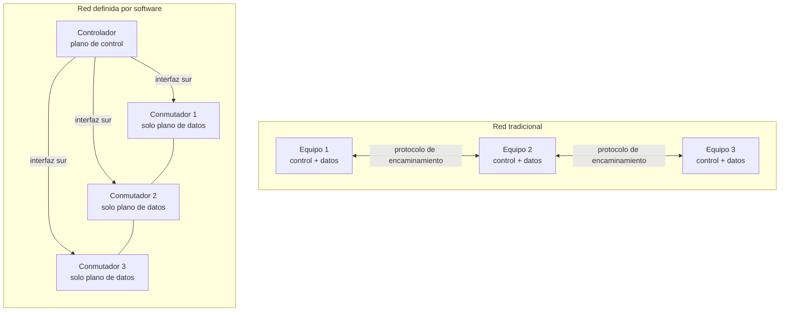
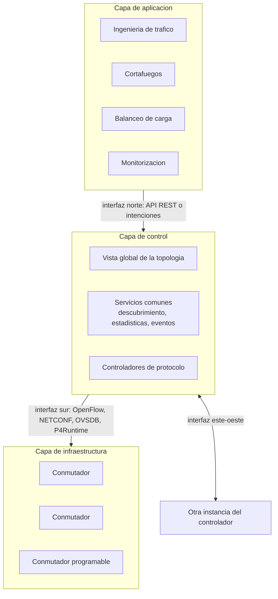
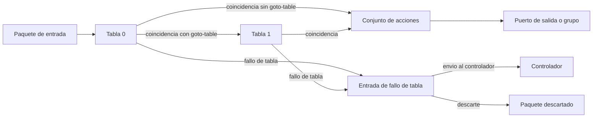
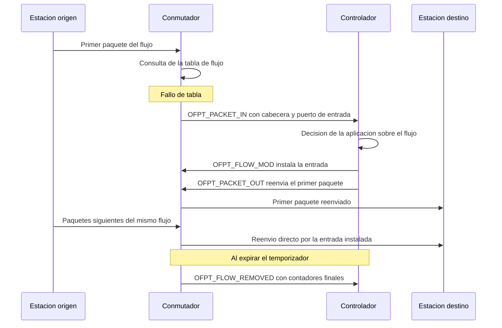

Una red construida con equipos cerrados reparte la inteligencia entre todos ellos: cada
conmutador y cada encaminador calcula por su cuenta cómo tratar el tráfico que lo
atraviesa, y el operador solo puede influir en esa decisión configurando dispositivo a
dispositivo. Las redes definidas por software rompen ese acoplamiento y trasladan la
lógica de decisión a un elemento externo que programa el reenvío de los equipos mediante
una interfaz abierta. Este capítulo desarrolla la separación entre el plano de control y
el plano de datos, la arquitectura en tres capas que resulta de ella, el protocolo con
el que el controlador programa las tablas de reenvío, el modelo de programación de los
controladores más extendidos y las contrapartidas que introduce el modelo. La
virtualización de las funciones de red, que persigue un objetivo complementario sobre el
mismo sustrato, se desarrolla en
[virtualización de funciones de red](section_2_nfv_y_mano.md).

## Introducción

Una **red definida por software** (Software Defined Networking, `SDN`) es una
arquitectura de red en la que la decisión sobre cómo se trata cada paquete se calcula en
un elemento lógicamente centralizado y externo a los equipos de reenvío, que la instalan
y la ejecutan sin participar en su cálculo. Un conmutador convencional tiene su software
y su funcionalidad fijados de fábrica, de modo que el fabricante decide qué protocolos
implementa y qué criterios aplica para reenviar tráfico. Un conmutador compatible con
una interfaz de programación del reenvío es, en cambio, programable, y su comportamiento
depende de las reglas que una entidad externa le instale en tiempo de ejecución. Esa
entidad recibe el nombre de **controlador**, y las reglas que instala describen qué
hacer con los paquetes que coinciden con un patrón determinado. El resultado es una red
cuyo comportamiento se define en software, sobre una infraestructura de reenvío
genérica, en lugar de emerger de la suma de decisiones autónomas de equipos con lógica
embebida.

## Planos funcionales de una red

Toda arquitectura de red, definida por software o no, reparte sus funciones entre tres
planos, cuya separación conceptual precede a `SDN` y que ya aparecen al tratar los
mecanismos de calidad de servicio en
[calidad de servicio en redes IP](../../05_servicios/05_qos_y_qoe/section_1_qos_en_redes_ip.md#plano-de-control).
Lo que `SDN` modifica no es la existencia de estos planos, sino dónde se ejecuta cada
uno y qué interfaz los une.

### Plano de datos

El **plano de datos** se encarga del movimiento de los paquetes: el reenvío hacia el
puerto de salida, el filtrado del tráfico que no debe progresar, el almacenamiento
temporal en colas, el marcado de paquetes para su clasificación posterior y la
limitación de la velocidad a la que un flujo atraviesa el equipo. Opera paquete a
paquete, a velocidad de línea, y por esa razón se implementa en hardware especializado.

### Plano de control

El **plano de control** decide cómo debe comportarse el plano de datos. Gestiona los
cambios de topología, calcula las rutas, actualiza las reglas de reenvío y reacciona
ante la caída de un enlace o la aparición de un vecino nuevo. Los protocolos de
encaminamiento descritos en
[fundamentos de encaminamiento](../../02_redes/04_encaminamiento/section_1_fundamentos_de_encaminamiento.md#reenvio-y-encaminamiento)
son su realización clásica: cada equipo ejecuta su propia instancia del protocolo y
construye su propia tabla de reenvío.

### Plano de gestión

El **plano de gestión** cubre la administración de la red, con la configuración de los
dispositivos, su monitorización y la recogida de medidas. Es el plano a través del cual
el operador expresa lo que quiere que la red haga, y también el que concentra la mayor
parte del esfuerzo humano en una red tradicional.

## Limitaciones de la red tradicional

La motivación de `SDN` nace de un conjunto de limitaciones que comparten las redes
construidas con equipos cerrados de propósito fijo.

### Control distribuido y decisión autónoma por equipo

En una red tradicional, cada equipo ejecuta su propio plano de control y decide de forma
autónoma. La coherencia global no se programa, sino que se espera como resultado de la
convergencia de todos los planos de control locales sobre una misma vista de la
topología. Esa convergencia funciona bien cuando el objetivo es alcanzar un destino por
el camino de menor coste, que es lo que un protocolo de estado del enlace calcula, y se
vuelve difícil de manejar cuando la política deseada no se expresa como un coste por
enlace. Encaminar el tráfico de una aplicación concreta por un camino distinto del que
elegiría ese algoritmo exige manipular métricas, inyectar rutas o superponer mecanismos
adicionales, porque no existe ningún punto donde la intención del operador pueda
declararse una sola vez para toda la red.

### Equipos cerrados e interfaces propietarias

Los equipos de red tradicionales integran el software con el hardware y exponen
interfaces propietarias. El operador no puede sustituir la lógica de control de un
equipo sin sustituir el equipo completo, ni introducir una función nueva sin esperar a
que el fabricante la incorpore a una versión futura. La innovación queda así
condicionada al calendario del fabricante, y con ella el rendimiento, la seguridad, la
fiabilidad y la calidad de servicio y de experiencia que la red puede ofrecer.

### Configuración dispositivo a dispositivo

La configuración representa una parte significativa del coste total de operación y es,
además, la principal fuente de riesgo. Aplicar un cambio de política obliga a repetirlo
en cada equipo afectado, con una sintaxis que depende del fabricante y sin ninguna
comprobación global de coherencia entre los cambios individuales. Un error en cualquiera
de ellos se traduce en una interrupción del servicio y en un gasto adicional de
diagnóstico. A esto se añade que el software defectuoso y los errores de diseño de los
propios equipos pueden provocar fallos en cascada, en los que un dispositivo arrastra a
los que dependen de él y amplifica el alcance del problema inicial.

### Patrones de tráfico heterogéneos

El tráfico que atraviesa una red moderna mezcla navegación web, dispositivos de
comunicación entre máquinas, transmisiones en tiempo real y aplicaciones con requisitos
muy distintos de velocidad, volumen y tolerancia al retardo. La carga de trabajo que esa
heterogeneidad impone a los administradores, cuando no se automatiza, degenera en
ineficiencias y en errores humanos. La demanda de servicios en la nube agrava el
problema, porque exige redes flexibles, escalables y capaces de establecer conexiones
rápidas, fiables y seguras en plazos que ninguna configuración manual puede sostener.

???+ example "Coste de aplicar una política de filtrado equipo a equipo"

    Una red de operador con 200 encaminadores debe bloquear el tráfico dirigido a un
    conjunto de direcciones a raíz de un incidente de seguridad. La configuración manual
    de cada equipo, incluida la comprobación posterior de que la regla quedó activa,
    consume unos 10 minutos, lo que arroja 2 000 minutos en total, algo más de 33 horas
    de intervención. Durante todo ese intervalo la política está aplicada solo en una
    parte de la red, de modo que el comportamiento efectivo es incoherente mientras el
    despliegue avanza.

    Con la decisión centralizada, la misma política se expresa una vez como un conjunto
    de reglas y el controlador la distribuye a los 200 equipos en el tiempo que tarda en
    escribir sus tablas, del orden de segundos. La diferencia no es solo de esfuerzo,
    sino de coherencia: en el primer caso existe una ventana de horas en la que dos
    equipos contiguos tratan el mismo tráfico de forma distinta, y en el segundo se
    reduce al tiempo de propagación de las órdenes de instalación.

## Separación del plano de control y del plano de datos

La idea central de `SDN` es extraer el plano de control de los equipos y ejecutarlo en
un elemento externo, dejando en el equipo únicamente un plano de datos programable. El
conmutador deja de calcular rutas y de interpretar protocolos de encaminamiento: se
convierte en una máquina que compara cabeceras contra un conjunto de reglas y ejecuta
las acciones asociadas a la que coincide. Todo el razonamiento sobre topología, política
y calidad de servicio se traslada al controlador, que posee una vista global de la red y
programa desde ella el comportamiento de cada equipo, como contrasta el diagrama
siguiente.



En el modelo tradicional la decisión se calcula tantas veces como equipos hay, y la
coherencia depende de que todos converjan a la misma conclusión. En el modelo definido
por software se calcula una sola vez, sobre una vista completa de la topología, y se
distribuye a los equipos como reglas de reenvío. Esa centralización es **lógica** y no
necesariamente física: un controlador puede estar formado por varias instancias
distribuidas que mantienen una vista común, tal como se describe más adelante.

### Consecuencias de la separación

La separación produce tres efectos encadenados. El comportamiento de la red pasa a ser
programable desde fuera del equipo, porque la infraestructura queda compuesta por nodos
configurables cuyas reglas determinan cómo se gestiona y encamina el tráfico y pueden
modificarse en tiempo real. La evolución del plano de control se desacopla del ciclo de
vida del hardware, de modo que añadir una función nueva significa desplegar una
aplicación sobre el controlador y no sustituir equipos. Y la red se convierte en un
sistema observable de forma unificada, puesto que el controlador conoce la topología
completa y recoge los contadores de todos los equipos, lo que permite decidir con
información que ningún equipo aislado posee.

## Arquitectura en tres capas

La arquitectura `SDN` se organiza en tres capas superpuestas, unidas por dos interfaces
cuya denominación responde a su posición en el diagrama clásico: la **interfaz sur**
(_southbound interface_), entre el controlador y los equipos, y la **interfaz norte**
(_northbound interface_), entre el controlador y las aplicaciones.



### Capa de infraestructura

La capa de infraestructura la forman los elementos de reenvío, físicos o implementados
en software, despojados de plano de control propio. Cada elemento mantiene una o varias
tablas de reglas, ejecuta las acciones que esas reglas indican y expone al controlador
tanto su inventario de puertos como los contadores asociados a cada regla. Un conmutador
virtual dentro de un servidor pertenece a esta capa en el mismo sentido que un equipo
dedicado, y es la pieza que conecta las máquinas virtuales y los contenedores descritos
en [tipos de virtualización](../01_virtualizacion/section_1_tipos_de_virtualizacion.md)
con la red física.

### Capa de control

La capa de control aloja el controlador, que mantiene la vista global de la red y ofrece
a las aplicaciones un conjunto de servicios comunes: descubrimiento de la topología,
inventario de equipos y puertos, recogida de estadísticas, notificación de eventos y
programación de las reglas de reenvío. El controlador no decide cuál debe ser la
política de la red, sino que proporciona las primitivas con las que las aplicaciones la
expresan y las traduce al protocolo que cada equipo entiende.

### Capa de aplicación

La capa de aplicación contiene la lógica de negocio de la red. Una aplicación de
ingeniería de tráfico, un cortafuegos, un balanceador de carga o un sistema de detección
de anomalías son programas que consultan el estado de la red a través de la interfaz
norte y expresan sobre ella el comportamiento deseado. La misma función que en una red
tradicional exigiría un equipo dedicado se reduce aquí a una aplicación sobre el
controlador, siempre que su cometido pueda expresarse en términos de reglas de reenvío.

### Interfaz sur

La interfaz sur transporta dos tipos de información en sentidos opuestos: del
controlador hacia el equipo viajan las órdenes de instalación, modificación y borrado de
reglas, y del equipo hacia el controlador viajan los eventos y las estadísticas.
`OpenFlow` es el protocolo de interfaz sur más conocido, pero no el único que un
controlador utiliza en la práctica. `NETCONF` con modelos `YANG` cubre la configuración
declarativa de los equipos, `OVSDB` la gestión de la base de datos de configuración de
los conmutadores virtuales, `P4Runtime` el control de un plano de datos programable,
`gNMI` la telemetría y la configuración en flujo continuo, y `PCEP` junto con `BGP-LS`
el cálculo y la instalación de caminos en la red de transporte.

### Interfaz norte

La interfaz norte carece de un estándar único. La forma más habitual es una `API` de
tipo `REST` que expone la topología, los equipos, los flujos y las estadísticas como
recursos consultables y modificables. Sobre ella se construyen modelos de mayor nivel,
donde la aplicación declara una **intención** en lugar de un conjunto de reglas: expresa
que dos puntos deben quedar conectados con unas características dadas y delega en el
controlador el cálculo de las reglas que lo consiguen en la topología del momento. Esa
delegación permite que la política sobreviva a un cambio de topología sin reescribirse.

## OpenFlow

`OpenFlow` es un protocolo de comunicaciones que regula la interacción entre un
controlador y los conmutadores con el propósito de gestionar el reenvío de datos. Su
característica esencial es la capacidad de programar las tablas de flujo de los
conmutadores, definiendo qué paquetes coinciden con cada regla y qué acciones se aplican
sobre ellos, entre ellas reenviar, descartar, modificar cabeceras o encapsular. El
protocolo se centra en la interfaz de programación del conmutador y cuenta con el
respaldo de la Open Networking Foundation, que publica sus especificaciones. Su
compatibilidad se extiende a conmutadores comerciales de diversos fabricantes y a
controladores de software que actúan como sistemas operativos de red.

### Canal de control

El controlador y el conmutador mantienen una conexión `TCP` sobre la que viaja toda la
señalización del protocolo, opcionalmente protegida con `TLS`. El puerto asignado por la
IANA para ese canal es el `6653`, que sustituyó al `6633` utilizado de forma no oficial
en los primeros despliegues y aún presente en material antiguo. La conexión se establece
con un intercambio de mensajes `OFPT_HELLO` en el que ambos extremos negocian la versión
del protocolo, tras el cual el controlador solicita las capacidades y los puertos del
conmutador con `OFPT_FEATURES_REQUEST` y recibe `OFPT_FEATURES_REPLY`. Mensajes
`OFPT_ECHO_REQUEST` y `OFPT_ECHO_REPLY` periódicos verifican que el canal sigue vivo.

### Tablas de flujo y cauce de proceso

Un conmutador `OpenFlow` organiza su lógica de reenvío en una o varias **tablas de
flujo** recorridas en secuencia. Cada tabla contiene entradas ordenadas por prioridad, y
el paquete se compara con ellas hasta encontrar la de mayor prioridad cuyos campos de
coincidencia encajan. Las instrucciones de esa entrada pueden aplicar acciones de
inmediato, acumularlas en un conjunto que se ejecuta al final del recorrido o enviar el
paquete a una tabla posterior, lo que encadena el proceso en un cauce de varias etapas.



El encadenamiento en varias tablas permite descomponer una política compleja en etapas
independientes, por ejemplo una primera tabla que clasifica el tráfico por inquilino y
una segunda que decide el reenvío dentro de ese inquilino, sin multiplicar entradas para
cubrir todas las combinaciones. La versión inicial del protocolo disponía de una única
tabla, y el cauce de varias tablas se introdujo a partir de `OpenFlow 1.1`.

### Campos de coincidencia

Los **campos de coincidencia** son los criterios que se aplican sobre la cabecera del
paquete y sobre su puerto de entrada para determinar si una regla es aplicable. La
primera versión del protocolo definía un conjunto fijo de doce campos: puerto de
entrada, direcciones física de origen y de destino, tipo de protocolo de nivel de red,
identificador y prioridad de red de área local virtual, direcciones `IP` de origen y de
destino, protocolo de nivel superior, bits de tipo de servicio y puertos de origen y de
destino de nivel de transporte. Las versiones posteriores sustituyeron ese conjunto fijo
por una codificación extensible en la que cada campo se transporta como un elemento con
tipo, longitud y valor, lo que permitió añadir campos nuevos sin cambiar el formato de
los mensajes y aplicar máscaras arbitrarias sobre cada uno.

| Campo      | Descripción                                                    |
| ---------- | -------------------------------------------------------------- |
| `in_port`  | Puerto físico o lógico por el que llegó el paquete.            |
| `eth_src`  | Dirección física de origen, con máscara opcional.              |
| `eth_dst`  | Dirección física de destino, con máscara opcional.             |
| `eth_type` | Tipo de protocolo transportado, `0x0800` para `IPv4`.          |
| `vlan_vid` | Identificador de red de área local virtual.                    |
| `ipv4_src` | Dirección `IP` de origen, con prefijo o máscara.               |
| `ipv4_dst` | Dirección `IP` de destino, con prefijo o máscara.              |
| `ip_proto` | Protocolo de nivel superior, `1` para `ICMP` y `6` para `TCP`. |
| `tcp_dst`  | Puerto de destino de nivel de transporte.                      |

Un campo que la regla no menciona queda sin especificar y coincide con cualquier valor,
de modo que una regla puede ser tan específica como un flujo individual identificado por
sus cinco campos habituales o tan general como todo el tráfico de un puerto de entrada.

### Acciones

Cuando un paquete coincide con una regla se ejecuta la **acción** asociada. Las acciones
disponibles cubren el reenvío a un puerto concreto, el envío a un grupo que define un
tratamiento colectivo como la difusión o el reparto entre caminos equivalentes, la
modificación de cualquier campo de la cabecera, la inserción o la extracción de
etiquetas de red de área local virtual o de conmutación por etiquetas, la medición del
caudal frente a un umbral y el envío del paquete al controlador. El descarte no es una
acción explícita: un paquete cuya regla no produce ninguna acción de salida se descarta
por ausencia de destino.

### Prioridades

Cuando varias reglas pueden aplicarse a un mismo paquete, la **prioridad** de cada una
determina cuál prevalece, lo que permite que convivan reglas generales y específicas en
la misma tabla: una regla de prioridad alta que bloquea un origen concreto se evalúa
antes que una de prioridad baja que reenvía el tráfico restante, sin que el orden de
instalación influya en el resultado. La entrada de menor prioridad posible, con todos
los campos sin especificar, constituye la **entrada de fallo de tabla** que decide qué
hacer con los paquetes que no coinciden con ninguna otra regla, habitualmente enviarlos
al controlador. Si esa entrada no existe, el paquete se descarta.

### Contadores

Cada entrada mantiene **contadores** que registran cuántas veces se ha aplicado, en
paquetes y en bytes, junto con el tiempo transcurrido desde su instalación, y existen
contadores equivalentes por tabla, por puerto y por cola. Esta información sirve para
monitorización, contabilidad del tráfico por cliente o por servicio y detección de
anomalías, y es la base sobre la que una aplicación de ingeniería de tráfico decide
redistribuir la carga.

### Temporizadores

Una entrada puede instalarse con dos temporizadores. El **temporizador de inactividad**
la elimina cuando transcurre un intervalo sin que ningún paquete coincida con ella, lo
que libera espacio ocupado por flujos terminados. El **temporizador absoluto** la
elimina al cumplirse un plazo desde su instalación, con independencia de la actividad,
lo que acota la vigencia de una decisión. El conmutador notifica la eliminación con un
mensaje `OFPT_FLOW_REMOVED` cuando la entrada se instaló con la marca correspondiente,
de modo que la aplicación puede registrar las estadísticas finales del flujo.

???+ example "Tabla de flujo de un conmutador que filtra y reenvía"

    Un conmutador con cuatro puertos debe bloquear todo el tráfico `ICMP`, descartar el
    tráfico dirigido al puerto `23` de nivel de transporte, reenviar el resto del
    tráfico entre dos estaciones conocidas y enviar al controlador lo que no encaje en
    ninguna de esas categorías. Las entradas se instalan con la orden de control local
    del conmutador virtual, que expresa la misma información que un mensaje
    `OFPT_FLOW_MOD`.

    ```bash linenums="1"
    # Bloqueo de todo el trafico ICMP: sin accion de salida el paquete se descarta
    ovs-ofctl -O OpenFlow13 add-flow s1 \
        "table=0,priority=300,eth_type=0x0800,ip_proto=1,actions=drop"
    # Bloqueo del acceso al puerto 23 de la estacion 10.0.0.1
    ovs-ofctl -O OpenFlow13 add-flow s1 \
        "table=0,priority=300,eth_type=0x0800,ipv4_dst=10.0.0.1,ip_proto=6,tcp_dst=23,actions=drop"
    # Reenvio entre las dos estaciones conocidas, en ambos sentidos
    ovs-ofctl -O OpenFlow13 add-flow s1 \
        "table=0,priority=200,in_port=1,eth_dst=00:00:00:00:00:02,actions=output:2"
    ovs-ofctl -O OpenFlow13 add-flow s1 \
        "table=0,priority=200,in_port=2,eth_dst=00:00:00:00:00:01,actions=output:1"
    # Entrada de fallo de tabla: el resto del trafico se consulta al controlador
    ovs-ofctl -O OpenFlow13 add-flow s1 \
        "table=0,priority=0,actions=controller"
    ```

    El volcado de la tabla tras unos segundos de tráfico muestra los contadores
    asociados a cada entrada.

    ```plaintext title="Expected output"
    duration=12.3s, table=0, n_packets=8, n_bytes=784, priority=300,icmp actions=drop
    duration=12.3s, table=0, n_packets=0, n_bytes=0, priority=300,tcp,nw_dst=10.0.0.1,tp_dst=23 actions=drop
    duration=12.2s, table=0, n_packets=34, n_bytes=3196, priority=200,in_port=1,dl_dst=00:00:00:00:00:02 actions=output:2
    duration=12.2s, table=0, n_packets=34, n_bytes=3196, priority=200,in_port=2,dl_dst=00:00:00:00:00:01 actions=output:1
    duration=12.1s, table=0, n_packets=3, n_bytes=246, priority=0 actions=CONTROLLER:65535
    ```

    Los ocho paquetes contabilizados por la primera entrada corresponden a cuatro
    intercambios de solicitud y respuesta de un diagnóstico de conectividad que no llegó
    a completarse, puesto que la acción es el descarte. La segunda entrada no registra
    tráfico, lo que indica que nadie intentó el acceso bloqueado en el intervalo medido.
    Las dos entradas de reenvío muestran cifras simétricas, coherentes con un
    intercambio bidireccional, y la entrada de fallo de tabla acumula los tres paquetes
    que viajaron al controlador porque ninguna regla anterior los cubría.

### Mensajes del protocolo

El protocolo define tres familias de mensajes según quién los origina. Los mensajes del
controlador hacia el conmutador modifican su estado o consultan información, con
`OFPT_FLOW_MOD` para instalar, modificar o borrar entradas, `OFPT_PACKET_OUT` para
inyectar un paquete por un puerto concreto y `OFPT_MULTIPART_REQUEST` para solicitar
estadísticas. Los mensajes asíncronos del conmutador hacia el controlador notifican
sucesos, con `OFPT_PACKET_IN` para entregar un paquete que requiere decisión,
`OFPT_FLOW_REMOVED` para informar de la expiración de una entrada, `OFPT_PORT_STATUS`
para anunciar un cambio de estado de un puerto y `OFPT_ERROR` para señalar un problema.
Los mensajes simétricos, `OFPT_HELLO` y `OFPT_ECHO`, los puede originar cualquiera de
los dos extremos, y `OFPT_BARRIER_REQUEST` permite al controlador exigir que todas las
órdenes previas se hayan completado antes de continuar, garantía necesaria cuando el
orden de instalación de varias reglas afecta a la corrección del resultado.

### Flujo reactivo y flujo proactivo

Existen dos formas de poblar las tablas de flujo, con propiedades muy distintas.

En el modo **reactivo**, las tablas comienzan vacías salvo la entrada de fallo de tabla.
El primer paquete de cada flujo nuevo no coincide con ninguna regla, viaja al
controlador dentro de un mensaje `OFPT_PACKET_IN`, y el controlador decide qué hacer con
él, instala la regla correspondiente con `OFPT_FLOW_MOD` y ordena el reenvío de ese
primer paquete con `OFPT_PACKET_OUT`. Los paquetes siguientes del mismo flujo ya
encuentran la regla instalada y se reenvían sin intervención del controlador.



En el modo **proactivo**, el controlador instala las reglas antes de que aparezca el
tráfico, a partir de la topología y de la política conocidas. Ningún paquete sufre el
retardo de la consulta y el controlador no se convierte en cuello de botella, a cambio
de que las reglas deben cubrir por anticipado todo el tráfico previsible, lo que consume
espacio de tabla incluso para flujos que nunca llegan a producirse. Los despliegues
reales combinan ambos modos, con reglas proactivas agregadas para el tráfico masivo y
reglas reactivas específicas para los flujos que exigen un tratamiento particular.

???+ example "Retardo de la consulta al controlador en el primer paquete"

    Un conmutador opera en modo reactivo con un controlador situado a 1 ms de retardo de
    ida. El tratamiento de la consulta en el controlador, incluida la decisión de la
    aplicación y la construcción de las órdenes de respuesta, consume 3 ms. El primer
    paquete de cada flujo acumula 1 ms de subida, 3 ms de proceso y 1 ms de bajada de
    órdenes, cerca de 5 ms adicionales sobre el retardo normal de reenvío, mientras que
    los paquetes siguientes no sufren penalización alguna.

    El efecto sobre una transferencia larga es despreciable, porque los 5 ms se reparten
    entre miles de paquetes. Sobre una sucesión de conexiones muy cortas, en cambio, el
    coste es dominante: un cliente que abre 200 conexiones independientes añade 5 ms a
    cada una, un segundo en total si se establecen en serie. Ese cálculo explica por qué
    el tráfico masivo se cubre con reglas proactivas agregadas y se reserva el modo
    reactivo para los flujos cuyo tratamiento no puede anticiparse.

### Versiones del protocolo

La primera versión ampliamente implementada, `OpenFlow 1.0`, define una sola tabla de
flujo y el conjunto fijo de doce campos de coincidencia. `OpenFlow 1.1` introduce el
cauce de varias tablas, las tablas de grupos y el soporte de conmutación por etiquetas.
`OpenFlow 1.2` reemplaza el conjunto fijo de campos por la codificación extensible y
añade soporte de `IPv6`. `OpenFlow 1.3` incorpora los medidores para limitación de
caudal, la entrada de fallo de tabla explícita y las conexiones simultáneas con varios
controladores, y es la versión que concentra la mayor parte de las implementaciones en
producción. Las versiones `1.4` y `1.5` añaden refinamientos como las tablas de salida,
con menor adopción en equipos comerciales. Un despliegue debe fijar de forma explícita
la versión con la que trabaja, porque un conmutador y un controlador que negocian
versiones distintas convergen a la menor común y pierden las capacidades posteriores a
ella.

## Controladores y modelo de programación

Un controlador es, desde el punto de vista del programador, una plataforma orientada a
eventos. Mantiene la conexión con los conmutadores, traduce los mensajes del protocolo
en eventos internos y los entrega a las aplicaciones registradas para recibirlos. Una
aplicación de control no ejecuta un bucle que consulta el estado de la red, sino que
declara qué eventos le interesan y qué debe ocurrir cuando se producen: la conexión de
un conmutador nuevo, la llegada de un paquete sin regla, el cambio de estado de un
puerto o la expiración de una entrada.

Ese modelo impone una disciplina concreta. Toda decisión debe tomarse con la información
que el evento transporta y con el estado que la propia aplicación haya acumulado, el
tratamiento de un evento debe ser breve porque bloquea la atención de los demás, y el
efecto sobre la red se materializa siempre como una orden de instalación de reglas, no
como una manipulación directa del paquete. Una aplicación bien escrita traslada al
conmutador tanto trabajo como puede, e interviene solo en las decisiones que las reglas
ya instaladas no cubren.

### Aprendizaje de direcciones como aplicación de control

El ejemplo canónico es la reimplementación del aprendizaje de direcciones descrito en
[conmutación y Ethernet](../../02_redes/03_conmutacion_y_lan/section_1_conmutacion_y_ethernet.md#tabla-de-direcciones-y-aprendizaje)
como aplicación sobre un controlador. La aplicación mantiene una tabla que asocia
direcciones físicas con puertos, la actualiza con la dirección de origen de cada paquete
que recibe y, cuando conoce el puerto que conduce al destino, instala una regla para que
el conmutador reenvíe por sí mismo el resto del flujo. Mientras el destino es
desconocido, el paquete se difunde por todos los puertos salvo el de entrada, como haría
un conmutador tradicional. La diferencia no está en el algoritmo, sino en dónde reside:
la política de reenvío es ahora un programa modificable, y sustituir el aprendizaje por
un criterio distinto no exige cambiar de equipo.

???+ example "Aplicación de controlador que aprende direcciones y programa el reenvío"

    La aplicación reacciona a dos eventos. Al conectarse un conmutador instala la
    de fallo de tabla que dirige al controlador el tráfico sin regla, y al recibir un
    paquete sin regla actualiza la tabla de direcciones y, si conoce el puerto de salida
    instala una entrada para ese par de direcciones con un temporizador de inactividad
    que la retira cuando el flujo termina.

    ```python linenums="1"
    from ryu.base import app_manager
    from ryu.controller import ofp_event
    from ryu.controller.handler import CONFIG_DISPATCHER, MAIN_DISPATCHER, set_ev_cls
    from ryu.lib.packet import ethernet, packet
    from ryu.ofproto import ofproto_v1_3


    class ConmutadorAprendizaje(app_manager.RyuApp):
        """Conmutador de nivel de enlace con aprendizaje de direcciones."""

        OFP_VERSIONS = [ofproto_v1_3.OFP_VERSION]

        def __init__(self, *args: object, **kwargs: object) -> None:
            super().__init__(*args, **kwargs)
            # Tabla de direcciones indexada por identificador de conmutador
            self.direcciones: dict[int, dict[str, int]] = {}

        def _instalar(
            self, dp: object, prioridad: int, match: object,
            acciones: list, inactividad: int = 0,
        ) -> None:
            """Envía al conmutador una orden de instalación de entrada de flujo."""
            parser = dp.ofproto_parser
            instr = [
                parser.OFPInstructionActions(dp.ofproto.OFPIT_APPLY_ACTIONS, acciones)
            ]
            dp.send_msg(
                parser.OFPFlowMod(
                    datapath=dp, priority=prioridad, match=match,
                    instructions=instr, idle_timeout=inactividad,
                )
            )

        @set_ev_cls(ofp_event.EventOFPSwitchFeatures, CONFIG_DISPATCHER)
        def _conexion(self, ev: ofp_event.EventOFPSwitchFeatures) -> None:
            """Instala la entrada de fallo de tabla al conectarse un conmutador."""
            dp = ev.msg.datapath
            parser, proto = dp.ofproto_parser, dp.ofproto
            al_controlador = parser.OFPActionOutput(
                proto.OFPP_CONTROLLER, proto.OFPCML_NO_BUFFER
            )
            self._instalar(dp, 0, parser.OFPMatch(), [al_controlador])

        @set_ev_cls(ofp_event.EventOFPPacketIn, MAIN_DISPATCHER)
        def _paquete_sin_regla(self, ev: ofp_event.EventOFPPacketIn) -> None:
            """Aprende el origen y reenvía el paquete entregado por el conmutador."""
            msg = ev.msg
            dp = msg.datapath
            parser, proto = dp.ofproto_parser, dp.ofproto
            entrada = msg.match["in_port"]
            trama = packet.Packet(msg.data).get_protocol(ethernet.ethernet)
            tabla = self.direcciones.setdefault(dp.id, {})
            # El puerto de entrada revela la ubicacion del origen
            tabla[trama.src] = entrada
            salida = tabla.get(trama.dst, proto.OFPP_FLOOD)
            acciones = [parser.OFPActionOutput(salida)]
            # Solo merece una regla el trafico cuyo destino ya se conoce
            if salida != proto.OFPP_FLOOD:
                match = parser.OFPMatch(
                    in_port=entrada, eth_src=trama.src, eth_dst=trama.dst
                )
                self._instalar(dp, 100, match, acciones, inactividad=30)
            dp.send_msg(
                parser.OFPPacketOut(
                    datapath=dp, buffer_id=msg.buffer_id, in_port=entrada,
                    actions=acciones, data=msg.data,
                )
            )
    ```

    El temporizador de inactividad de 30 segundos es la pieza que mantiene acotado el
    consumo de tabla: una entrada creada para un flujo concreto desaparece cuando ese
    flujo cesa, sin que el controlador tenga que recordar borrarla. Sin ese
    temporizador, la tabla crecería con cada par de direcciones observado y agotaría el
    espacio disponible en un conmutador real.

### Controladores de uso extendido

Los controladores difieren en el lenguaje en que se programan, en el modelo con que
representan la red y en el grado de distribución que admiten.

| Controlador    | Lenguaje | Modelo de programación                                                       |
| -------------- | -------- | ---------------------------------------------------------------------------- |
| `ONOS`         | Java     | Agrupación de instancias con consenso y marco de intenciones al norte.       |
| `OpenDaylight` | Java     | Plataforma modular con modelos `YANG` sobre una abstracción de servicios.    |
| `Ryu`          | Python   | Biblioteca orientada a eventos, de arranque inmediato y sin infraestructura. |

`ONOS` y `OpenDaylight` responden a un objetivo de producción, con agrupación de
instancias, persistencia del estado y catálogo amplio de protocolos de interfaz sur, y
el primero está orientado en particular a redes de operador. `Ryu` responde a un
objetivo distinto, escribir una aplicación de control en unas decenas de líneas, y es el
que permite ver el protocolo sin la mediación de una capa de abstracción. La elección no
es una cuestión de calidad, sino de qué se quiere resolver.

### Agrupación de instancias del controlador

La centralización lógica no obliga a una única instancia física. Un controlador de
producción se despliega como una agrupación de instancias que comparten una vista común
de la red mediante un algoritmo de consenso, y cada conmutador mantiene conexiones
simultáneas con varias de ellas. Una instancia actúa como maestra para un conmutador
dado y las demás permanecen como esclavas, con derecho a leer su estado pero no a
modificarlo, de modo que la caída de la maestra provoca la promoción de otra sin
interrumpir el reenvío. El conmutador sigue aplicando las reglas ya instaladas mientras
no tiene controlador asignado, comportamiento que acota el efecto de un fallo del plano
de control sobre el tráfico en curso.

## Programabilidad del plano de datos

`OpenFlow` programa el reenvío, pero no el análisis de cabeceras: el conjunto de campos
que un conmutador sabe reconocer viene fijado por la especificación del protocolo y por
la implementación del fabricante, de modo que una cabecera nueva no puede utilizarse
como criterio de coincidencia hasta que la especificación la incorpora. Los lenguajes de
programación del plano de datos, entre los que `P4` es el más extendido, atacan esa
limitación un nivel más abajo: en lugar de programar las reglas de un cauce fijo,
describen el propio cauce.

Un programa de este tipo declara qué cabeceras existen, cómo se extraen del flujo de
bits de entrada mediante un analizador, qué tablas se consultan en qué orden, qué
acciones se aplican y cómo se reconstruye el paquete de salida. El compilador traduce
esa descripción al sustrato concreto del dispositivo, lo que elimina la necesidad de un
compilador distinto por arquitectura. El resultado es un plano de datos independiente
del protocolo, capaz de reconocer cabeceras que ningún estándar ha definido todavía, y
programado de abajo arriba desde los dispositivos individuales hasta la configuración
completa de la red. Su control en tiempo de ejecución se ejerce con una interfaz sur
propia, `P4Runtime`, que cumple para un cauce descrito en `P4` la misma función que
`OpenFlow` cumple para un cauce fijo.

## Casos de uso

El modelo se aplica a situaciones en las que la política deseada no se expresa bien como
un coste de encaminamiento. El control de acceso dinámico admite o bloquea tráfico según
criterios que cambian en el tiempo, sin reconfigurar equipo alguno. La movilidad
transparente reprograma el reenvío para seguir a un terminal que cambia de punto de
conexión sin alterar su dirección. El balanceo de carga reparte las peticiones dirigidas
a una dirección virtual entre varias máquinas reales, y la virtualización de red
construye topologías lógicas independientes sobre una misma infraestructura física. El
ahorro de energía concentra el tráfico en un subconjunto de enlaces y apaga el resto en
horas de baja demanda. La monitorización adaptativa ajusta qué tráfico se examina en
función de lo que los contadores revelan, y la detección de ataques de denegación de
servicio aprovecha esa visibilidad global para identificar patrones anómalos e instalar
reglas de bloqueo en el punto de entrada.

???+ example "Balanceo de carga sobre una dirección virtual"

    Tres servidores atienden peticiones dirigidas a una dirección virtual que ningún
    equipo físico posee. La aplicación de control mantiene un índice rotatorio y, al
    recibir el primer paquete de cada conexión nueva hacia esa dirección, elige el
    servidor siguiente, instala dos reglas que traducen las direcciones en los dos
    y deja que el resto de la conexión atraviese el conmutador sin intervención.

    ```bash linenums="1"
    # Topologia con cuatro estaciones, direcciones fisicas predecibles y control remoto
    sudo mn --arp --topo single,4 --mac --switch ovsk --controller remote
    # Resolucion estatica de la direccion virtual en cada estacion
    mininet> h1 arp -s 10.0.0.5 00:00:00:00:00:05
    # Servidores web en las tres estaciones que atienden la direccion virtual
    mininet> h2 python3 -m http.server 8000 &
    mininet> h3 python3 -m http.server 8000 &
    mininet> h4 python3 -m http.server 8000 &
    # Peticiones sucesivas desde la estacion cliente
    mininet> h1 curl 10.0.0.5:8000
    ```

    La estación cliente dirige todas sus peticiones a `10.0.0.5` y observa siempre la
    misma dirección de destino, mientras que las respuestas proceden alternativamente de
    `10.0.0.2`, `10.0.0.3` y `10.0.0.4`. El reparto no lo decide el cliente ni ningún
    equipo intermedio dedicado, sino la aplicación de control, que reescribe las
    direcciones con acciones de modificación de cabecera en las reglas que instala.
    Cambiar el criterio de reparto, para enviar varias peticiones consecutivas al mismo
    servidor o para ponderarlos según su capacidad, es una modificación del programa del
    controlador y no de la configuración de la red.

## SDN en el centro de datos

El centro de datos fue el primer entorno donde el modelo se desplegó de forma masiva,
por tres razones que lo hacen propicio. La infraestructura pertenece a un único
propietario, que controla a la vez la red y los servidores. La topología es regular,
habitualmente de hoja y espina con múltiples caminos de igual coste entre cualquier par
de servidores. Y el tráfico dominante es horizontal, entre servidores del propio centro,
con flujos que aparecen y desaparecen al ritmo con que se crean y se destruyen máquinas
virtuales y contenedores.

En ese entorno, el plano de datos relevante no está solo en los conmutadores físicos,
sino también en el conmutador virtual que cada servidor ejecuta para conectar sus
máquinas virtuales. Ese conmutador es software, admite tantas reglas como la memoria del
servidor permita y se programa con la misma interfaz sur que un equipo físico, lo que
hace del servidor el punto natural donde aplicar la política por inquilino. Sobre esa
base se construyen redes superpuestas que encapsulan el tráfico de cada inquilino en
túneles entre servidores, de modo que la red física solo ve tráfico entre servidores y
desconoce la topología lógica que transporta. El controlador mantiene la correspondencia
entre direcciones lógicas y ubicaciones físicas, y la actualiza cuando una máquina
virtual migra de servidor. La consecuencia operativa es que la red pasa a crearse y
destruirse por programa, al mismo ritmo que la capacidad de cómputo, tal como consumen
esa red las plataformas descritas en
[contenedores y orquestación](../01_virtualizacion/section_2_contenedores_y_orquestacion.md).

## SDN en la red de transporte

La red de transporte de un operador plantea un problema distinto. La topología es
irregular, los enlaces son costosos y su ocupación debe planificarse, los caminos tienen
requisitos contractuales de retardo y disponibilidad, y el número de flujos individuales
es demasiado grande para instalar una regla por cada uno. Un modelo que instale entradas
de flujo extremo a extremo en cada nodo del núcleo no escala en ese escenario, de modo
que el control centralizado se aplica de otra forma: el controlador no programa el
reenvío paquete a paquete, sino que calcula caminos y los impone al tráfico que debe
seguirlos, mediante dos piezas complementarias.

El **encaminamiento por segmentos** (_segment routing_) expresa un camino como una lista
ordenada de identificadores, los **segmentos**, que el nodo de entrada inserta en la
cabecera del paquete; cada segmento representa una instrucción, habitualmente alcanzar
un nodo por el camino más corto o cruzar un enlace concreto, y los nodos intermedios se
limitan a ejecutarlo y a retirarlo cuando lo completan, sin mantener estado por camino
ni por flujo. Los identificadores se distribuyen con extensiones de los protocolos de
estado del enlace descritos en
[OSPF y BGP](../../02_redes/04_encaminamiento/section_2_ospf_y_bgp.md), y la lista viaja
codificada bien como pila de etiquetas, tratada en
[convergencia y redes de nueva generación](../../02_redes/05_redes_de_operador/section_1_convergencia_y_ngn.md#conmutacion-por-etiquetas-en-el-nucleo-de-transporte),
bien como una cabecera de extensión de encaminamiento sobre `IPv6`. El **elemento de
cálculo de caminos** (Path Computation Element, `PCE`) es quien decide esa lista: recibe
la topología y la ocupación de los enlaces, resuelve el problema de encontrar caminos
que satisfagan restricciones de ancho de banda, retardo y disjunción, y comunica el
resultado a los nodos de entrada mediante el protocolo `PCEP`. Un `PCE` con estado
mantiene además el registro de los caminos ya establecidos y reoptimiza el conjunto
cuando cambia la carga, y en su modo de iniciativa propia es él, y no el nodo de
entrada, quien decide crear, modificar o eliminar un camino.

La comparación entre ambos entornos resume dos formas de aplicar la misma idea.

| Aspecto               | Centro de datos                                   | Red de transporte                                |
| --------------------- | ------------------------------------------------- | ------------------------------------------------ |
| Unidad de control     | Flujo individual o grupo de flujos por inquilino. | Camino extremo a extremo con restricciones.      |
| Estado en el núcleo   | Entradas de flujo en conmutadores y servidores.   | Sin estado por flujo, la política va al paquete. |
| Interfaz sur habitual | `OpenFlow`, `OVSDB`, `P4Runtime`.                 | `PCEP`, `BGP-LS`, `NETCONF`.                     |
| Criterio de decisión  | Aislamiento entre inquilinos y reparto de carga.  | Ancho de banda, retardo y disjunción.            |

## Contrapartidas del modelo

La centralización del plano de control resuelve problemas reales, pero introduce otros
que un despliegue debe afrontar de forma explícita.

### Punto único de fallo

Un controlador que concentra la decisión concentra también el riesgo. Su caída no
interrumpe de inmediato el tráfico, porque los conmutadores siguen aplicando las reglas
ya instaladas, pero deja la red sin capacidad de reaccionar: ningún flujo nuevo obtiene
regla en modo reactivo, ninguna caída de enlace provoca recálculo y ninguna política
nueva puede aplicarse. El canal de control es igualmente crítico, porque un conmutador
que pierde la conexión queda aislado aunque el controlador siga operativo. La mitigación
consiste en agrupar instancias con consenso distribuido, conectar cada conmutador con
varias de ellas, separar el canal de control del tráfico de usuario cuando la topología
lo permite e instalar reglas de reserva que mantengan una conectividad mínima en
ausencia de controlador. Ninguna de estas medidas es gratuita: todas añaden complejidad
al plano de control que la arquitectura pretendía simplificar.

### Latencia de instalación de flujos

El modo reactivo introduce, en el primer paquete de cada flujo, el tiempo de ida y
vuelta hasta el controlador más su tiempo de proceso. El efecto no se limita al retardo
de ese paquete: el ritmo con que aparecen flujos nuevos impone una carga de mensajes que
crece con la actividad de la red, y una ráfaga puede saturar tanto el canal de control
como la capacidad de proceso de la aplicación. El primer paquete queda además almacenado
en el conmutador mientras espera decisión, lo que consume un recurso finito. Las
mitigaciones habituales son instalar reglas de forma proactiva para el tráfico
previsible, agregar flujos en reglas con comodines en lugar de una regla por flujo, y
delegar en el propio conmutador las decisiones que no requieren vista global.

### Escalabilidad de la tabla de flujo

Un conmutador físico almacena sus reglas de coincidencia por comodines en memoria
direccionable por contenido, un recurso caro en superficie de silicio y en consumo, de
modo que su capacidad se mide en unos pocos miles de entradas en equipos de gama
comercial. Una política que instale una entrada por flujo agota ese espacio con rapidez,
y un conmutador con la tabla llena rechaza las órdenes de instalación posteriores, lo
que obliga a la aplicación a tratar el error y a decidir qué entrada sacrificar. Vivir
dentro de ese límite exige agregar reglas con comodines para que una entrada cubra
muchos flujos, ajustar los temporizadores de inactividad para retirar pronto las
entradas de flujos terminados, repartir la política entre varias tablas del cauce y
desplazar las reglas de grano fino hacia el conmutador virtual del servidor, donde la
tabla reside en memoria convencional. Este límite es la razón principal por la que el
modelo reactivo puro, elegante en su formulación, rara vez sobrevive al contacto con una
red real.

### Coherencia durante la actualización

Instalar una política nueva en varios conmutadores no es instantáneo, y en el intervalo
en que unas reglas ya están activas y otras no un paquete puede recorrer un camino que
ninguna de las dos políticas contemplaba. Los mensajes de barrera ordenan las escrituras
dentro de un conmutador, y las técnicas de actualización coherente etiquetan el tráfico
con la versión de política que le corresponde para que cada paquete sea tratado de
principio a fin por una sola de ellas.

## Relación con la virtualización de funciones de red

`SDN` y la virtualización de funciones de red son iniciativas independientes y
complementarias. `SDN` separa el plano de control del plano de datos y programa el
reenvío desde un punto centralizado, mientras que la virtualización de funciones de red
desacopla las funciones del hardware dedicado y las ejecuta como software sobre
servidores de propósito general. Cada una resuelve un problema distinto: una decide por
dónde va el tráfico, la otra dónde se ejecuta la función que lo trata. Ninguna necesita
a la otra para existir, y una función virtualizada puede desplegarse en una red
gestionada de forma tradicional igual que una red definida por software puede
interconectar equipos físicos dedicados.

La combinación de ambas es donde cada una alcanza su pleno sentido. Una función de red
virtualizada solo aporta flexibilidad real si el tráfico que debe atravesarla puede
redirigirse hacia ella cuando se instancia y desviarse cuando se retira, y esa
redirección dinámica es lo que un plano de control programable proporciona. El
encadenamiento de varias funciones en un orden determinado, la migración de una
instancia a otro servidor sin interrumpir el servicio y el escalado añadiendo instancias
en paralelo exigen reprogramar el reenvío al mismo ritmo que cambia el despliegue. La
arquitectura de las funciones virtualizadas, los elementos que las gestionan y las
orquestan y su aplicación a las redes móviles se desarrollan en
[virtualización de funciones de red](section_2_nfv_y_mano.md), y la aplicación conjunta
de ambos modelos a la red de acceso radio y al cómputo en el borde se trata en
[RAN virtualizada y computación en el borde](section_3_ran_virtualizada_y_edge.md).
