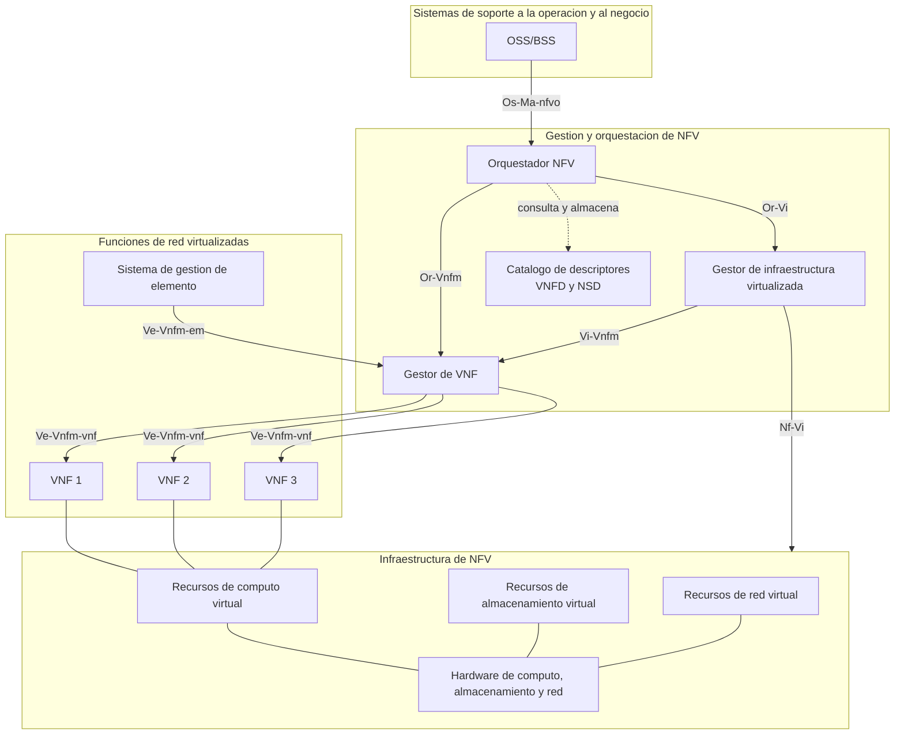
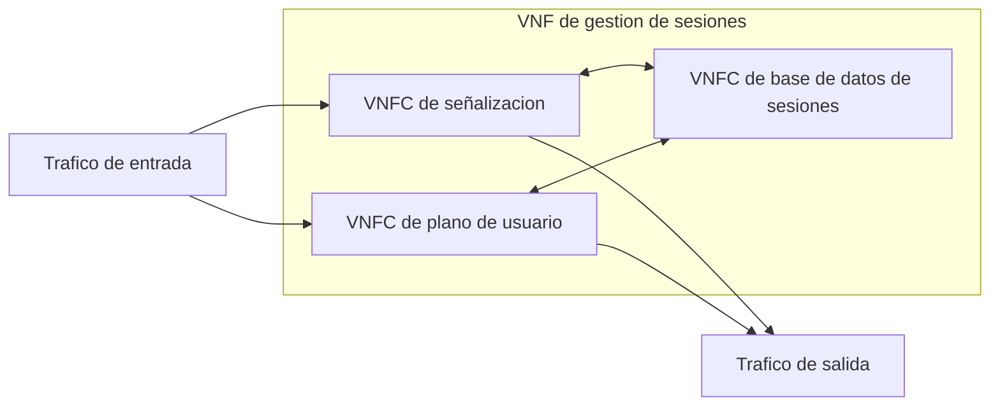
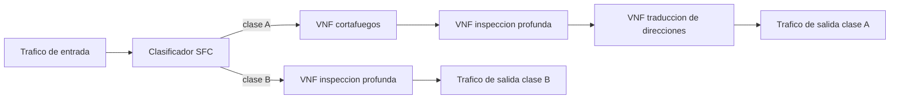
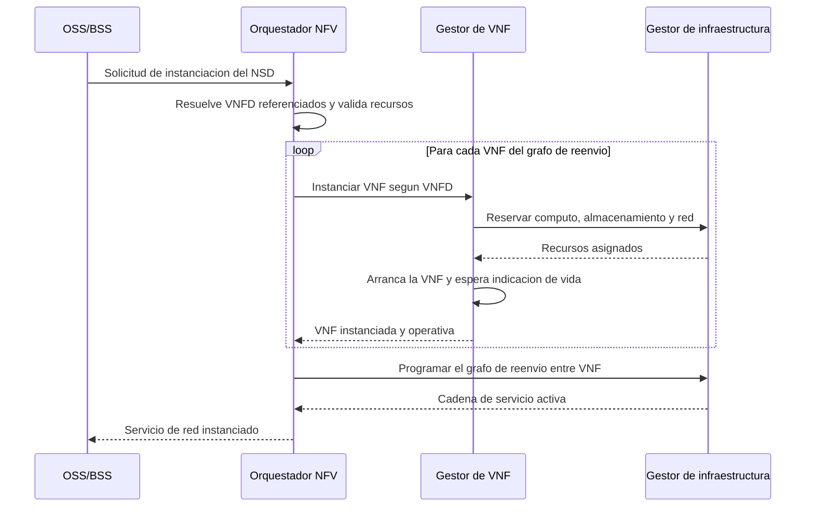

Una red construida con equipos dedicados de función fija resuelve cada función nueva con
un equipo nuevo: un cortafuegos, una pasarela o un nodo de señalización llegan como una
caja cerrada que integra su propio hardware, su propio software y su propia vida útil.
La **virtualización de funciones de red** (Network Functions Virtualization, `NFV`)
desacopla esa función del hardware que la ejecuta y la convierte en software que corre
sobre servidores de propósito general, con el mismo sustrato de cómputo, almacenamiento
y red que sostiene cualquier otra carga virtualizada. Este capítulo desarrolla la
motivación de esa transformación, el marco arquitectónico que el Instituto Europeo de
Normas de Telecomunicaciones (`ETSI`) publicó para ella, la función de red virtualizada
y sus componentes, el encadenamiento de varias funciones en una cadena de servicio, el
bloque de gestión y orquestación que sostiene el ciclo de vida de esas funciones, y las
contrapartidas reales que introduce ejecutar en software lo que antes corría en hardware
dedicado. La base de virtualización sobre la que se apoya `NFV`, con hipervisores,
contenedores y las técnicas de aceleración de entrada y salida, se desarrolla en
[tipos de virtualización](../01_virtualizacion/section_1_tipos_de_virtualizacion.md) y
en
[contenedores y orquestación](../01_virtualizacion/section_2_contenedores_y_orquestacion.md).
La relación de `NFV` con las redes definidas por software se retoma al final de este
capítulo y se desarrolla en detalle en [redes definidas por software](section_1_sdn.md).

## Introducción

En una red tradicional, todos los equipos se implementan sobre plataformas cerradas y
propietarias que actúan como cajas negras: el hardware de cada una está dedicado a su
función y no puede compartirse con ninguna otra, de modo que aumentar la capacidad de un
servicio exige añadir hardware nuevo, aunque otro equipo de la misma red tenga capacidad
sobrante. Con `NFV`, los elementos de red se convierten en aplicaciones independientes
que se despliegan de forma flexible sobre una plataforma unificada de cómputo,
almacenamiento y red. El software y el hardware quedan desacoplados, y la capacidad de
cada aplicación crece o decrece añadiendo o retirando recursos virtuales, sin tocar el
equipo físico subyacente. Una **función de red virtualizada** (Virtualized Network
Function, `VNF`) es la pieza de software que resulta de esa transformación: implementa
una función que antes vivía en un equipo dedicado, pero se ejecuta como una o varias
máquinas virtuales o contenedores sobre servidores estándar.

## Motivación frente al equipamiento dedicado de función fija

Las redes de telecomunicaciones acumulan una gran diversidad de equipos de función fija,
cada uno construido para una tarea concreta y con una vida útil ligada a la de su propio
hardware. Introducir un servicio nuevo suele exigir añadir otro equipo dedicado más, lo
que agrava tres problemas que se refuerzan entre sí.

El primero es de espacio y de energía. Cada equipo adicional ocupa espacio físico en el
centro de datos o en la sala de equipos, consume energía de forma continua y necesita
refrigeración, y la multiplicación de equipos de propósito único incrementa ambos costes
de forma proporcional al número de funciones desplegadas, no a la carga real que cada
una atiende en cada momento.

El segundo es la vida útil corta y la sustitución por obsolescencia. Un equipo dedicado
queda obsoleto cuando la demanda que puede atender se queda pequeña o cuando el
fabricante deja de darle soporte, y la única forma de aumentar su capacidad o de
incorporarle una función nueva es sustituirlo, con el coste de capital y el riesgo
operativo que esa sustitución conlleva.

El tercero es la rigidez frente a la demanda. La capacidad de un equipo dedicado está
fijada de fábrica, de modo que dimensionar para la demanda pico obliga a mantener
recursos ociosos la mayor parte del tiempo, mientras que dimensionar para la demanda
media deja a la red sin margen cuando la demanda crece.

`NFV` ataca los tres problemas centralizando el hardware de cómputo, almacenamiento y
red en una infraestructura común y ejecutando las funciones de red como software sobre
ella. Dos funciones de red distintas pueden convivir en el mismo servidor físico, cada
una con sus propios recursos virtuales de cómputo, memoria y red, sin necesidad de dos
equipos separados. La sustitución del hardware físico se desacopla de la evolución de la
función, porque actualizar o sustituir un servidor de propósito general no exige tocar
el software de la función que corre sobre él. Y la capacidad de una función crece o
decrece añadiendo o retirando recursos virtuales, en la escala de minutos que exige el
aprovisionamiento de una máquina virtual o de un contenedor, en lugar de la escala de
semanas o meses que exige la adquisición e instalación de un equipo dedicado nuevo.

???+ example "Coste de capacidad de un cortafuegos dedicado frente a uno virtualizado"

    Un operador dimensiona un cortafuegos de borde dedicado para soportar una demanda
    pico de 40 Gb/s, aunque la demanda media de la instalación es de 12 Gb/s. El equipo
    dedicado que cubre ese pico se paga y se energiza durante toda su vida útil al
    tamaño del pico, con independencia de que la mayor parte del tiempo trabaje muy por
    debajo de su capacidad nominal. La relación entre la capacidad contratada y la
    demanda media, 40 Gb/s frente a 12 Gb/s, arroja un factor de sobredimensionado de
    aproximadamente 3,3, que es exactamente el margen de capacidad ociosa que el
    operador paga sin usar durante la operación normal.

    Con la misma función desplegada como `VNF`, el operador reserva recursos virtuales
    para la demanda media y añade instancias adicionales, o incrementa los recursos de
    las ya desplegadas, cuando la demanda se acerca al pico, del mismo modo que se
    detalla en el apartado del ciclo de vida del servicio de red más adelante en este
    capítulo. El coste del pico se paga solo mientras el pico dura, no durante toda la
    vida útil del equipo, y el hardware físico subyacente lo comparten otras funciones
    de red cuya demanda no coincide en el tiempo con la del cortafuegos.

## El marco arquitectónico ETSI NFV

`ETSI` publica el marco de referencia que estructura `NFV` en tres bloques principales,
unidos por puntos de referencia que definen qué información intercambia cada par de
bloques. El marco distingue la **infraestructura de NFV** (`NFVI`), que aporta los
recursos físicos y virtuales de cómputo, almacenamiento y red; las **funciones de red
virtualizadas** (`VNF`), que son el software de la función propiamente dicho; y la
**gestión y orquestación de NFV** (NFV Management and Orchestration, `MANO`), que
gestiona el ciclo de vida de ambas.



Cada punto de referencia acota qué información viaja entre dos bloques. `Os-Ma-nfvo`
lleva las solicitudes de servicio desde los sistemas de soporte a la operación y al
negocio hacia el orquestador, en forma de instanciación, escalado o terminación de un
servicio de red completo. `Or-Vnfm` transporta las órdenes del orquestador hacia el
gestor de `VNF` para el ciclo de vida de una función concreta, y `Ve-Vnfm-vnf` lleva
esas órdenes desde el gestor de `VNF` hasta la propia función, junto con la información
de estado que la función reporta en sentido inverso. `Or-Vi` y `Vi-Vnfm` conectan,
respectivamente, el orquestador y el gestor de `VNF` con el gestor de infraestructura
virtualizada, para reservar y liberar los recursos de cómputo, almacenamiento y red
sobre los que corre cada función. `Nf-Vi` es interno a la infraestructura, entre el
gestor de infraestructura virtualizada y los recursos físicos y virtuales que gestiona.
`Ve-Vnfm-em` conecta el gestor de `VNF` con el sistema de gestión de elemento cuando la
`VNF` incluye uno propio, descrito más adelante en este capítulo.

Ningún bloque del marco resuelve por sí solo el problema completo. La infraestructura
aporta el sustrato de recursos, pero no sabe qué función corre sobre ella ni por qué se
le asignan esos recursos y no otros. La `VNF` implementa la función, pero no decide
cuándo debe crecer, migrar o detenerse. El bloque `MANO`, que se desarrolla en detalle
más adelante, es el que cierra ese ciclo: traduce la intención declarada en un
descriptor en órdenes concretas sobre la infraestructura y sobre cada función.

## La función de red virtualizada y sus componentes

Una `VNF` es la implementación en software de una función de red que antes se ejecutaba
en un equipo dedicado. Puede ser tan sencilla como una única instancia que ejecuta toda
la función, o puede descomponerse en varios **componentes de VNF** (`VNFC`), cada uno
responsable de una parte de la funcionalidad y desplegado como una máquina virtual o un
contenedor independiente. La descomposición en `VNFC` permite escalar cada parte de la
función por separado, según cuál sea el recurso que realmente limita su capacidad: el
componente que procesa señalización puede escalar de forma distinta al componente que
procesa el plano de usuario, porque cada uno consume un perfil distinto de cómputo, de
memoria y de ancho de banda.



Una `VNF` puede incluir además un **sistema de gestión de elemento** (Element Management
System, `EMS`) propio, heredado de la práctica de gestión de equipos dedicados, que
supervisa el funcionamiento interno de la función y expone al gestor de `VNF` la
información de estado y de configuración específica de esa función que el marco general
de `MANO` no necesita interpretar. Cuando la `VNF` no incluye un `EMS` propio, esa
supervisión recae directamente en el gestor de `VNF`.

Dos relaciones adicionales estructuran cómo varias `VNF` se combinan entre sí. El
**grafo de reenvío de VNF** especifica la conectividad de red requerida entre un
conjunto de `VNF`, es decir, el orden y las condiciones en que el tráfico debe atravesar
cada una, y es la base sobre la que se construye la cadena de servicio que se desarrolla
en el apartado siguiente. El **conjunto de VNF**, en cambio, agrupa varias `VNF` sin
especificar conectividad entre ellas, para expresar que deben desplegarse juntas por
motivos de afinidad o de gestión sin que exista un orden de tráfico entre ellas.

???+ example "Descomposición en VNFC de un nodo de gestión de movilidad"

    Un operador virtualiza el nodo de gestión de movilidad de su red móvil y decide
    descomponerlo en dos `VNFC`: uno que procesa la señalización de control con los
    equipos de usuario y con los nodos vecinos, y otro que mantiene la base de datos de
    contextos de sesión activos. El primero consume sobre todo cómputo, porque cada
    mensaje de señalización exige decodificar, validar y construir protocolos, mientras
    que el segundo consume sobre todo memoria, porque el tamaño de la base de datos
    crece linealmente con el número de equipos de usuario conectados.

    Un incremento del número de equipos de usuario sin cambio en la tasa de
    señalización por equipo, típico de un despliegue que añade cobertura sin cambiar el
    patrón de uso, se resuelve añadiendo memoria y capacidad de almacenamiento al `VNFC`
    de base de datos sin tocar el `VNFC` de señalización. Un incremento de la tasa de
    señalización sin cambio en el número de equipos de usuario, típico de un evento con
    muchas conexiones y desconexiones en poco tiempo, se resuelve en cambio añadiendo
    cómputo al `VNFC` de señalización. La descomposición evita sobredimensionar el
    componente que no está bajo presión en cada uno de los dos escenarios.

## Cadenas de servicio y encadenamiento de funciones de servicio

Una única `VNF` rara vez cubre por sí sola el tratamiento completo que el tráfico de un
servicio necesita. Un flujo típico atraviesa, en un orden determinado, una función de
cortafuegos, una función de inspección profunda de paquetes y una función de
optimización, y ese orden es parte de la política del operador tanto como lo es la
propia existencia de cada función. Una **cadena de servicio** es esa secuencia ordenada
de funciones de red por la que debe pasar un tráfico determinado, y el **encadenamiento
de funciones de servicio** (Service Function Chaining, `SFC`) es el mecanismo que fuerza
a ese tráfico a recorrer la secuencia sin que cada función intermedia necesite conocer
cuál es la siguiente en la cadena ni cuál es el destino final del paquete.



El **clasificador** es el elemento que decide, a la entrada de la cadena, a qué clase de
tráfico pertenece un flujo y por tanto qué cadena de servicio le corresponde, a partir
de criterios como la dirección de origen, el tipo de aplicación o el acuerdo de nivel de
servicio del cliente. Una vez clasificado, el flujo se etiqueta con la identidad de su
cadena, de modo que cada `VNF` de la cadena y el plano de reenvío que las conecta puedan
decidir el siguiente salto sin volver a clasificar el paquete. El grafo de reenvío de
`VNF` mencionado en el apartado anterior es la descripción declarativa de esa cadena, y
el gestor de infraestructura virtualizada es quien la materializa, con apoyo de un
controlador programable, en las reglas de reenvío que efectivamente conducen el tráfico
de una función a la siguiente.

Encadenar funciones de esta forma tiene una consecuencia directa sobre el rendimiento:
cada función que el tráfico atraviesa añade su propio retardo de procesado, y ese
retardo se acumula a lo largo de toda la cadena. Una cadena larga, con muchas funciones
en serie, puede degradar el retardo extremo a extremo por debajo del que un servicio de
tiempo real tolera, aunque cada función individual cumpla su presupuesto de retardo por
separado. El diseño de una cadena de servicio no es solo una cuestión de qué funciones
incluir, sino también de cuántas puede tolerar el presupuesto de retardo del servicio
que la atraviesa.

???+ example "Presupuesto de retardo de una cadena de servicio de voz"

    Un servicio de voz sobre IP exige un retardo de boca a oreja no superior a 150 ms
    para mantener una conversación fluida, del cual el operador reserva 40 ms para la
    red de acceso y el núcleo de transporte, dejando 110 ms disponibles para el
    tratamiento del tráfico dentro del dominio donde viven las funciones virtualizadas.
    La cadena de servicio propuesta encadena cuatro funciones: cortafuegos, inspección
    profunda de paquetes, transcodificación de audio y traducción de direcciones, con
    retardos de procesado individuales de 2 ms, 8 ms, 25 ms y 1,5 ms respectivamente.

    La suma de los cuatro retardos de procesado es 2 + 8 + 25 + 1,5 = 36,5 ms. A ese
    valor hay que añadir el retardo de conmutación entre funciones consecutivas, que en
    un despliegue sobre el mismo servidor físico con un conmutador virtual eficiente se
    puede estimar en torno a 0,5 ms por salto, lo que añade 3 saltos × 0,5 ms = 1,5 ms
    adicionales. El retardo total de la cadena es entonces 36,5 + 1,5 = 38 ms, bien por
    debajo de los 110 ms disponibles, con un margen de 72 ms que el operador puede
    dedicar a otras funciones de la cadena o a variabilidad de carga en las funciones ya
    desplegadas. La función de transcodificación de audio es, con diferencia, la que
    domina el presupuesto de la cadena, y es la primera candidata a revisar si el
    margen se estrecha en un despliegue posterior.

## El bloque MANO en detalle

La **gestión y orquestación de NFV** (`MANO`) es el bloque que traduce la intención
declarada sobre un servicio de red en órdenes concretas sobre la infraestructura y sobre
cada `VNF`, y que mantiene ese servicio en el estado deseado durante toda su vida. Se
compone de tres funciones que colaboran en torno a un catálogo común de descriptores,
desarrollado en el apartado siguiente.

### Orquestador NFV

El **orquestador NFV** (`NFVO`) es el punto de entrada del bloque `MANO` y el único que
tiene visión de todos los servicios de red desplegados sobre la infraestructura. Recibe
las solicitudes de los sistemas de soporte a la operación y al negocio a través del
punto de referencia `Os-Ma-nfvo`, valida esas solicitudes contra los descriptores de
servicio de red del catálogo, y descompone cada servicio en las `VNF` que lo componen.
Su responsabilidad se divide en dos planos. El **orquestador de recursos** decide qué
recursos de infraestructura, en qué localización y con qué capacidad, se asignan a cada
servicio, y coordina esa asignación con uno o varios gestores de infraestructura
virtualizada cuando el servicio se extiende sobre más de un dominio de infraestructura.
El **orquestador de servicios de red** gestiona el ciclo de vida del servicio como un
todo coherente, coordinando a los gestores de `VNF` responsables de cada función
individual y resolviendo las dependencias entre ellas que el grafo de reenvío declara.

### Gestor de VNF

El **gestor de VNF** (`VNFM`) es responsable del ciclo de vida de una `VNF` concreta o
de un conjunto de ellas: su instanciación, su configuración, su escalado, su curación y
su terminación, según se detalla en el apartado siguiente. Un despliegue puede optar por
un `VNFM` genérico que gestiona cualquier `VNF` conforme a su descriptor, sin lógica
específica de la función, o por un `VNFM` especializado que el proveedor de la `VNF`
entrega junto con ella y que conoce procedimientos propios de esa función, como una
secuencia de arranque particular o una forma propia de comprobar su salud. El `VNFM`
recibe órdenes del `NFVO` a través de `Or-Vnfm`, las traduce en operaciones concretas
sobre la `VNF` a través de `Ve-Vnfm-vnf`, y solicita al gestor de infraestructura
virtualizada, a través de `Vi-Vnfm`, los recursos que cada operación necesita.

### Gestor de infraestructura virtualizada

El **gestor de infraestructura virtualizada** (Virtualized Infrastructure Manager,
`VIM`) controla y gestiona los recursos de cómputo, almacenamiento y red de la `NFVI`, y
es el único bloque de `MANO` que interactúa directamente con el hardware y con las capas
de virtualización descritas en
[tipos de virtualización](../01_virtualizacion/section_1_tipos_de_virtualizacion.md). Su
función incluye el inventario de los recursos físicos y virtuales disponibles, la
asignación de esos recursos a las peticiones que recibe del `NFVO` y de los `VNFM`, y la
recogida de las medidas de rendimiento y de fallo que la infraestructura genera, que
reenvía hacia arriba para que el orquestador y los gestores de `VNF` puedan reaccionar.
Un gestor de infraestructura virtualizada típico gestiona una plataforma de
virtualización completa con hipervisores, como las descritas en
[tipos de virtualización](../01_virtualizacion/section_1_tipos_de_virtualizacion.md), o
una plataforma de orquestación de contenedores, como las descritas en
[contenedores y orquestación](../01_virtualizacion/section_2_contenedores_y_orquestacion.md#arquitectura-de-kubernetes),
y un mismo despliegue puede combinar varios gestores de infraestructura virtualizada
cuando la infraestructura se reparte entre distintas localizaciones o entre distintas
tecnologías de virtualización.

| Función | Responsabilidad principal                                          | Punto de referencia hacia arriba                 |
| ------- | ------------------------------------------------------------------ | ------------------------------------------------ |
| `NFVO`  | Orquesta servicios de red completos y sus recursos entre dominios. | `Os-Ma-nfvo` hacia OSS/BSS.                      |
| `VNFM`  | Gestiona el ciclo de vida de una VNF o de un conjunto de ellas.    | `Or-Vnfm` hacia el NFVO.                         |
| `VIM`   | Controla los recursos físicos y virtuales de la NFVI.              | `Or-Vi` hacia el NFVO y `Vi-Vnfm` hacia el VNFM. |

## Descriptores de VNF y de servicio de red

El bloque `MANO` no improvisa cómo desplegar una función ni un servicio: opera sobre
**descriptores**, ficheros declarativos que especifican de forma estructurada qué
recursos necesita cada elemento y cómo se conecta con los demás. Los dos descriptores
centrales son el descriptor de `VNF` (`VNFD`) y el descriptor de servicio de red
(`NSD`), y ambos se almacenan en el catálogo al que el `NFVO` consulta cada vez que
recibe una solicitud.

El **descriptor de VNF** (`VNFD`) especifica los requisitos de despliegue y de
comportamiento operativo de una `VNF`: cuántos `VNFC` la componen, qué recursos de
cómputo, memoria, almacenamiento y red necesita cada uno, qué interfaces de red expone,
qué límites de escalado admite, y qué acciones de curación aplicar ante cada tipo de
fallo. El **descriptor de servicio de red** (`NSD`) opera un nivel por encima:
referencia uno o varios `VNFD` y describe cómo se conectan entre sí, es decir,
materializa el grafo de reenvío de `VNF` introducido antes en este capítulo, junto con
las políticas de escalado del servicio completo.

```yaml linenums="1"
# Descriptor simplificado de una VNF de cortafuegos
vnfd:
    id: vnfd_cortafuegos_borde
    version: "1.0"
    proveedor: operador_interno
    vnfc:
        - id: vnfc_cortafuegos
          computo:
              vcpus: 4
              memoria_mb: 8192
          almacenamiento:
              disco_gb: 40
          interfaces_red:
              - nombre: entrada
                tipo: sriov
              - nombre: salida
                tipo: sriov
          escalado:
              instancias_minimas: 1
              instancias_maximas: 4
              metrica_disparo: uso_cpu_porcentaje
              umbral_ascenso: 70
              umbral_descenso: 20
          curacion:
              reinicio_automatico: true
              intentos_maximos: 3
```

```yaml linenums="1"
# Descriptor simplificado de un servicio de red que encadena dos VNF
nsd:
    id: nsd_cadena_seguridad_borde
    version: "1.0"
    vnfd_referenciados:
        - vnfd_cortafuegos_borde
        - vnfd_inspeccion_profunda
    grafo_reenvio:
        - origen: entrada_servicio
          destino: vnfc_cortafuegos.entrada
        - origen: vnfc_cortafuegos.salida
          destino: vnfc_inspeccion.entrada
        - origen: vnfc_inspeccion.salida
          destino: salida_servicio
    politica_escalado:
        metrica_disparo: tasa_paquetes_por_segundo
        umbral_ascenso: 500000
```

???+ example "Validación de un NSD frente a los recursos disponibles"

    Un operador dispone de un servidor físico con 32 vCPU y 128 GB de memoria libres
    para desplegar el servicio de red descrito en el `NSD` anterior. El `VNFD` de
    cortafuegos exige 4 vCPU y 8 GB por instancia, con hasta 4 instancias, y el `VNFD` de
    inspección profunda, no mostrado en el ejemplo, exige 6 vCPU y 16 GB por instancia,
    también con hasta 4 instancias. El `NFVO` debe comprobar, antes de aceptar la
    solicitud de instanciación, que el peor caso de escalado del servicio completo cabe
    en los recursos disponibles.

    El peor caso de cómputo es 4 instancias de cortafuegos más 4 de inspección profunda,
    es decir, 4 × 4 + 4 × 6 = 16 + 24 = 40 vCPU, que supera las 32 vCPU disponibles en
    ese único servidor. El peor caso de memoria es 4 × 8 + 4 × 16 = 32 + 96 = 128 GB,
    que agota exactamente la memoria disponible sin dejar margen para ninguna otra
    carga. El `NFVO` no puede garantizar el escalado máximo declarado en un solo
    servidor y debe repartir el servicio entre varios servidores, o negociar con el
    operador un límite de escalado máximo menor que sí quede cubierto por los recursos
    de ese servidor, antes de aceptar la solicitud.

## Ciclo de vida de un servicio de red

El bloque `MANO` gestiona un servicio de red a lo largo de un ciclo de vida con cuatro
fases características, cada una desencadenada por un evento distinto y ejecutada por una
colaboración distinta entre `NFVO`, `VNFM` y `VIM`.



### Instanciación

La **instanciación** arranca cuando el `NFVO` recibe una solicitud referida a un `NSD`
concreto. El orquestador resuelve los `VNFD` que ese `NSD` referencia, valida que la
infraestructura disponible puede satisfacer los requisitos declarados, y solicita a cada
`VNFM` correspondiente que instancie su `VNF`. Cada `VNFM` reserva los recursos
necesarios a través del `VIM`, arranca la `VNF` sobre esos recursos y espera la
indicación de que la función está operativa antes de informar de vuelta al orquestador.
Una vez que todas las `VNF` del grafo de reenvío están operativas, el `NFVO` programa la
cadena de servicio entre ellas y el servicio de red queda disponible.

### Escalado

El **escalado** modifica la capacidad de una `VNF` ya desplegada sin interrumpir el
servicio, en cualquiera de dos direcciones. El **escalado horizontal** añade o retira
instancias completas de un `VNFC`, lo que exige que ese componente admita repartir su
carga entre varias instancias, típicamente con un elemento de reparto delante de ellas.
El **escalado vertical** modifica los recursos asignados a una instancia ya existente,
como aumentar su número de vCPU o su memoria, sin cambiar el número de instancias. La
política de escalado declarada en el `VNFD` o en el `NSD`, con la métrica de disparo y
los umbrales que se ilustran en el descriptor anterior, es la que determina cuándo el
`VNFM` inicia una operación de escalado sin intervención manual del operador.

### Curación

La **curación** (_healing_) es la reacción automática ante el fallo de una instancia de
`VNF`, sin que el operador humano tenga que intervenir en el caso general. El `VNFM`
detecta el fallo por la ausencia de indicación de vida de la instancia o por un aviso
del sistema de gestión de elemento cuando existe, y ejecuta la acción de curación
declarada en el `VNFD`, que puede ser reiniciar la instancia en el mismo servidor,
reinstanciarla en otro servidor si el fallo es del propio hardware, o escalar el
incidente al operador cuando se agota el número de intentos automáticos permitido. La
curación automática es, junto con el escalado, la capacidad que más distingue a un
despliegue `NFV` maduro de una simple sustitución de hardware dedicado por software: la
resiliencia deja de depender de la redundancia física fija de un equipo y pasa a
depender de la rapidez con que `MANO` detecta y repara un fallo.

### Terminación

La **terminación** retira un servicio de red o una `VNF` concreta de la infraestructura,
en orden inverso al de la instanciación: primero se retira la cadena de servicio que
conecta las `VNF`, después se detienen las instancias de cada `VNF` y finalmente el
`VIM` libera los recursos de cómputo, almacenamiento y red que tenían asignados, para
que queden disponibles para otro servicio. Una terminación mal secuenciada, que libere
recursos antes de detener limpiamente la función que los usa, puede dejar estado
inconsistente en la propia función o en los sistemas que dependían de ella, razón por la
que el orden de las operaciones de terminación es tan parte del contrato de `MANO` como
el de la instanciación.

???+ example "Reacción de MANO ante el fallo de una instancia bajo carga alta"

    Una `VNF` de inspección profunda de paquetes tiene desplegadas tres instancias por
    escalado horizontal, cada una atendiendo un tercio del tráfico total gracias a un
    reparto de carga previo. Una de las tres instancias falla por agotamiento de
    memoria en un momento de carga elevada, y el `VNFM` lo detecta a los pocos segundos
    por la ausencia de indicación de vida.

    Sin curación automática, la pérdida de una instancia sobre tres redistribuiría de
    inmediato un tercio del tráfico total sobre las dos instancias restantes, que
    pasarían a soportar 1,5 veces su carga habitual cada una, con el riesgo de que la
    sobrecarga provoque un segundo fallo en cascada si el margen de las instancias
    supervivientes es escaso. Con curación automática, el `VNFM` reinstancia de
    inmediato una réplica en otro servidor con recursos disponibles, siguiendo la
    acción de curación declarada en el `VNFD`, y el reparto de carga vuelve a las tres
    vías en el tiempo que tarda la nueva instancia en arrancar y en superar la
    indicación de vida, del orden de las decenas de segundos que requiere el
    aprovisionamiento de una máquina virtual o de un contenedor. El coste de la
    sobrecarga temporal sobre las dos instancias restantes se limita a esa ventana, en
    lugar de perdurar hasta una intervención manual del operador.

## Relación entre NFV y SDN

`NFV` decide dónde se ejecuta una función de red y `SDN` decide por dónde va el tráfico
que la atraviesa; ninguna disciplina depende de la otra para existir, pero el grafo de
reenvío de `VNF` y la cadena de servicio de este capítulo solo se materializan como
reglas dinámicas, en lugar de configuración manual, gracias al plano de control
programable que
[redes definidas por software](section_1_sdn.md#relacion-con-la-virtualizacion-de-funciones-de-red)
desarrolla en detalle. El `VIM` del bloque `MANO` se apoya, en un despliegue real, en un
controlador `SDN` o en su equivalente para programar esas reglas al ritmo con que el
despliegue cambia.

## Contrapartidas reales de NFV

Ejecutar en software lo que antes corría en hardware dedicado no es una transformación
sin coste. Tres contrapartidas concretas condicionan si un despliegue `NFV` alcanza el
rendimiento y la fiabilidad que el equipo dedicado ofrecía.

### Rendimiento del plano de datos en software

Un equipo de función fija dedica silicio específico al tratamiento de paquetes a
velocidad de línea, mientras que una `VNF` que procesa el plano de datos compite por los
mismos recursos de cómputo genéricos que cualquier otra carga del servidor, y su tráfico
de red atraviesa, en la configuración más simple, el conmutador virtual del hipervisor
descrito en
[tipos de virtualización](../01_virtualizacion/section_1_tipos_de_virtualizacion.md#paso-de-entrada-y-salida-por-el-hipervisor).
Ese paso adicional introduce latencia y limita el _throughput_ que la `VNF` puede
sostener, y es tanto más determinante cuanto mayor es la tasa de paquetes por segundo
que la función debe tratar, porque el coste de conmutación en software se paga por
paquete, no por bit.

### Aceleración del plano de datos: DPDK y SR-IOV

Dos técnicas complementarias recuperan buena parte del rendimiento perdido frente al
equipo dedicado, cada una atacando un cuello de botella distinto de la ruta de entrada y
salida.

El **kit de desarrollo de plano de datos** (Data Plane Development Kit, `DPDK`) es un
conjunto de bibliotecas que permite a una aplicación en espacio de usuario acceder
directamente a la tarjeta de red, sin atravesar la pila de red convencional del núcleo
del sistema operativo. Sondear los descriptores de la tarjeta en un bucle activo en
lugar de esperar una interrupción por paquete recibido, y reservar de forma estática los
búferes de paquetes en memoria en lugar de asignarlos y liberarlos por paquete, elimina
gran parte del coste de cambio de contexto y de gestión de memoria que la pila de red
convencional impone. `DPDK` actúa dentro de la propia `VNF` o del conmutador virtual que
la sirve, y no depende de que el hardware de red soporte ninguna función especial más
allá de un controlador compatible.

La **virtualización de entrada y salida de raíz única** (`SR-IOV`), presentada en
[tipos de virtualización](../01_virtualizacion/section_1_tipos_de_virtualizacion.md#asignacion-directa-de-dispositivos-y-sr-iov),
ataca el mismo problema desde el otro extremo de la ruta: en lugar de acelerar el
procesado en espacio de usuario, evita por completo el paso por el conmutador virtual
del hipervisor asignando una función virtual de la tarjeta de red directamente a la
`VNF`. Las dos técnicas son complementarias y se combinan con frecuencia en el mismo
despliegue: `SR-IOV` evita el conmutador virtual del hipervisor, y `DPDK` dentro de la
`VNF` evita a su vez el coste de la pila de red convencional del sistema operativo
invitado sobre el tráfico que ya le llega por la función virtual asignada.

???+ example "Presupuesto de rendimiento de un plano de datos en software"

    Una `VNF` de reenvío de paquetes debe sostener 10 Gb/s con un tamaño medio de
    paquete de 512 bytes, lo que exige tratar aproximadamente 10×10⁹ / (512×8) ≈
    2,44×10⁶ paquetes por segundo. Sobre un conmutador virtual convencional que atiende
    cada paquete mediante interrupción y copia entre espacio de núcleo y espacio de
    usuario, el coste de tratamiento por paquete se sitúa en torno a 1 microsegundo,
    lo que fija un límite de aproximadamente 1×10⁶ paquetes por segundo por núcleo de
    cómputo dedicado a esa tarea, insuficiente para el objetivo con un solo núcleo y
    exigiendo repartir la carga entre varios.

    Con `DPDK` sobre una función virtual `SR-IOV`, el coste de tratamiento por paquete
    baja a un rango habitual de 100 a 200 nanosegundos por paquete al eliminar la
    interrupción, la copia entre espacios y el paso por el conmutador virtual, lo que
    eleva el límite por núcleo a un rango de 5×10⁶ a 10×10⁶ paquetes por segundo. Un
    solo núcleo de cómputo dedicado en exclusiva a esa tarea, con sondeo activo en
    lugar de interrupciones, cubre entonces con holgura los 2,44×10⁶ paquetes por
    segundo exigidos, con el coste añadido de dedicar ese núcleo por completo a la
    tarea y de no poder compartirlo con ninguna otra carga del servidor durante todo el
    tiempo en que la `VNF` permanece activa.

### Fiabilidad y trazabilidad de fallos en una pila de varias capas

Un equipo dedicado tiene una única pila que diagnosticar cuando falla: su propio
hardware y su propio software embebido. Una `VNF` desplegada según el marco `ETSI NFV`
añade, entre la función y el hardware físico, tantas capas como bloques atraviesa el
tráfico o el propio proceso de gestión: el hipervisor o el motor de contenedores, el
conmutador virtual o la función virtual `SR-IOV` que conecta la `VNF` con la red, el
`VIM` que gestiona esos recursos, el `VNFM` que gestiona el ciclo de vida de la función,
y el `NFVO` que coordina el servicio completo. Un fallo observado en la propia `VNF`,
como una caída de rendimiento o una desconexión intermitente, puede originarse en
cualquiera de esas capas, y diagnosticarlo exige correlacionar información de todas
ellas, no solo la que la propia `VNF` reporta.

Esa dificultad de correlación es la razón por la que la telemetría entre capas, mediante
los puntos de referencia `Nf-Vi`, `Vi-Vnfm` y `Ve-Vnfm-vnf` descritos en el marco
arquitectónico, no es un añadido opcional sobre `MANO`, sino una condición para que la
curación automática descrita antes en este capítulo funcione con la rapidez que se
espera de ella: un `VNFM` que solo ve la indicación de vida de la propia `VNF`, sin
información de la capa de infraestructura sobre la que corre, no puede distinguir un
fallo de la función de un fallo del servidor físico que la aloja, y aplicará la misma
acción de curación, típicamente el reinicio de la instancia, a dos problemas que exigen
respuestas distintas: reiniciar la `VNF` no repara un fallo del hardware subyacente, y
reasignar recursos de infraestructura no repara un defecto de la propia función.

La aplicación conjunta de `NFV` y `SDN` a la red de acceso radio, con el reparto de
funciones entre el equipo de radio y el resto de la infraestructura virtualizada y su
extensión al cómputo en el borde, se desarrolla en
[RAN virtualizada y computación en el borde](section_3_ran_virtualizada_y_edge.md).
