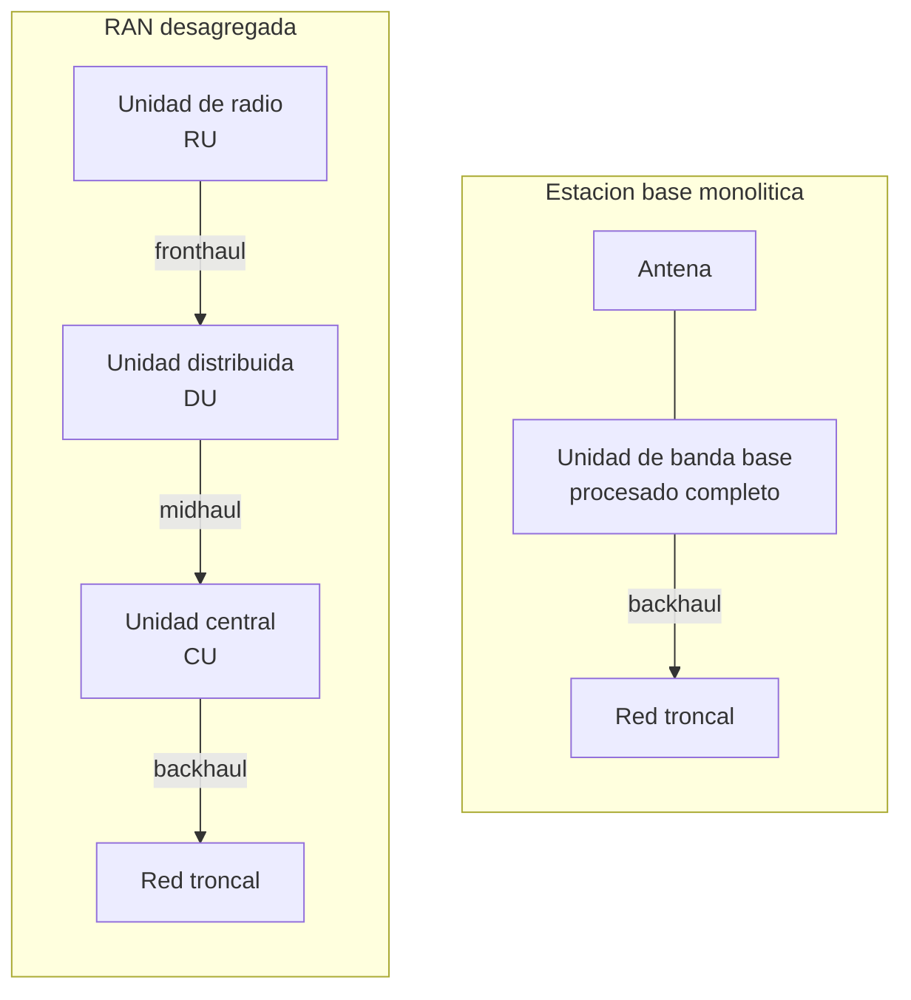
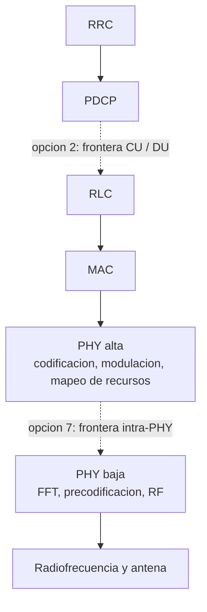
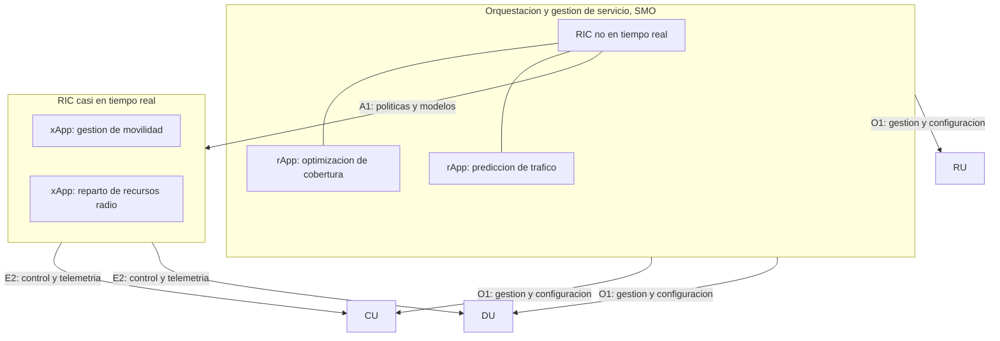

La virtualización de funciones de red descrita en
[virtualización de funciones de red](section_2_nfv_y_mano.md) y la programabilidad que
aporta [redes definidas por software](section_1_sdn.md) alcanzan en la red de acceso
radio uno de sus escenarios de aplicación más exigentes. Una estación base no es un
servicio de mejor esfuerzo que tolera un retardo variable: procesa señal de radio con
plazos de microsegundos y debe seguir el ritmo exacto de la interfaz aérea. Este
capítulo desarrolla cómo esa estación base, tradicionalmente un equipo monolítico, se
descompone en unidades funcionales que pueden ejecutarse en servidores de propósito
general y distribuirse geográficamente, qué interfaces de transporte conectan esas
unidades y qué latencia y capacidad exigen, cómo se distinguen los conceptos de RAN
centralizada, RAN virtualizada y RAN abierta, cómo se organiza esta última en torno a
controladores inteligentes y, por último, por qué esa desagregación abre la puerta a
ejecutar aplicaciones de cómputo en el borde de la red de acceso.

## Introducción

Una estación base clásica, sea el `BTS` de GSM, el `eNodeB` de LTE o el `gNB` de NR
descrito en
[nodos de la red de acceso](../../03_redes_moviles/04_5g/section_2_new_radio.md#nodos-de-la-red-de-acceso),
integra en un único equipo, situado junto a la antena, todo el procesado que separa la
señal de radiofrecuencia de los paquetes que llegan a la red troncal. Ese procesado
incluye la conversión entre señal analógica y digital, la modulación y la demodulación,
la codificación de canal, la planificación de los recursos radio y los protocolos de la
pila descrita en
[protocolos radio y transmisión en LTE](../../03_redes_moviles/03_lte/section_3_protocolos_radio_y_transmision.md).
La **unidad de banda base** (Baseband Unit, `BBU`) es la pieza que concentra esa carga
de cómputo, y en el modelo tradicional vive en el mismo emplazamiento que la antena, con
un cableado corto y dedicado entre ambas. Este capítulo desarrolla qué ocurre cuando esa
unidad se separa físicamente de la antena y se reparte a su vez en varias unidades
funcionales, cada una candidata a ejecutarse como software sobre un servidor de
propósito general en lugar de como equipo dedicado.

## De la estación base monolítica a la RAN desagregada

El modelo de estación base monolítica reparte tantos equipos de banda base como
emplazamientos radio existen, cada uno dimensionado para el tráfico máximo que puede
llegar a soportar. Esa forma de desplegar acumula tres costes que no dependen de la
tecnología de radio concreta, sino de la propia arquitectura del despliegue.

El primer coste es de eficiencia estadística. El tráfico de una celda varía a lo largo
del día, con máximos en las horas de mayor actividad y valles nocturnos, y esa variación
no está sincronizada entre celdas vecinas: mientras una zona residencial alcanza su
máximo por la tarde, una zona de oficinas puede estar en su valle. Un equipo de banda
base dedicado a una sola celda debe dimensionarse para el máximo de esa celda en
solitario, sin poder aprovechar la capacidad que otra celda vecina deja libre en ese
mismo instante. El segundo coste es de mantenimiento y de espacio: cada emplazamiento
requiere su propio armario de equipos, su propia alimentación de respaldo y su propia
climatización, multiplicados por el número de emplazamientos de la red. El tercero es de
evolución tecnológica: sustituir el algoritmo de planificación o añadir soporte para una
técnica de codificación nueva exige intervenir físicamente en cada emplazamiento, con el
mismo problema de escala que ya se describió para los equipos de red cerrados en
[limitaciones de la red tradicional](section_1_sdn.md#limitaciones-de-la-red-tradicional).

La respuesta a estos tres costes es **desagregar** la estación base: separar sus
funciones en unidades independientes, trasladar las que no dependen de una proximidad
física estricta con la antena a un emplazamiento común donde varias celdas comparten
recursos de cómputo, y dejar junto a la antena únicamente lo que la propagación de la
señal de radio exige que permanezca allí. El diagrama siguiente contrasta ambos modelos.



En el modelo monolítico, cada emplazamiento aloja su propia unidad de banda base
completa y se conecta a la red troncal mediante el **backhaul**, la interfaz de
transporte de mayor alcance de toda la red de acceso, ya descrita en su vertiente de
señalización y de datos en
[interfaz S1](../../03_redes_moviles/03_lte/section_1_arquitectura_eps.md#interfaz-s1).
En el modelo desagregado, la unidad de banda base se reparte en tres unidades
funcionales distintas, unidas entre sí por interfaces de transporte con requisitos muy
distintos entre ellas, que se desarrollan en detalle en el apartado siguiente.

## División funcional de la banda base

### Unidad central, unidad distribuida y unidad de radio

La desagregación reparte el procesado de la estación base en tres unidades, cada una con
una relación distinta con la antena y con la red troncal.

La **unidad de radio** (Radio Unit, `RU`) permanece físicamente junto a la antena.
Contiene la conversión entre señal analógica y digital, la amplificación de potencia y
las funciones de la capa física que dependen de forma directa e ineludible de la
propagación electromagnética, como el filtrado de radiofrecuencia. Es la unidad que no
puede alejarse de la antena sin degradar la señal.

La **unidad distribuida** (Distributed Unit, `DU`) alberga las funciones de tiempo real
más exigentes que sí admiten cierta distancia respecto de la antena: la capa física de
banda base, el control de acceso al medio descrito en
[control de acceso al medio](../../03_redes_moviles/03_lte/section_3_protocolos_radio_y_transmision.md#control-de-acceso-al-medio)
y, según la opción de división elegida, el control de enlace radio. Suele situarse en un
emplazamiento próximo, capaz de agregar el procesado de varias celdas vecinas.

La **unidad central** (Centralized Unit, `CU`) concentra las funciones que toleran mayor
retardo, entre ellas el protocolo de convergencia de datos de paquetes descrito en
[protocolo de convergencia de datos de paquetes](../../03_redes_moviles/03_lte/section_3_protocolos_radio_y_transmision.md#protocolo-de-convergencia-de-datos-de-paquetes)
y el control de recursos radio. Al no depender de plazos de microsegundos, puede
situarse en un emplazamiento mucho más alejado de la antena, compartido por un número de
celdas mayor que el que agrega una única unidad distribuida.

Esta separación no es arbitraria: cada función se sitúa en la unidad determinada por su
propio requisito de latencia y por cuánto se beneficia de agregar el procesado de varias
celdas. Cuanto más alta es una función en la pila de protocolos, con menos frecuencia
necesita ejecutarse y más tolera el retardo de un enlace de transporte, lo que la hace
candidata a alejarse de la antena y a compartirse entre más celdas.

### Opciones de división del 3GPP

El 3GPP no fija un único punto de corte entre unidades, sino un catálogo de **opciones
de división funcional** (_functional split options_), numeradas de la 1 a la 8, cada una
situada en una frontera distinta de la pila de protocolos. El diagrama siguiente sitúa
las dos opciones que este capítulo desarrolla en detalle sobre esa pila.



La **opción 2** sitúa la frontera entre `PDCP` y `RLC`, coincidiendo con el reparto de
funciones entre `CU` y `DU` descrito en el apartado anterior. Todo lo que hay por encima
de la frontera, `PDCP` y `RRC`, se ejecuta en la `CU`; todo lo que hay por debajo,
`RLC`, `MAC` y la capa física completa, se ejecuta en la `DU`. Esta opción tolera un
retardo de transporte del orden de milisegundos entre `CU` y `DU`, porque ninguna de las
dos capas que quedan a ambos lados de la frontera participa en el bucle de retransmisión
híbrida descrito en
[retransmisión híbrida](../../03_redes_moviles/03_lte/section_3_protocolos_radio_y_transmision.md#retransmision-hibrida),
cuyo plazo se mide en unidades de tiempo de transmisión. A cambio, gana muy poco en
reducción del volumen de datos transportado: el tráfico entre `CU` y `DU` sigue siendo,
en esencia, el tráfico de usuario, con la sobrecarga de las cabeceras de `RLC` y de
`MAC` añadida.

La **opción 7**, llamada división intra-PHY, corta dentro de la propia capa física,
entre las etapas que dependen de la asignación de recursos de un usuario concreto, como
la codificación de canal y el mapeo de símbolos a recursos, y las etapas que operan
sobre la forma de onda completa de la celda, como la transformada rápida de Fourier y la
conformación de haz. Es una división mucho más exigente en tiempo: el procesado situado
por debajo de la frontera debe ejecutarse dentro del plazo de un símbolo o de un _slot_,
lo que impone a la interfaz de transporte una latencia de microsegundos y no de
milisegundos. A cambio, el volumen de datos que atraviesa esa frontera, expresado como
muestras de señal en el dominio de la frecuencia después de la transformada, resulta
menor que si se transportara la forma de onda completa en el dominio del tiempo, aunque
sigue siendo sustancialmente mayor que el tráfico de usuario que atraviesa la frontera
de la opción 2.

La tabla siguiente resume el compromiso entre ambas opciones.

| Aspecto                        | Opción 2 (`PDCP`/`RLC`)            | Opción 7 (intra-PHY)                     |
| ------------------------------ | ---------------------------------- | ---------------------------------------- |
| Frontera en la pila            | Entre `PDCP` y `RLC`.              | Dentro de la capa física.                |
| Presupuesto de latencia típico | Del orden de milisegundos.         | Del orden de decenas de microsegundos.   |
| Volumen de datos transportado  | Próximo al tráfico de usuario.     | Varias veces el tráfico de usuario.      |
| Unidades que separa            | `CU` de `DU`.                      | `DU` de `RU`.                            |
| Interfaz de transporte típica  | Midhaul, sobre red de paquetes.    | Fronthaul, con requisitos deterministas. |
| Coordinación radio ganada      | Movilidad y gestión de portadores. | Coordinación fina entre celdas vecinas.  |

???+ example "Elección de división para un emplazamiento rural con transporte caro"

    Un operador debe conectar un emplazamiento rural aislado, al que solo llega un
    enlace de microondas de capacidad modesta y con un retardo variable de varios
    milisegundos según las condiciones atmosféricas. Elegir la opción de división 7
    para ese emplazamiento es inviable: el enlace de microondas no sostiene ni el
    volumen de datos ni la latencia determinista de microsegundos que esa opción exige,
    de modo que la `DU` no podría mantener sincronizada su interfaz con una `RU` remota.

    La opción de división 2 sí es viable en ese mismo enlace. La `DU` se instala junto a
    la antena, en el propio emplazamiento rural, ejecutando de forma local toda la capa
    física, el control de acceso al medio y el control de enlace radio, mientras que
    solo el tráfico ya agregado por `PDCP` atraviesa el enlace de microondas hacia la
    `CU` central. El operador sacrifica así la coordinación fina entre celdas vecinas
    que la opción 7 permitiría, una pérdida menor en un emplazamiento aislado sin celdas
    próximas con las que coordinarse, y mantiene en cambio el traspaso y la gestión de
    movilidad centralizados en la `CU`.

## Interfaces de transporte: fronthaul, midhaul y backhaul

La RAN desagregada introduce tres segmentos de transporte con requisitos muy distintos
entre sí, cada uno bautizado según la unidad que conecta.

El **_fronthaul_** conecta la unidad de radio con la unidad distribuida. Es el segmento
más exigente de los tres, porque transporta el tráfico correspondiente a una división de
capas bajas, como la opción 7 descrita antes, con una latencia de microsegundos y una
capacidad que depende directamente del ancho de banda de radio de la celda y del número
de antenas. El **_midhaul_** conecta la unidad distribuida con la unidad central,
transportando el tráfico correspondiente a una división de capas altas, como la opción
2, con requisitos de latencia mucho más relajados. El **_backhaul_**, ya introducido en
el modelo monolítico, conecta la unidad central con la red troncal, con el mismo perfil
de tráfico agregado y de latencia relajada que tiene en cualquier red de acceso, tanto
si la estación base está desagregada como si no lo está.

### Requisitos de latencia y de capacidad del fronthaul

El _fronthaul_ es, de los tres segmentos, el que impone las condiciones más difíciles de
sostener, y es también el factor que en la práctica determina qué opción de división
puede elegirse en un emplazamiento concreto. Dos magnitudes gobiernan ese límite.

La primera es la **latencia**. Cuando la frontera de división cae dentro de la capa
física, como en la opción 7, el procesado situado en la unidad distribuida participa del
bucle de temporización de la interfaz radio, que exige entregar cada respuesta dentro de
un plazo medido en microsegundos. Ese plazo se reparte entre el procesado en cada
extremo y el tiempo de ida y vuelta del enlace de transporte, de modo que un _fronthaul_
más largo reduce el margen de procesado disponible en ambos extremos. La segunda
magnitud es la **capacidad**. El _fronthaul_ de una división de capas bajas transporta
muestras de la señal de radio, cuyo volumen crece con el ancho de banda de la portadora
y con el número de antenas, y no con el número de usuarios activos ni con el tráfico
real que cursan: una celda vacía y una celda saturada exigen, para la misma
configuración de antenas, la misma capacidad de _fronthaul_.

Esa combinación de una latencia estricta y una capacidad que no se reduce aunque el
tráfico de usuario sea bajo es la razón por la que el _fronthaul_ limita el alcance
geográfico de una división de capas bajas a distancias de decenas de kilómetros como
mucho, mientras que el _midhaul_ y el _backhaul_, con presupuestos de latencia mucho más
holgados, admiten distancias propias de una red de área metropolitana o incluso mayores.

### eCPRI frente a CPRI

`CPRI` (Common Public Radio Interface) fue la primera interfaz estandarizada para
conectar una unidad de radio remota con su unidad de banda base, pensada desde su origen
para una división de capas muy bajas, próxima a la opción 8, en la que la unidad de
radio se limita a la conversión analógico-digital y toda la capa física reside en la
unidad de banda base. Transporta directamente las muestras en fase y cuadratura de la
señal digitalizada, sin ninguna compresión, codificadas con una técnica de línea de
8B/10B y organizadas en tramas con palabras de control periódicas. El resultado es una
interfaz sencilla de implementar pero de una demanda de capacidad muy elevada, porque
transporta la forma de onda completa con independencia de cuánto tráfico real curse la
celda.

`eCPRI` (evolved CPRI) surge para acompañar divisiones de capas algo más altas dentro de
la propia capa física, como la opción 7, y corrige las dos limitaciones más señaladas de
`CPRI`. Transporta las muestras después de la transformada de Fourier, en el dominio de
la frecuencia y solo para los recursos realmente ocupados, en lugar de la forma de onda
completa en el dominio del tiempo, y las codifica con un ancho de bits comprimido en
lugar de la resolución completa sin pérdidas de `CPRI`. Además, se transporta sobre
tramas Ethernet estándar en lugar de sobre la codificación de línea propietaria de
`CPRI`, lo que permite compartir la misma infraestructura de conmutación que el resto
del tráfico de paquetes de la red, con las técnicas de calidad de servicio y de
programación de tráfico que esa infraestructura ya ofrece.

???+ example "Capacidad de fronthaul CPRI para una portadora LTE de 20 MHz"

    Una portadora LTE de 20 MHz con dos antenas, transportada íntegramente por `CPRI`
    hacia una unidad de banda base remota, digitaliza la señal a una frecuencia de
    muestreo de 30,72 millones de muestras por segundo, con una resolución de 15 bits
    por componente en fase y en cuadratura. La trama básica de `CPRI` dedica una palabra
    de control por cada quince palabras de datos, y la codificación de línea 8B/10B
    añade dos bits de redundancia por cada ocho bits útiles. El cálculo siguiente
    reproduce ese encadenamiento de factores para una sola antena.

    ```python linenums="1"
    def tasa_binaria_cpri(
        frecuencia_muestreo_hz: float,
        bits_por_componente: int,
        num_antenas: int,
    ) -> float:
        """Calcula la tasa binaria de linea CPRI para una portadora de radio.

        Args:
            frecuencia_muestreo_hz: Frecuencia de muestreo IQ, en muestras por
                segundo.
            bits_por_componente: Bits de resolucion de cada componente I o Q.
            num_antenas: Numero de flujos de antena transportados.

        Returns:
            Tasa binaria de linea CPRI, en bits por segundo.
        """
        # Dos componentes (I y Q) por cada muestra
        tasa_iq = 2 * frecuencia_muestreo_hz * bits_por_componente
        # Palabra de control cada quince palabras de datos en la trama basica
        tasa_con_control = tasa_iq * (16 / 15)
        # Codificacion de linea 8B/10B
        tasa_de_linea = tasa_con_control * (10 / 8)
        return tasa_de_linea * num_antenas
    ```

    ```plaintext title="Expected output"
    >>> tasa_binaria_cpri(30.72e6, 15, 2) / 1e6
    2457.6
    ```

    El resultado, 2457,6 megabits por segundo, coincide con una de las tasas de línea
    estandarizadas por la propia especificación `CPRI`. Esa cifra no depende de cuántos
    usuarios curse la celda en un instante dado: una portadora sin ningún terminal
    conectado exige exactamente la misma capacidad de _fronthaul_, porque lo que viaja
    por el enlace es la forma de onda digitalizada al completo, no el tráfico de datos
    de los usuarios.

???+ example "Ahorro de capacidad de eCPRI frente a CPRI en la división 7-2"

    El mismo escenario de la portadora LTE de 20 MHz con dos antenas se transporta ahora
    con `eCPRI` sobre una división 7-2, que comprime cada componente en fase y en
    cuadratura a 9 bits en lugar de los 15 bits sin pérdidas de `CPRI`, y que prescinde
    tanto de la palabra de control periódica de la trama básica como de la codificación
    de línea 8B/10B, porque las muestras viajan encapsuladas en tramas Ethernet
    estándar.

    ```python linenums="1"
    def tasa_binaria_ecpri(
        frecuencia_muestreo_hz: float,
        bits_por_componente: int,
        num_antenas: int,
    ) -> float:
        """Calcula la tasa binaria util de eCPRI para una portadora de radio.

        Args:
            frecuencia_muestreo_hz: Frecuencia de muestreo IQ, en muestras por
                segundo.
            bits_por_componente: Bits de resolucion tras la compresion de eCPRI.
            num_antenas: Numero de flujos de antena transportados.

        Returns:
            Tasa binaria util de eCPRI, en bits por segundo.
        """
        # Sin palabra de control ni codificacion de linea 8B/10B: la trama es Ethernet
        return 2 * frecuencia_muestreo_hz * bits_por_componente * num_antenas
    ```

    ```plaintext title="Expected output"
    >>> tasa_binaria_ecpri(30.72e6, 9, 2) / 1e6
    1105.92
    ```

    El resultado es 1105,92 megabits por segundo, frente a los 2457,6 megabits por
    segundo de `CPRI` sin comprimir calculados en el ejemplo anterior, una reducción
    algo superior a la mitad. Esa reducción procede únicamente de comprimir la
    resolución de la muestra y de eliminar la sobrecarga de trama de `CPRI`, sin tocar
    todavía la ventaja adicional que aporta transportar solo los recursos ocupados en
    el dominio de la frecuencia en lugar de la forma de onda completa en el dominio del
    tiempo, ventaja que crece con el número de antenas de una configuración de
    `MIMO` masivo y que resulta decisiva en las portadoras de mayor ancho de banda de
    NR.

???+ example "Presupuesto de latencia del fronthaul y alcance máximo en fibra"

    La luz se propaga en una fibra óptica monomodo estándar a una velocidad reducida
    respecto del vacío por el índice de refracción del núcleo, típicamente próximo a
    1,5. La velocidad de propagación resulta $v = c / n \approx 3 \times 10^8 / 1,5 =
    2 \times 10^8$ metros por segundo, lo que equivale a un retardo de propagación de
    5 microsegundos por kilómetro en un solo sentido.

    $$
    t_{\text{km}} = \frac{1000 \ \text{m}}{2 \times 10^8 \ \text{m/s}} = 5 \ \mu s
    $$

    Una división de capas bajas como la opción 7 impone un presupuesto de latencia de
    _fronthaul_ habitual de 100 microsegundos en un solo sentido, del que la mayor parte
    corresponde al margen de procesado que exige el bucle de temporización de la capa
    física, no a la propagación. La distancia máxima admisible resulta:

    $$
    d_{\text{max}} = \frac{100 \ \mu s}{5 \ \mu s / \text{km}} = 20 \ \text{km}
    $$

    Una división de capas altas como la opción 2, en cambio, se sitúa fuera del bucle
    de temporización de la capa física y admite un presupuesto de latencia de _midhaul_
    del orden de 1500 microsegundos en un solo sentido, lo que multiplica el alcance
    admisible:

    $$
    d_{\text{max}} = \frac{1500 \ \mu s}{5 \ \mu s / \text{km}} = 300 \ \text{km}
    $$

    La diferencia de un orden de magnitud entre ambos alcances explica por qué la
    elección de la opción de división no es solo una cuestión de arquitectura de
    protocolos, sino una decisión que fija de antemano qué tipo de transporte físico
    puede sostener el despliegue: fibra oscura dedicada de corto alcance para el
    _fronthaul_ de una división de capas bajas, frente a una red de paquetes de área
    metropolitana o incluso una red de mayor alcance para el _midhaul_ de una división
    de capas altas.

## C-RAN, vRAN y O-RAN: tres conceptos distintos

Los tres acrónimos que dominan la literatura sobre la desagregación de la RAN describen
ideas relacionadas pero no intercambiables, y confundirlos lleva a atribuir a uno de
ellos propiedades que en realidad pertenecen a otro.

La **RAN centralizada** (Cloud RAN o C-RAN) describe una topología: varias unidades de
banda base, antes repartidas una por emplazamiento en el modelo de RAN distribuida, se
concentran en un único emplazamiento común que atiende a varias celdas a la vez. Esa
concentración reduce el número de equipos de banda base y permite compartir su capacidad
de cómputo entre celdas con patrones de tráfico complementarios, pero no dice nada por
sí misma sobre en qué se ejecuta ese procesado concentrado: puede seguir siendo hardware
dedicado de un único fabricante, simplemente reunido en una sala común en lugar de
repartido por el territorio.

La **RAN virtualizada** (vRAN) añade a la centralización un requisito distinto: que ese
procesado concentrado se ejecute como software sobre servidores de propósito general,
con las técnicas de virtualización descritas en
[tipos de virtualización](../01_virtualizacion/section_1_tipos_de_virtualizacion.md), en
lugar de sobre equipos de banda base dedicados. Una vRAN es casi siempre también una
C-RAN, porque concentrar el cómputo en servidores compartidos es lo que hace rentable
virtualizarlo, pero el énfasis del término está en el **cómo** se ejecuta la función, no
en **dónde** se ubica.

La **RAN abierta** (Open RAN u O-RAN) añade todavía otro requisito, ortogonal a los dos
anteriores: que las interfaces entre las unidades funcionales, entre los distintos
proveedores de equipos y entre la red y sus aplicaciones de control estén especificadas
de forma abierta y sean, por tanto, interoperables entre fabricantes. Una red puede ser
una C-RAN sin ser una vRAN, si concentra hardware dedicado sin virtualizarlo; puede ser
una vRAN sin ser abierta, si un único proveedor virtualiza sus propias funciones sobre
sus propios servidores con interfaces internas propietarias; y solo alcanza la condición
de O-RAN cuando además garantiza que una `RU` de un fabricante pueda interoperar con una
`DU` de otro. La tabla siguiente resume la diferencia de énfasis entre los tres
términos.

| Término                  | Pregunta que responde               | Requiere necesariamente                             |
| ------------------------ | ----------------------------------- | --------------------------------------------------- |
| RAN centralizada (C-RAN) | ¿Dónde se concentra el procesado?   | Agregación geográfica.                              |
| RAN virtualizada (vRAN)  | ¿En qué se ejecuta el procesado?    | Software sobre servidores de propósito general.     |
| RAN abierta (O-RAN)      | ¿Quién puede interoperar con quién? | Interfaces especificadas abiertas y multiproveedor. |

## Arquitectura O-RAN

La alianza O-RAN, formada por operadores y proveedores, define sobre la desagregación
funcional ya descrita una capa adicional de control y de optimización basada en datos,
organizada alrededor de dos controladores con horizontes temporales distintos.



### RIC no en tiempo real y RIC casi en tiempo real

El **RIC no en tiempo real** (Non-RT RIC) reside dentro de la función de orquestación y
gestión de servicio (Service Management and Orchestration, `SMO`), con un horizonte de
decisión que va del segundo hacia arriba, hasta análisis que pueden tardar horas o días.
Su función es entrenar y actualizar los modelos de optimización de la red, planificar
cambios de configuración a medio plazo y distribuir hacia el `RIC` casi en tiempo real
las políticas que este último aplicará. El **RIC casi en tiempo real** (Near-RT RIC)
opera con un horizonte mucho más corto, entre diez milisegundos y un segundo, suficiente
para intervenir sobre decisiones de gestión de movilidad y de reparto de recursos radio
mientras se están produciendo, pero no tan corto como el bucle de temporización de la
capa física que sigue residiendo dentro de la `DU` y de la `RU`. Esta separación de
horizontes reproduce, en el dominio de la RAN, la misma idea que
[la agrupación de instancias del controlador](section_1_sdn.md#agrupacion-de-instancias-del-controlador)
ya introduce para el plano de control de una red definida por software: una decisión
lenta y global se calcula en un punto con visión amplia, y una decisión rápida y local
se ejecuta cerca de donde el efecto se necesita.

### rApps y xApps

Las **rApp** son las aplicaciones que se ejecutan sobre el `RIC` no en tiempo real,
típicamente entrenadas con datos históricos agregados de toda la red, con objetivos como
la optimización de la cobertura, la previsión de la demanda de tráfico o el ajuste de
parámetros que cambian con poca frecuencia. Las **xApp** se ejecutan sobre el `RIC` casi
en tiempo real, consumen la telemetría que las unidades `CU` y `DU` reportan con una
cadencia de milisegundos y actúan sobre decisiones tan específicas como a qué celda
traspasar un terminal concreto o cómo repartir los bloques de recursos radio de la
siguiente trama. La relación entre ambas es análoga a la que existe entre una aplicación
de ingeniería de tráfico que recalcula rutas cada varios minutos y una aplicación de
control que reacciona a cada paquete nuevo, ya descritas ambas en
[casos de uso](section_1_sdn.md#casos-de-uso): unas aplicaciones razonan sobre
tendencias y otras sobre eventos, y ambas comparten la misma arquitectura de controlador
que separa la lógica de decisión del equipo que la ejecuta.

???+ example "Cierre de un bucle de control con una xApp de movilidad"

    Una xApp de gestión de movilidad recibe, a través de la interfaz `E2`, medidas de
    calidad de señal de los terminales activos en un conjunto de celdas vecinas, con una
    cadencia de decenas de milisegundos. Cuando detecta que un terminal se aproxima al
    borde de su celda actual con una calidad de señal decreciente y una celda vecina con
    mejor calidad disponible, decide anticipar el traspaso y envía, por la misma
    interfaz `E2`, una orden de control hacia la `CU` que lo gestiona.

    Ese bucle completo, desde la medida hasta la orden, debe cerrarse en un tiempo muy
    inferior al segundo para resultar útil, porque la condición de radio que lo motiva
    cambia a ese ritmo. La política que decide el umbral de calidad de señal a partir
    del cual conviene anticipar el traspaso, en cambio, no se recalcula a esa velocidad:
    la entrena y la distribuye el `RIC` no en tiempo real mediante la interfaz `A1`, a
    partir de estadísticas agregadas de traspasos anteriores en toda la red, y la xApp
    se limita a aplicarla sobre los eventos que observa en tiempo casi real.

### Interfaces A1, E2 y O1

Tres interfaces conectan los elementos de esta arquitectura entre sí, cada una con un
propósito distinto. La interfaz **A1** conecta el `RIC` no en tiempo real con el `RIC`
casi en tiempo real, y transporta políticas, modelos entrenados y objetivos de
optimización en un sentido, junto con información de retorno sobre cómo se están
aplicando esas políticas en el sentido contrario. La interfaz **E2** conecta el `RIC`
casi en tiempo real con las unidades `CU` y `DU`, y transporta en un sentido la
telemetría casi en tiempo real que las xApp consumen, y en el sentido contrario las
órdenes de control que esas xApp emiten. La interfaz **O1** conecta la función de
orquestación y gestión de servicio con todos los elementos de la RAN, incluida la `RU`,
y cubre la gestión más tradicional: configuración, gestión de fallos, recogida de
contadores de rendimiento y actualización de software, con una cadencia mucho más lenta
que la de `A1` o `E2`. La existencia de tres interfaces separadas, en lugar de una sola
interfaz de gestión, es lo que permite que la optimización basada en datos evolucione
con su propio ciclo de vida sin acoplarse a la gestión de configuración tradicional del
equipo.

## Computación en el borde y MEC

### Motivación por latencia y por volumen de tráfico

La misma desagregación que sitúa unidades de la RAN en emplazamientos intermedios entre
la antena y la red troncal abre la posibilidad de ejecutar, en esos mismos
emplazamientos, cargas de trabajo que no forman parte de la RAN pero que se benefician
de estar cerca del usuario. Esa idea recibe el nombre de **computación en el borde**
(_edge computing_), y su aplicación específica a las redes móviles se conoce como
computación de borde de acceso multiacceso (Multi-access Edge Computing, `MEC`).

Dos motivaciones, distintas entre sí, justifican alejar el cómputo de un centro de datos
central y acercarlo a la red de acceso. La primera es la **latencia**: cualquier
aplicación cuyo tiempo de respuesta importe, desde el control remoto de maquinaria hasta
la realidad aumentada, sufre el retardo de propagación de ida y vuelta hasta donde se
ejecuta el procesado, un retardo que crece con la distancia según la misma física ya
calculada para el _fronthaul_. Situar la aplicación más cerca del usuario reduce
directamente ese retardo. La segunda motivación es el **volumen de tráfico**: una
aplicación que procesa vídeo en alta resolución o telemetría masiva de sensores genera
un caudal de datos que, si tuviera que atravesar toda la red troncal hasta un centro de
datos remoto, consumiría una capacidad de _backhaul_ desproporcionada. Procesar ese
volumen cerca de su origen y transportar solo el resultado ya reducido alivia esa carga,
con independencia de cuál sea el requisito de latencia de la aplicación.

### Ubicaciones posibles del borde

El cómputo de borde no tiene una única ubicación fija, sino un continuo de posiciones
entre la antena y el centro de datos central: cuanto más cerca de la antena, menor la
latencia disponible pero menor también el número de usuarios que un mismo emplazamiento
agrega, y viceversa.

| Ubicación               | Latencia | Usuarios agregados | Reside allí                                 |
| ----------------------- | -------- | ------------------ | ------------------------------------------- |
| Emplazamiento de antena | Mínima   | Mínimos            | `RU` y `DU`.                                |
| Central local           | Baja     | Moderados          | `CU` de varios emplazamientos.              |
| Central regional        | Media    | Altos              | `MEC` regional.                             |
| Centro de datos central | Alta     | Máximos            | Núcleo y servicios no sensibles a latencia. |

### Aplicaciones que lo justifican

No toda aplicación justifica el coste, mayor cuanto más cerca de la antena, de desplegar
cómputo en el borde. Las que lo justifican comparten un rasgo: un requisito que ningún
centro de datos central puede satisfacer por razones de física y no de ingeniería de
red. Entre ellas están el control remoto de vehículos y de maquinaria industrial, la
realidad aumentada y virtual, el análisis de vídeo en tiempo real y las aplicaciones de
vehículo conectado, todas con exigencias de latencia o de volumen de tráfico que solo un
emplazamiento próximo al usuario puede sostener.

???+ example "Presupuesto de latencia para una aplicación de borde táctil"

    Una aplicación de retroalimentación táctil, de las que exige la literatura sobre
    interacción a distancia con maquinaria remota, fija un objetivo de latencia de ida
    y vuelta de 1000 microsegundos entre el movimiento del operador y la respuesta que
    percibe. De ese presupuesto, 200 microsegundos se destinan al procesado de la
    aplicación en el servidor de borde, lo que deja 800 microsegundos para el trayecto
    de ida y vuelta por la red de transporte, es decir, 400 microsegundos en un solo
    sentido.

    Con el mismo retardo de propagación en fibra de 5 microsegundos por kilómetro
    calculado para el _fronthaul_, la distancia máxima entre el usuario y el servidor de
    borde resulta:

    $$
    d_{\text{max}} = \frac{400 \ \mu s}{5 \ \mu s / \text{km}} = 80 \ \text{km}
    $$

    Esa cifra descarta de inmediato un centro de datos central situado a varios cientos
    de kilómetros del usuario, y sitúa el requisito de ubicación en el rango de una
    central local o, como mucho, una central regional próxima. Una aplicación de
    videollamada convencional, con un presupuesto de latencia de ida y vuelta más
    cercano a los 150 milisegundos que a un solo milisegundo, no comparte esa
    restricción y puede servirse sin problema desde un centro de datos central mucho
    más alejado, lo que ilustra por qué no toda aplicación justifica el coste de
    desplegar cómputo cerca de la antena.

## Contrapartidas reales

La desagregación de la RAN y el cómputo en el borde no son mejoras sin coste: cada
ventaja descrita en los apartados anteriores viene acompañada de una exigencia que un
despliegue real debe resolver de forma explícita.

### Sincronización y temporización estrictas

Una `RU` y una `DU` conectadas por _fronthaul_ deben compartir una referencia de
frecuencia y de fase extremadamente precisa, porque la capa física de la interfaz radio
depende de esa referencia para generar la forma de onda y para mantener sincronizadas
entre sí las celdas vecinas que comparten espectro. En el modelo monolítico, esa
referencia se distribuye dentro del mismo equipo y no exige ningún mecanismo adicional.
En el modelo desagregado, la referencia debe distribuirse a través de una red de
paquetes que, por defecto, no ofrece ninguna garantía de temporización, lo que obliga a
desplegar protocolos de sincronización de precisión dedicados y, a menudo, receptores de
un sistema de navegación por satélite en cada emplazamiento como referencia primaria.
Perder esa sincronización no degrada el servicio de forma gradual, sino que provoca
directamente la pérdida de la interfaz radio en las celdas afectadas.

### Coste del transporte

El _fronthaul_ exige, según se ha calculado antes, una capacidad que no depende del
tráfico real cursado sino de la configuración de antenas de la celda, y una latencia que
limita su alcance a decenas de kilómetros. Esas dos condiciones encarecen el transporte
por dos vías distintas: la capacidad contratada o desplegada debe dimensionarse para el
caso peor de la configuración de radio, no para el tráfico medio, y la limitación de
alcance obliga a construir o a arrendar fibra oscura de corto alcance en lugar de
aprovechar un transporte de paquetes genérico de mayor alcance, más barato por unidad de
capacidad. Una división de capas altas relaja ambas condiciones a costa de perder parte
de la coordinación fina entre celdas que una división de capas bajas permite, el mismo
compromiso ya ilustrado en el ejemplo del emplazamiento rural.

### Rendimiento del procesado en software de propósito general

Ejecutar la capa física de la RAN como software sobre un servidor de propósito general
sustituye el silicio dedicado del modelo tradicional por un procesador de uso general,
cuyo rendimiento por vatio y cuya capacidad de proceso paquete a paquete a velocidad de
línea son inferiores a los de un circuito diseñado específicamente para esa tarea. Las
mismas técnicas de asignación directa de dispositivos descritas en
[asignación directa de dispositivos y SR-IOV](../01_virtualizacion/section_1_tipos_de_virtualizacion.md#asignacion-directa-de-dispositivos-y-sr-iov)
se aplican aquí para acelerar las etapas más exigentes, como la codificación de canal o
la transformada rápida de Fourier, mediante tarjetas aceleradoras dedicadas a las que el
procesado en software accede con una latencia mínima de virtualización. Sin esa
aceleración, sostener una portadora de ancho de banda elevado con una configuración de
`MIMO` masivo sobre software puro de propósito general no resulta viable dentro de los
plazos que la capa física exige, lo que matiza la promesa de que toda función de la RAN
pueda ejecutarse indistintamente sobre hardware genérico.

### Complejidad operativa

Un despliegue de RAN desagregada y abierta multiplica el número de elementos que un
operador debe integrar, monitorizar y actualizar: unidades `RU`, `DU` y `CU`, cada una
con posibilidad de proceder de un proveedor distinto, dos `RIC` con sus rApp y sus xApp,
y tres interfaces de gestión y de control adicionales a las que ya existían en el modelo
monolítico. La promesa de interoperabilidad multiproveedor de O-RAN, descrita en el
apartado que distingue este término de C-RAN y de vRAN, exige a cambio un esfuerzo de
integración y de resolución de problemas entre proveedores que un despliegue de un único
fabricante integrado verticalmente no necesita, porque en ese caso la responsabilidad de
que las piezas funcionen juntas recae en un solo proveedor. Ese esfuerzo de integración
adicional es el precio operativo de la flexibilidad y de la competencia entre
proveedores que la desagregación persigue.
