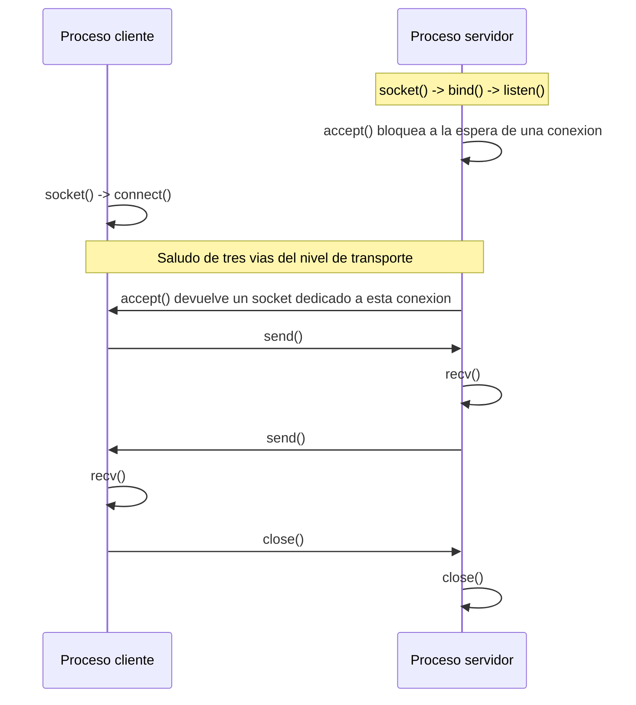
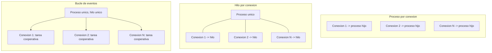

El software que ejecuta un protocolo de comunicaciones no es una aplicación más: atiende
a muchos interlocutores a la vez, responde dentro de un plazo que el propio protocolo
fija y debe seguir funcionando cuando una parte de la red falla. Este capítulo
desarrolla qué distingue a ese software del software de propósito general, las técnicas
con las que se programa la comunicación entre procesos mediante `sockets`, los modelos
de concurrencia que sostienen un servidor con múltiples conexiones simultáneas, la forma
en que los mensajes se serializan y se delimitan sobre un flujo de bytes, el lugar de
las interfaces de red modernas en una arquitectura de red programable, y el ciclo de
pruebas e integración continua que valida una función de red antes de desplegarla.
Cierra así el recorrido de la virtualización de la red: los tipos de virtualización y
los contenedores que ejecutan una carga, la separación entre el plano de control y el
plano de datos y la virtualización de las propias funciones de red, y por último el
software que las implementa.

## Introducción

El **software de comunicaciones** es el conjunto de programas que implementan un
protocolo: el código que construye, envía, recibe e interpreta los mensajes que dos o
más procesos intercambian para prestar un servicio de red. A diferencia de una
aplicación de escritorio o de un servicio por lotes, este software vive permanentemente
condicionado por un interlocutor externo cuyo comportamiento no controla, por un canal
de transporte cuyas garantías son limitadas y por un conjunto de reglas, el propio
protocolo, que ninguna de las dos partes puede alterar unilateralmente sin dejar de
interoperar. Esa dependencia de un tercero explica por qué las técnicas de este
capítulo, la programación de `sockets`, los modelos de concurrencia y las disciplinas de
prueba, aparecen una y otra vez en la implementación de equipos de comunicaciones,
mientras que apenas se mencionan al programar una aplicación aislada.

## Rasgos distintivos del software de comunicaciones

Cuatro rasgos separan al software de comunicaciones del software de propósito general.
Ninguno es exclusivo de las telecomunicaciones, pero su combinación sí lo es: un
programa de gestión de inventario puede tener una base de datos concurrida, una
aplicación de control industrial puede tener requisitos de tiempo real, y una biblioteca
puede depender de un formato de fichero ajeno, pero pocos programas combinan los cuatro
rasgos al mismo tiempo y con la misma intensidad que un equipo de comunicaciones.

### Concurrencia como condición estructural

Un servidor de aplicación aislado puede, en el caso más simple, atender una petición,
responder y terminar. Un equipo de comunicaciones no tiene ese lujo: en el instante en
que acepta una conexión ya hay otras en curso, cada una en un punto distinto del
protocolo, y todas comparten el mismo proceso, la misma memoria y la misma capacidad de
cómputo. La concurrencia no es una optimización que se añade después, sino la condición
de partida sobre la que se diseña el programa, y los modelos que la organizan, tratados
más adelante en este capítulo, determinan cuántas conexiones simultáneas puede sostener
el sistema antes de degradarse.

### Requisitos de latencia y de tiempo real

Muchos protocolos fijan un plazo de respuesta, explícito o implícito, más allá del cual
el mensaje deja de tener valor o el propio protocolo lo trata como perdido. Un
temporizador de retransmisión que vence antes de que la respuesta llegue provoca una
retransmisión innecesaria, y una respuesta que llega después de que el emisor haya
decidido que el mensaje se perdió se descarta sin utilidad alguna. Ese plazo no es un
objetivo de rendimiento deseable, como lo sería en una aplicación web, sino una
condición de corrección: un mensaje tardío puede ser tan inútil como un mensaje nunca
enviado. La disciplina de programación que impone ese requisito se aleja de la de un
programa por lotes, donde una operación puede tardar el tiempo que necesite sin que nada
dependa de un reloj externo.

### El protocolo como contrato

Un protocolo fija, con precisión que no admite ambigüedad, qué mensajes existen, en qué
orden pueden aparecer y qué debe hacer cada extremo al recibirlos. Ese contrato se
compone de cinco elementos que cualquier protocolo, por sencillo que sea, tiene que
resolver. Las **suposiciones sobre el escenario de ejecución** fijan el contexto en el
que el protocolo opera: si el canal subyacente puede perder mensajes, si los dos
extremos arrancan con un estado compartido o si un tercero puede intervenir en la
comunicación. El **servicio ofrecido** describe qué consigue el protocolo para quien lo
usa, con independencia de cómo lo consigue por dentro. El **vocabulario de mensajes**
enumera los tipos de mensaje que el protocolo define y el significado que cada uno tiene
para el receptor. La **codificación de mensajes** especifica cómo se representan esos
mensajes como una secuencia de bits, cuestión que se retoma más adelante en
[serialización y formato de mensajes](#serializacion-y-formato-de-mensajes). Y las
**reglas de comportamiento** describen qué debe hacer cada extremo ante cada mensaje
posible, incluidos los que llegan fuera de orden o en un momento inesperado.

Un programa que implementa un protocolo no tiene libertad para reinterpretar ninguno de
esos cinco elementos: enviar un mensaje que el vocabulario no contempla, codificarlo de
una forma distinta a la acordada o ignorar una regla de comportamiento rompe la
interoperabilidad con cualquier implementación ajena que sí respete el contrato. Esa
rigidez es la contrapartida de que dos programas escritos por equipos distintos, sin
haber visto nunca el código del otro, puedan comunicarse con éxito.

Algunas funciones que un protocolo de comunicaciones exige se desarrollan con detalle
propio en otros capítulos de la wiki y aquí solo se enuncian como catálogo. El control
de errores, con temporizadores y confirmaciones, se trata en
[codificación de canal](../../01_fundamentos/05_codificacion/section_1_codificacion_de_canal.md).
El control de flujo y los protocolos de retransmisión, con parada y espera, vuelta atrás
`N` y repetición selectiva, se desarrollan en
[adaptación de enlace y retransmisión](../../01_fundamentos/05_codificacion/section_3_adaptacion_de_enlace_y_retransmision.md#protocolos-de-retransmision).
El acceso a un medio compartido, con las técnicas de espera aleatoria que evitan
colisiones repetidas, se trata en
[acceso múltiple](../../01_fundamentos/04_acceso_al_medio/section_2_acceso_multiple.md).
Y la conmutación, el aprendizaje de direcciones y el encaminamiento se desarrollan en
[conmutación y Ethernet](../../02_redes/03_conmutacion_y_lan/section_1_conmutacion_y_ethernet.md)
y en el área de encaminamiento. Este capítulo no repite esas funciones, sino que se
ocupa de las técnicas con las que se programa el software que las ejecuta.

### Tolerancia a fallos parciales

Una aplicación de propósito general suele razonar sobre dos estados, correcto o fallido,
y trata el segundo como una excepción que interrumpe la operación en curso. Un equipo de
comunicaciones opera en un entorno donde el fallo parcial es la norma: un mensaje se
pierde mientras el resto del tráfico llega con normalidad, un interlocutor deja de
responder mientras otros mil siguen activos, o un enlace se degrada sin llegar a caerse
por completo. El software tiene que seguir prestando servicio a los interlocutores que
funcionan mientras aísla o recupera al que ha fallado, sin que un fallo localizado se
propague al resto de la aplicación. Esa expectativa aparece de nuevo, con una
formulación distinta, en las pruebas de interoperabilidad descritas más adelante, donde
una implementación se somete deliberadamente a condiciones de red adversas para
comprobar que reacciona con esa misma disciplina.

### Requisitos de robustez

La combinación de los cuatro rasgos anteriores exige que el software de comunicaciones
se diseñe para cumplir cinco requisitos de robustez, cuya importancia relativa varía
según la criticidad del servicio, pero que ningún equipo de comunicaciones puede ignorar
por completo.

| Requisito      | Qué exige                                                                                                                             |
| -------------- | ------------------------------------------------------------------------------------------------------------------------------------- |
| Disponibilidad | Tiempo en que el sistema está listo para su uso, mejorado con redundancia, diseño de red, actualizaciones sin corte y virtualización. |
| Fiabilidad     | Resistencia frente a errores y fallos, con tolerancia a fallos, detección de incidentes y recuperación automática.                    |
| Escalabilidad  | Crecimiento sin degradación, sin multiplicar el coste ni la complejidad de gestión.                                                   |
| Capacidad      | Manejo de grandes volúmenes de usuarios, datos y operaciones sin degradación del servicio.                                            |
| Productividad  | Eficiencia del propio desarrollo, con metodologías ágiles y reutilización de interfaces bien definidas.                               |

## Programación de sockets

### El socket como extremo de comunicación

Un **`socket`** es la abstracción que un sistema operativo ofrece a un proceso para
enviar y recibir datos a través de la red, tal como se introduce en
[puertos y sockets](../../02_redes/02_ip/section_2_protocolos_de_transporte.md#puertos-y-sockets).
Programar sobre `sockets` consiste en manipular esa abstracción con un conjunto reducido
de llamadas: crear el `socket`, asociarlo a una dirección local, y a partir de ahí
enviar y recibir datos con el interlocutor remoto. El comportamiento exacto de esas
llamadas depende del protocolo de transporte elegido, y las dos familias de mayor uso,
`TCP` y `UDP`, descritas con detalle en
[protocolos de transporte](../../02_redes/02_ip/section_2_protocolos_de_transporte.md),
se reflejan en la interfaz de programación con diferencias visibles: una sesión con
`TCP` exige establecer una conexión antes de intercambiar datos, mientras que una sesión
con `UDP` permite enviar un datagrama sin ningún paso previo.

### Servidor y cliente TCP

Un servidor `TCP` sigue una secuencia fija de llamadas. Crea un `socket` con `socket()`,
lo asocia a una dirección y a un puerto locales con `bind()`, declara que va a aceptar
conexiones entrantes con `listen()` y, por cada conexión que llega, obtiene con
`accept()` un `socket` nuevo, distinto del de escucha, dedicado por completo a esa
conexión concreta. El `socket` de escucha permanece disponible para aceptar la conexión
siguiente mientras el `socket` devuelto por `accept()` atiende la que ya se estableció.
Un cliente `TCP` es más simple: crea su propio `socket` y lo conecta directamente a la
dirección y al puerto del servidor con `connect()`, lo que en el nivel de transporte
desencadena el saludo de tres vías descrito en
[establecimiento y cierre de conexión](../../02_redes/02_ip/section_2_protocolos_de_transporte.md#establecimiento-y-cierre-de-conexion).
Una vez conectados, ambos extremos leen y escriben sobre su `socket` respectivo con
`send()` y `recv()`, como si se tratara de un flujo continuo de bytes sin fronteras
propias, una propiedad que se retoma en la sección sobre delimitación de mensajes.



???+ example "Servidor y cliente de eco sobre TCP"

    Un servicio de eco devuelve al cliente exactamente lo que este le envía, y sirve
    para ilustrar la secuencia mínima de llamadas de un servidor y un cliente TCP sin
    ninguna lógica de aplicación que la oscurezca. El servidor de este ejemplo atiende
    una única conexión y, sobre ella, retransmite cada fragmento recibido hasta que el
    cliente cierra su extremo de escritura, momento en el que `recv()` devuelve una
    cadena de bytes vacía.

    ```python linenums="1"
    import socket


    def servidor_eco_tcp(host: str, puerto: int) -> None:
        """Atiende una conexión TCP entrante y devuelve lo que recibe.

        Args:
            host: Dirección local en la que escuchar.
            puerto: Puerto local en el que escuchar.
        """
        with socket.socket(socket.AF_INET, socket.SOCK_STREAM) as escucha:
            escucha.setsockopt(socket.SOL_SOCKET, socket.SO_REUSEADDR, 1)
            escucha.bind((host, puerto))
            escucha.listen(1)
            conexion, direccion_cliente = escucha.accept()
            with conexion:
                while True:
                    datos = conexion.recv(4096)
                    if not datos:
                        break
                    conexion.sendall(datos)


    def cliente_eco_tcp(host: str, puerto: int, mensaje: bytes) -> bytes:
        """Envía un mensaje a un servidor de eco TCP y devuelve la respuesta.

        Args:
            host: Dirección del servidor.
            puerto: Puerto del servidor.
            mensaje: Bytes que se envían al servidor.

        Returns:
            Los bytes devueltos por el servidor.
        """
        with socket.socket(socket.AF_INET, socket.SOCK_STREAM) as conexion:
            conexion.connect((host, puerto))
            conexion.sendall(mensaje)
            return conexion.recv(4096)
    ```

    La opción `SO_REUSEADDR` evita que el servidor falle al reiniciarse si el puerto
    queda temporalmente reservado por una conexión anterior en proceso de cierre, una
    situación habitual durante el desarrollo y las pruebas. El uso de `sendall()` en
    lugar de `send()` es igualmente deliberado: `send()` no garantiza haber transmitido
    todos los bytes solicitados en una sola llamada, mientras que `sendall()` repite el
    envío hasta agotar el búfer completo.

### UDP: intercambio sin conexión

Programar sobre `UDP` elimina los pasos de establecimiento y cierre de conexión: un
proceso crea su `socket`, lo asocia opcionalmente a una dirección local, y a partir de
ahí puede enviar datagramas a cualquier destino con `sendto()`, indicando la dirección
en cada llamada, y recibir datagramas de cualquier origen con `recvfrom()`, que además
de los datos devuelve la dirección de quien los envió. No existe `accept()` porque no
existe conexión que aceptar, y un mismo `socket` `UDP` puede intercambiar datagramas con
múltiples interlocutores sin ninguna gestión adicional. Esa simplicidad es la cara
visible de la ausencia de garantías descrita en
[UDP](../../02_redes/02_ip/section_2_protocolos_de_transporte.md#udp): ni el sistema
operativo ni el protocolo informan de que un datagrama enviado no ha llegado, y es la
propia aplicación la que debe decidir si necesita detectar esa pérdida.

???+ example "Servidor y cliente de eco sobre UDP"

    El mismo servicio de eco sobre UDP no distingue conexiones: el servidor recibe un
    datagrama de cualquier origen y responde a esa dirección concreta, sin mantener
    ningún estado entre un datagrama y el siguiente.

    ```python linenums="1"
    import socket


    def servidor_eco_udp(host: str, puerto: int) -> None:
        """Recibe un datagrama UDP y devuelve el mismo contenido al emisor.

        Args:
            host: Dirección local en la que escuchar.
            puerto: Puerto local en el que escuchar.
        """
        with socket.socket(socket.AF_INET, socket.SOCK_DGRAM) as zocalo:
            zocalo.bind((host, puerto))
            datos, direccion_origen = zocalo.recvfrom(4096)
            zocalo.sendto(datos, direccion_origen)


    def cliente_eco_udp(host: str, puerto: int, mensaje: bytes) -> bytes:
        """Envía un datagrama UDP y devuelve la respuesta recibida.

        Args:
            host: Dirección del servidor.
            puerto: Puerto del servidor.
            mensaje: Bytes que se envían en el datagrama.

        Returns:
            Los bytes recibidos en el datagrama de respuesta.
        """
        with socket.socket(socket.AF_INET, socket.SOCK_DGRAM) as zocalo:
            zocalo.sendto(mensaje, (host, puerto))
            respuesta, _ = zocalo.recvfrom(4096)
            return respuesta
    ```

    Nada en este código impide que el datagrama de petición o el de respuesta se
    pierdan sin que ninguno de los dos extremos lo detecte por sí mismo: si la pérdida
    importa, es este programa, y no el sistema operativo, quien debe añadir un número
    de secuencia y un temporizador de reintento.

### Bloqueo, no bloqueo y multiplexado de entrada y salida

Las llamadas anteriores son, por defecto, **bloqueantes**: `accept()` no devuelve el
control al programa hasta que llega una conexión, y `recv()` no lo devuelve hasta que
hay datos que entregar. Un servidor que solo atiende una conexión puede vivir con esa
espera, pero un servidor que debe atender muchas a la vez no puede permitirse quedar
detenido en la espera de una mientras otras diez tienen datos listos para leer. La
solución más directa es marcar cada `socket` como **no bloqueante**, de modo que
`recv()` devuelva de inmediato un error específico cuando no hay datos disponibles en
lugar de detener el programa, pero esa solución por sí sola obliga a consultar cada
`socket` de forma repetida para saber cuál tiene trabajo pendiente, un patrón que
desperdicia ciclos de proceso en la consulta de `sockets` sin actividad.

El **multiplexado de entrada y salida** resuelve ese desperdicio delegando la consulta
en el propio sistema operativo: el programa entrega al núcleo la lista completa de
`sockets` que le interesan y se bloquea en una única llamada que solo devuelve el
control cuando al menos uno de ellos tiene datos que leer, espacio libre para escribir o
una condición de error, junto con la identidad de cuáles. `select()` es la llamada más
antigua y portable, pero su coste crece con el número de `sockets` vigilados porque el
núcleo debe recorrerlos todos en cada invocación. `epoll`, disponible en los sistemas
basados en el núcleo Linux, mantiene en su lugar una lista de interés persistente dentro
del propio núcleo y notifica únicamente los `sockets` que cambian de estado, lo que
reduce el coste de una vigilancia sobre miles de conexiones simultáneas de un recorrido
lineal a un coste proporcional a la actividad real. La biblioteca estándar de Python
expone ambas bajo una interfaz común en el módulo `selectors`, que selecciona `epoll`
cuando está disponible sin que el programa tenga que distinguir la plataforma.

???+ example "Servidor de eco multiplexado con un único hilo"

    Un servidor puede atender varias conexiones simultáneas sin hilos ni procesos
    adicionales si delega en el sistema operativo la vigilancia de qué `socket` tiene
    datos pendientes. El servidor de escucha y cada conexión aceptada se registran en
    un mismo selector, con una función asociada a cada uno que el bucle principal
    invoca cuando corresponde.

    ```python linenums="1"
    import selectors
    import socket

    selector = selectors.DefaultSelector()


    def aceptar_conexion(escucha: socket.socket) -> None:
        """Acepta una conexión entrante y la registra en el selector.

        Args:
            escucha: Socket en modo escucha que señaló actividad de lectura.
        """
        conexion, _ = escucha.accept()
        conexion.setblocking(False)
        selector.register(conexion, selectors.EVENT_READ, atender_conexion)


    def atender_conexion(conexion: socket.socket) -> None:
        """Reenvía lo recibido de una conexión aceptada, o la cierra si terminó.

        Args:
            conexion: Socket de una conexión aceptada previamente.
        """
        datos = conexion.recv(4096)
        if datos:
            conexion.sendall(datos)
        else:
            selector.unregister(conexion)
            conexion.close()


    def servidor_multiplexado(host: str, puerto: int) -> None:
        """Atiende conexiones simultáneas con un único hilo y un selector.

        Args:
            host: Dirección local en la que escuchar.
            puerto: Puerto local en el que escuchar.
        """
        escucha = socket.socket(socket.AF_INET, socket.SOCK_STREAM)
        escucha.setsockopt(socket.SOL_SOCKET, socket.SO_REUSEADDR, 1)
        escucha.bind((host, puerto))
        escucha.listen()
        escucha.setblocking(False)
        selector.register(escucha, selectors.EVENT_READ, aceptar_conexion)
        while True:
            eventos = selector.select(timeout=None)
            for clave, _ in eventos:
                callback = clave.data
                callback(clave.fileobj)
    ```

    Ninguna conexión bloquea a las demás porque ninguna llamada del bucle principal
    espera a un `socket` concreto: `selector.select()` solo devuelve el control cuando
    hay trabajo real que hacer, y ese trabajo se reparte llamando a la función que cada
    `socket` tiene asociada.

### Asincronía con corrutinas

El patrón del ejemplo anterior, un bucle que consulta eventos y despacha una función por
cada uno, es exactamente lo que una biblioteca de **programación asíncrona** automatiza.
El módulo `asyncio` de la biblioteca estándar de Python sustituye las funciones de
retorno registradas a mano por **corrutinas**, funciones declaradas con `async def` que
pueden suspenderse en un punto marcado con `await` mientras esperan una operación de
entrada o salida, y que el propio bucle de eventos reanuda cuando esa operación se
completa. El programador escribe cada conexión como si fuera secuencial, una función que
lee, procesa y escribe en el orden natural, y es el bucle de eventos quien intercala la
ejecución de todas las corrutinas activas sin que ninguna bloquee a las demás mientras
espera datos.

???+ example "Servidor de eco con asyncio"

    La misma lógica de eco se expresa con `asyncio` como una única corrutina que
    atiende una conexión de principio a fin, delegando en `asyncio.start_server()` la
    aceptación de las conexiones entrantes y la creación de una tarea por cada una: el
    `while datos := await lector.read(4096)` ocupa, en la corrutina, el papel que
    desempeñaba la función `atender_conexion()` en el ejemplo con `selectors`, y
    `await escritor.drain()` evita que una conexión lenta acumule datos sin límite en
    su búfer de salida, suspendiendo la corrutina hasta que el sistema operativo ha
    aceptado suficiente cantidad de los datos ya escritos.

    ```python linenums="1"
    import asyncio


    async def atender_cliente(
        lector: asyncio.StreamReader, escritor: asyncio.StreamWriter
    ) -> None:
        """Reenvía al cliente lo que este envía, hasta que cierra la conexión.

        Args:
            lector: Flujo de lectura asociado a la conexión aceptada.
            escritor: Flujo de escritura asociado a la misma conexión.
        """
        try:
            while datos := await lector.read(4096):
                escritor.write(datos)
                await escritor.drain()
        finally:
            escritor.close()


    async def servidor_asincrono(host: str, puerto: int) -> None:
        """Levanta un servidor de eco basado en corrutinas.

        Args:
            host: Dirección local en la que escuchar.
            puerto: Puerto local en el que escuchar.
        """
        servidor = await asyncio.start_server(atender_cliente, host, puerto)
        async with servidor:
            await servidor.serve_forever()


    if __name__ == "__main__":
        asyncio.run(servidor_asincrono("0.0.0.0", 9000))
    ```

## Modelos de concurrencia del lado servidor

Los tres patrones con los que un servidor atiende conexiones simultáneas difieren en qué
unidad del sistema operativo asignan a cada conexión, y esa decisión determina tanto la
sencillez del programa como el número de conexiones que puede sostener antes de
degradarse.

### Proceso por conexión

El modelo más antiguo asigna un **proceso** completo a cada conexión: el proceso
principal se limita a aceptar conexiones y, por cada una, crea un proceso hijo que
hereda el `socket` ya establecido y se dedica en exclusiva a esa conexión durante toda
su vida. El aislamiento entre conexiones es total, porque cada proceso tiene su propio
espacio de memoria y un fallo en uno no puede corromper el estado de otro, pero ese
mismo aislamiento es también su límite: crear un proceso es una operación costosa en
tiempo y en memoria, y un sistema que reciba miles de conexiones por segundo agota su
capacidad de creación de procesos mucho antes de agotar su capacidad de red.

### Hilo por conexión

El modelo de **hilo por conexión** sustituye el proceso por un hilo dentro de un mismo
proceso: la creación es más ligera que la de un proceso completo, y todos los hilos
comparten el mismo espacio de memoria, lo que facilita compartir estado entre conexiones
cuando el servicio lo necesita, a cambio de exigir mecanismos explícitos de
sincronización sobre ese estado compartido. El límite de escala se desplaza, pero no
desaparece: cada hilo consume memoria propia para su pila de ejecución y el sistema
operativo debe conmutar entre todos ellos, de modo que un número muy elevado de hilos
concurrentes degrada el rendimiento por el propio coste de gestionarlos, un fenómeno
conocido de forma coloquial como el problema de los diez mil clientes. En Python,
además, un único bloqueo global de intérprete impide que dos hilos ejecuten código de
Python de forma simultánea, lo que limita la ganancia de este modelo a las conexiones
cuyo tiempo se consume esperando red y no calculando.

### Bucle de eventos

El **bucle de eventos**, ya introducido en la sección de asincronía, atiende todas las
conexiones dentro de un único hilo, sin crear ni un proceso ni un hilo por conexión.
Cada conexión se convierte en una tarea cooperativa que cede el control voluntariamente
en cada punto de espera, y el bucle reparte la atención entre todas las tareas activas
según qué `sockets` señala el multiplexado de entrada y salida subyacente. El consumo de
memoria por conexión se reduce al mínimo, porque no hay pila de hilo ni espacio de
proceso que reservar, y el número de conexiones simultáneas que un único bucle puede
sostener supera en órdenes de magnitud al de los dos modelos anteriores. La
contrapartida es que una sola tarea que no cede el control, por ejecutar un cálculo
largo sin ningún punto de espera, bloquea a todas las demás por igual, y que aprovechar
varios núcleos de procesador exige levantar varios bucles de eventos independientes,
cada uno en su propio proceso.



### Límites de escala de cada modelo

La tabla siguiente resume el recurso que cada modelo consume por conexión y el factor
que primero lo lleva a degradarse cuando el número de conexiones simultáneas crece.

| Modelo               | Recurso consumido por conexión  | Primer factor de degradación              |
| -------------------- | ------------------------------- | ----------------------------------------- |
| Proceso por conexión | Espacio de proceso completo.    | Tiempo de creación y conmutación.         |
| Hilo por conexión    | Pila de ejecución del hilo.     | Memoria acumulada y conmutación de hilos. |
| Bucle de eventos     | Estructuras de la propia tarea. | Una tarea que no cede el control.         |

Ningún modelo es superior en abstracto: un servicio con pocas conexiones de larga
duración y cómputo intensivo por conexión encaja bien con procesos o hilos, mientras que
un servicio con decenas de miles de conexiones mayoritariamente inactivas, como suele
ocurrir en la señalización de una red de operador, encaja mejor con un bucle de eventos.
Los servidores de producción combinan además ambos ejes, con varios procesos en
paralelo, uno por núcleo de procesador disponible, y un bucle de eventos dentro de cada
proceso.

## Serialización y formato de mensajes

### Binario frente a texto

Un `socket` transmite bytes sin ninguna estructura propia, de modo que todo protocolo
debe definir cómo convierte sus mensajes, que en la aplicación son objetos con campos y
tipos, en esa secuencia de bytes, y cómo reconstruye esos objetos en el extremo
receptor. Esa conversión, la **serialización**, admite dos familias de formato. Un
formato **de texto**, como `JSON` o `XML`, representa los datos como caracteres
legibles, lo que facilita la depuración manual y la interoperabilidad entre lenguajes de
programación distintos, a costa de un mensaje más voluminoso y de un coste de análisis
sintáctico mayor en cada extremo. Un formato **binario**, propio o definido mediante una
descripción como `Protocol Buffers`, representa cada campo con su codificación mínima,
sin caracteres de separación ni nombres de campo repetidos en cada mensaje, lo que
reduce tanto el tamaño transmitido como el coste de proceso, a cambio de que un mensaje
capturado en tránsito ya no se interpreta a simple vista y de que ambos extremos deben
compartir de antemano la descripción exacta de cada campo.

### Delimitación de mensajes en un flujo continuo

`TCP` entrega a la aplicación un flujo continuo de bytes, sin ninguna frontera que
separe un mensaje del siguiente, como se describe en
[segmentación y entrega ordenada](../../02_redes/02_ip/section_2_protocolos_de_transporte.md#segmentacion-y-entrega-ordenada):
una llamada a `recv()` puede devolver menos bytes de los que compone un mensaje
completo, más de uno junto al principio del siguiente, o cualquier combinación
intermedia, según cómo el sistema operativo haya decidido entregar los datos acumulados.
La aplicación necesita, por tanto, un mecanismo propio de **delimitación de mensajes**
que le permita reconstruir, a partir de ese flujo sin fronteras, la secuencia exacta de
mensajes que el emisor escribió. Tres técnicas cubren la práctica totalidad de los
protocolos existentes: un **delimitador** fijo, un carácter o secuencia de bytes que
nunca aparece dentro de un mensaje y marca su final, como el salto de línea que separa
las líneas de un protocolo de texto; un **prefijo de longitud**, un campo de tamaño fijo
al principio de cada mensaje que declara cuántos bytes ocupa el resto, de modo que el
receptor sabe exactamente cuándo ha terminado de leerlo; o un **formato
autodescriptivo** en el que la propia estructura de los datos, como ocurre con muchos
documentos `JSON` bien formados, revela dónde termina un valor sin necesidad de un campo
adicional. `UDP`, en cambio, no sufre este problema porque cada `recvfrom()` entrega
exactamente un datagrama completo, nunca un fragmento ni la concatenación de varios.

### Orden de bytes de red

Un entero de más de un byte puede almacenarse en memoria con el byte más significativo
primero o el menos significativo primero, una elección que varía según la arquitectura
del procesador y que se conoce como **orden de bytes**. Dos equipos con arquitecturas
distintas que intercambiaran un entero binario sin acordar un orden común lo
interpretarían con valores diferentes, de modo que todo protocolo binario fija un
**orden de bytes de red**, que por convención es el orden con el byte más significativo
primero, con independencia del orden nativo de cada arquitectura. Cada extremo convierte
sus enteros del orden nativo al orden de red antes de enviarlos, y del orden de red al
nativo al recibirlos, una conversión que las bibliotecas de red realizan de forma
transparente para las direcciones y los puertos, pero que la aplicación debe realizar
por sí misma para cualquier campo binario propio que incluya en sus mensajes.

???+ example "Delimitación por prefijo de longitud con orden de bytes de red"

    Un protocolo binario propio antepone a cada mensaje un campo de cuatro bytes con su
    longitud, codificado en orden de red, lo que permite al receptor saber exactamente
    cuántos bytes debe acumular antes de considerar el mensaje completo, sin depender de
    ningún delimitador dentro del propio contenido.

    ```python linenums="1"
    import struct

    # Entero sin signo de 4 bytes, en orden de red ("!" en el formato de struct)
    PREFIJO = struct.Struct("!I")


    def empaquetar_mensaje(cuerpo: bytes) -> bytes:
        """Antepone la longitud del cuerpo a un mensaje, en orden de red.

        Args:
            cuerpo: Contenido del mensaje que se va a enviar.

        Returns:
            El mensaje completo, listo para escribirse en un flujo TCP.
        """
        return PREFIJO.pack(len(cuerpo)) + cuerpo


    def desempaquetar_mensaje(
        flujo: bytearray,
    ) -> tuple[bytes | None, bytearray]:
        """Extrae un mensaje completo de un búfer acumulado, si ya está entero.

        Args:
            flujo: Búfer con los bytes recibidos hasta el momento.

        Returns:
            Una tupla con el cuerpo del mensaje si está completo, o `None` si
            aún faltan bytes por llegar, junto con el resto del búfer sin
            consumir.
        """
        if len(flujo) < PREFIJO.size:
            return None, flujo
        (longitud,) = PREFIJO.unpack_from(flujo)
        fin = PREFIJO.size + longitud
        if len(flujo) < fin:
            return None, flujo
        cuerpo = bytes(flujo[PREFIJO.size : fin])
        return cuerpo, flujo[fin:]
    ```

    El receptor llama a `desempaquetar_mensaje()` cada vez que `recv()` añade bytes
    nuevos al búfer acumulado, y solo procesa el mensaje cuando la función devuelve un
    cuerpo distinto de `None`. Esa comprobación explícita es la que sustituye, en un
    protocolo binario propio, a la frontera que un delimitador de texto marcaría de
    forma implícita.

## Interfaces de red modernas

Las técnicas anteriores programan la comunicación entre dos procesos cualesquiera, pero
buena parte del software de comunicaciones actual no diseña su protocolo desde cero,
sino que lo expone a través de una **API** de red ya extendida en la industria, sobre la
que existen bibliotecas cliente en prácticamente cualquier lenguaje.

`REST` estructura la comunicación como operaciones sobre recursos identificados por una
dirección, transportadas sobre `HTTP` y con el cuerpo de la petición y de la respuesta
codificado habitualmente en `JSON`. Su atractivo procede de su sencillez: cualquier
herramienta capaz de hablar `HTTP`, desde un navegador hasta una línea de comandos,
puede invocar una API `REST` sin necesidad de una biblioteca generada específicamente
para ella, y el formato de texto que suele acompañarla se inspecciona y depura a simple
vista. `gRPC` invierte esas prioridades a cambio de rendimiento y de tipado estricto:
define el contrato de la API en un lenguaje de descripción de interfaces, genera a
partir de él el código cliente y servidor para el lenguaje de cada extremo, serializa
los mensajes con `Protocol Buffers` en formato binario y transporta las llamadas sobre
`HTTP/2`, lo que además de reducir el tamaño de cada mensaje habilita flujos de datos
bidireccionales sobre una misma conexión, una capacidad que una API `REST` convencional
no ofrece de forma nativa.

| Aspecto                 | `REST`                                  | `gRPC`                                                        |
| ----------------------- | --------------------------------------- | ------------------------------------------------------------- |
| Transporte              | `HTTP` sobre texto o `JSON`.            | `HTTP/2` con `Protocol Buffers` binario.                      |
| Contrato                | Documentación de la API, sin obligar.   | Descripción de interfaz que genera código cliente y servidor. |
| Flujo de datos          | Petición y respuesta única.             | Flujos bidireccionales sobre una misma conexión.              |
| Facilidad de inspección | Alta, formato legible sin herramientas. | Baja, requiere el contrato para decodificar los mensajes.     |

### Su lugar en la interfaz norte de los controladores

Ninguna de las dos tecnologías nació para las redes definidas por software, pero ambas
se han convertido en la forma habitual de construir la
[interfaz norte](../02_sdn_y_nfv/section_1_sdn.md#interfaz-norte) de un controlador: la
capa de aplicación consulta la topología, los equipos y las estadísticas, y programa las
reglas de reenvío, invocando una API `REST` o `gRPC` que el controlador expone,
exactamente con las técnicas de programación de sockets y de serialización descritas en
este capítulo por debajo de esa API. La elección entre una y otra sigue el mismo
criterio general expuesto arriba: una interfaz norte pensada para integrarse con
herramientas de operación diversas y con scripts de administración tiende a `REST`,
mientras que una interfaz pensada para un volumen alto de consultas de estado o para la
transmisión continua de eventos de topología tiende a `gRPC`.

## Pruebas de software de comunicaciones

### Simulación de red

Comprobar que una implementación se comporta con corrección exige, casi siempre,
someterla a condiciones de red que no se producen de forma fiable en una red física de
pruebas: una pérdida concreta en el momento exacto, un retardo variable o una topología
con un número de saltos determinado. La **simulación de red**, mediante espacios de
nombres de red aislados dentro de un mismo equipo o mediante enlaces virtuales que
conectan procesos sin necesidad de hardware dedicado, reproduce esas condiciones de
forma controlada y repetible, lo que permite ejecutar la misma prueba muchas veces con
exactamente las mismas condiciones, algo que una red física rara vez garantiza.

### Inyección de latencia y de pérdidas

Sobre esa red simulada, las herramientas de control de tráfico del sistema operativo
permiten **inyectar latencia y pérdidas** de forma programática en un enlace concreto,
sin modificar ni una línea del software bajo prueba: un retardo fijo o variable retrasa
artificialmente cada paquete que atraviesa el enlace, y una probabilidad de pérdida
descarta una fracción configurable del tráfico, con o sin correlación entre pérdidas
sucesivas. Esa capacidad convierte una prueba que de otro modo dependería de la suerte,
esperar a que la red física degrade por sí misma, en una prueba determinista que se
repite con el mismo resultado en cada ejecución. Es también la forma más directa de
comprobar la tolerancia a fallos parciales descrita al principio del capítulo: una
implementación correcta debe seguir prestando servicio, con la degradación que las
condiciones impuestas justifiquen, y no colapsar ante una pérdida o un retardo que
ninguna prueba sin inyección habría revelado nunca.

### Pruebas de interoperabilidad

El protocolo como contrato, descrito más arriba, solo se verifica de verdad cuando dos
implementaciones distintas, escritas por equipos distintos sin acceso al código
respectivo, se comunican entre sí sin fallar. Las **pruebas de interoperabilidad**
someten a esa prueba una implementación nueva frente a implementaciones ya establecidas
del mismo protocolo, y su valor está precisamente en que revelan discrepancias que
ninguna prueba contra la propia implementación, por exhaustiva que sea, puede detectar:
una interpretación ambigua de la especificación que ambos equipos resolvieron de forma
distinta, o un caso límite que la especificación no cubre con la precisión suficiente.
Un **analizador de protocolo**, que captura e inspecciona los mensajes que las dos
implementaciones intercambian en bruto, es la herramienta con la que se diagnostica en
qué punto exacto del intercambio diverge el comportamiento observado del comportamiento
esperado por el contrato.

## Integración y despliegue continuo de una función de red

El ciclo con el que una función de red llega de un cambio de código a una versión en
producción encadena varias comprobaciones automáticas, cada una diseñada para detectar
un tipo de fallo distinto antes de que llegue a la siguiente etapa. Tras la construcción
y el análisis estático del código, las pruebas unitarias verifican la lógica interna de
cada componente de forma aislada, y las pruebas de conformidad de protocolo comprueban
que la implementación respeta el contrato descrito en este capítulo frente a mensajes
válidos e inválidos. Superadas esas comprobaciones, la función se empaqueta en una
imagen de contenedor versionada, con el proceso descrito en
[imágenes de contenedor](../01_virtualizacion/section_2_contenedores_y_orquestacion.md#imagenes-de-contenedor),
y esa misma imagen es la que se sometió a las pruebas y la que se desplegará después,
sin reconstruirse en ningún paso intermedio. Sobre la red simulada descrita en esta
misma sección se ejecutan entonces las pruebas de red emulada, con latencia y pérdidas
inyectadas, seguidas de las pruebas de interoperabilidad frente a las implementaciones
de referencia disponibles. Solo entonces la función se despliega en un entorno de
preproducción y, superada esa última comprobación, en producción de forma progresiva,
dirigiendo primero una fracción reducida del tráfico real hacia la versión nueva antes
de completar el reemplazo, con las métricas del servicio como criterio para continuar o
para revertir el despliegue.


Ninguna de estas etapas sustituye a las anteriores: una función que supera las pruebas
unitarias puede seguir violando el contrato del protocolo, y una función que lo respeta
frente a mensajes bien formados puede seguir colapsando ante la pérdida y el retardo que
solo la etapa de red emulada introduce de forma deliberada. La automatización de todo el
ciclo, y no solo de la construcción del código, es lo que permite integrar cambios con
la frecuencia que un servicio de red en producción exige sin arriesgar su
disponibilidad.

Con este capítulo se cierra el recorrido de la virtualización de la red: desde los tipos
de virtualización y los contenedores que ejecutan una carga cualquiera, pasando por la
separación entre el plano de control y el plano de datos y por la virtualización de las
propias funciones de red, hasta el software que las implementa y el ciclo con el que ese
software se prueba y se despliega. Las tres piezas, infraestructura programable,
funciones desacopladas del hardware y software de comunicaciones disciplinado, son las
que sostienen una red que se opera como se opera cualquier sistema software moderno.
